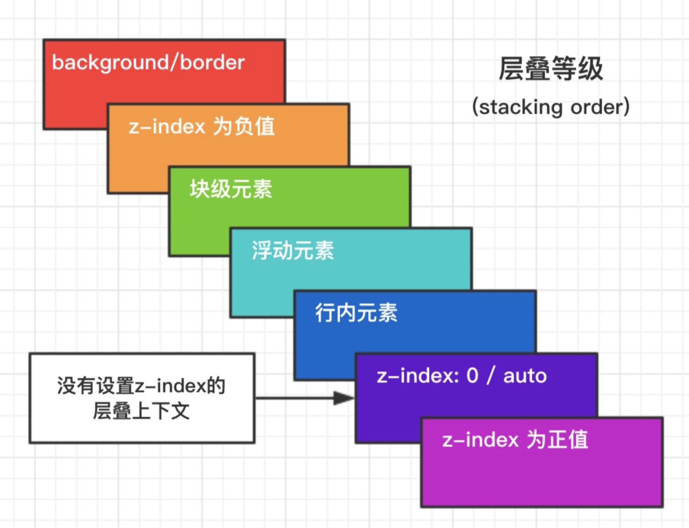

CSS
===

--------------------------------------------------------------------------------------------------------

### 1 盒模型

> content（元素内容） + padding（内边距） + border（边框） + margin（外边距）

延伸：`box-sizing`

-   `content-box`：默认值，总宽度 = `margin` + `border` + `padding` + `width`
-   `border-box`：盒子宽度包含 `padding` 和 `border`，`总宽度 = margin + width`
-   `inherit`：从父元素继承 `box-sizing` 属性

### 2 BFC

> 块级格式化上下文，是一个独立的渲染区域，让处于 `BFC` 内部的元素与外部的元素相互隔离，使内外元素的定位不会相互影响。

> IE下为 `Layout`，可通过 `zoom:1` 触发

触发条件:

-   根元素
-   `position: absolute/fixed`
-   `display: inline-block / table`
-   `float` 元素
-   `ovevflow !== visible`

规则:

-   属于同一个 `BFC` 的两个相邻 `Box` 垂直排列
-   属于同一个 `BFC` 的两个相邻 `Box` 的 `margin` 会发生重叠
-   `BFC` 中子元素的 `margin box` 的左边， 与包含块 (BFC) `border box`的左边相接触 (子元素 `absolute` 除外)
-   `BFC` 的区域不会与 `float` 的元素区域重叠
-   计算 `BFC` 的高度时，浮动子元素也参与计算
-   文字层不会被浮动层覆盖，环绕于周围

应用:

-   阻止`margin`重叠
-   可以包含浮动元素 ------ 清除内部浮动(清除浮动的原理是两个`div`都位于同一个 `BFC` 区域之中)
-   自适应两栏布局
-   可以阻止元素被浮动元素覆盖

### 3 层叠上下文

> 元素提升为一个比较特殊的图层，在三维空间中 (z轴) 高出普通元素一等。

触发条件

-   根层叠上下文(`html`)
-   `position`
-   `css3`属性
    -   `flex`
    -   `transform`
    -   `opacity`
    -   `filter`
    -   `will-change`
    -   `webkit-overflow-scrolling`

层叠等级：层叠上下文在z轴上的排序

-   在同一层叠上下文中，层叠等级才有意义
-   `z-index`的优先级最高



### 4 左右居中方案

-   行内元素: `text-align: center`
-   定宽块状元素: 左右 `margin` 值为 `auto`
-   不定宽块状元素: `table`布局，`position + transform`

```
/* 方案1 */
.wrap {
  text-align: center
}
.center {
  display: inline;
  /* or */
  /* display: inline-block; */
}
/* 方案2 */
.center {
  width: 100px;
  margin: 0 auto;
}
/* 方案2 */
.wrap {
  position: relative;
}
.center {
  position: absulote;
  left: 50%;
  transform: translateX(-50%);
}

```

### 5 上下垂直居中方案

-   定高：`margin`，`position + margin`(负值)
-   不定高：`position` + `transform`，`flex`，`IFC + vertical-align:middle`

```
/* 定高方案1 */
.center {
  height: 100px;
  margin: 50px 0;
}
/* 定高方案2 */
.center {
  height: 100px;
  position: absolute;
  top: 50%;
  margin-top: -25px;
}
/* 不定高方案1 */
.center {
  position: absolute;
  top: 50%;
  transform: translateY(-50%);
}
/* 不定高方案2 */
.wrap {
  display: flex;
  align-items: center;
}
.center {
  width: 100%;
}
/* 不定高方案3 */
/* 设置 inline-block 则会在外层产生 IFC，高度设为 100% 撑开 wrap 的高度 */
.wrap::before {
  content: '';
  height: 100%;
  display: inline-block;
  vertical-align: middle;
}
.wrap {
  text-align: center;
}
.center {
  display: inline-block;
  vertical-align: middle;
}

```

### 6 选择器权重计算方式

> !important > 内联样式 = 外联样式 > ID选择器 > 类选择器 = 伪类选择器 = 属性选择器 > 元素选择器 = 伪元素选择器 > 通配选择器 = 后代选择器 = 兄弟选择器

1.  属性后面加`!import`会覆盖页面内任何位置定义的元素样式
2.  作为`style`属性写在元素内的样式
3.  `id`选择器
4.  类选择器
5.  标签选择器
6.  通配符选择器（`*`）
7.  浏览器自定义或继承

同一级别：后写的会覆盖先写的

> css选择器的解析原则：选择器定位DOM元素是从右往左的方向，这样可以尽早的过滤掉一些不必要的样式规则和元素

### 7 清除浮动

1.  在浮动元素后面添加 `clear:both`的空 `div` 元素

```
<div class="container">
    <div class="left"></div>
    <div class="right"></div>
    <div style="clear:both"></div>
</div>

```

1.  给父元素添加 `overflow:hidden` 或者 `auto` 样式，触发`BFC`

```
<div class="container">
    <div class="left"></div>
    <div class="right"></div>
</div>

```

```
.container{
    width: 300px;
    background-color: #aaa;
    overflow:hidden;
    zoom:1;   /*IE6*/
}

```

1.  使用伪元素，也是在元素末尾添加一个点并带有 `clear: both` 属性的元素实现的。

```
<div class="container clearfix">
    <div class="left"></div>
    <div class="right"></div>
</div>

```

```
.clearfix{
    zoom: 1; /*IE6*/
}
.clearfix:after{
    content: ".";
    height: 0;
    clear: both;
    display: block;
    visibility: hidden;
}

```

> 推荐使用第三种方法，不会在页面新增div，文档结构更加清晰

### 8 左边定宽，右边自适应方案

> float + margin，float + calc

```
/* 方案1 */
.left {
  width: 120px;
  float: left;
}
.right {
  margin-left: 120px;
}
/* 方案2 */
.left {
  width: 120px;
  float: left;
}
.right {
  width: calc(100% - 120px);
  float: left;
}

```

### 9 左右两边定宽，中间自适应

> float，`float + calc`, 圣杯布局（设置BFC，margin负值法），flex

```
.wrap {
  width: 100%;
  height: 200px;
}
.wrap > div {
  height: 100%;
}
/* 方案1 */
.left {
  width: 120px;
  float: left;
}
.right {
  float: right;
  width: 120px;
}
.center {
  margin: 0 120px;
}
/* 方案2 */
.left {
  width: 120px;
  float: left;
}
.right {
  float: right;
  width: 120px;
}
.center {
  width: calc(100% - 240px);
  margin-left: 120px;
}
/* 方案3 */
.wrap {
  display: flex;
}
.left {
  width: 120px;
}
.right {
  width: 120px;
}
.center {
  flex: 1;
}

```

### 10 CSS动画和过渡

animation / keyframes

-   `animation-name`: 动画名称，对应`@keyframes`
-   `animation-duration`: 间隔
-   `animation-timing-function`: 曲线
-   `animation-delay`: 延迟
-   `animation-iteration-count`: 次数
    -   `infinite`: 循环动画
-   `animation-direction`: 方向
    -   `alternate`: 反向播放
-   `animation-fill-mode`: 静止模式
    -   `forwards`: 停止时，保留最后一帧
    -   `backwards`: 停止时，回到第一帧
    -   `both`: 同时运用 `forwards / backwards`
-   常用钩子: `animationend`

> 动画属性: 尽量使用动画属性进行动画，能拥有较好的性能表现

-   `translate`
-   `scale`
-   `rotate`
-   `skew`
-   `opacity`
-   `color`

transform

-   位移属性 `translate( x , y )`
-   旋转属性 `rotate()`
-   缩放属性 `scale()`
-   倾斜属性 `skew()`

transition

-   `transition-property`（过渡的属性的名称）。
-   `transition-duration`（定义过渡效果花费的时间,默认是 `0`）。
-   `transition-timing-function:linear(匀速) ease`(慢速开始，然后变快，然后慢速结束)（规定过渡效果的时间曲线，最常用的是这两个）。
-   `transition-delay`（规定过渡效果何时开始。默认是 0）

> 般情况下，我们都是写一起的，比如：`transition： width 2s ease 1s`

关键帧动画animation

> 一个关键帧动画，最少包含两部分，animation 属性及属性值（动画的名称和运行方式运行时间等）。@keyframes（规定动画的具体实现过程）

animation 属性可以拆分为

-   `animation-name` 规定@keyframes 动画的名称。
-   `animation-duration` 规定动画完成一个周期所花费的秒或毫秒。默认是 `0`。
-   `animation-timing-function` 规定动画的速度曲线。默认是 "ease"，常用的还有`linear`，同`transtion` 。
-   `animation-delay` 规定动画何时开始。默认是 0。
-   `animation-iteration-count` 规定动画被播放的次数。默认是 1，但我们一般用`infinite`，一直播放

> 而`@keyframes`的使用方法，可以是`from->to`（等同于0%和100%），也可以是从`0%->100%`之间任意个的分层设置。我们通过下面一个稍微复杂点的`demo`来看一下，基本上用到了上面说到的大部分知识

```
eg:
   @keyframes mymove
  {
      from {top:0px;}
      to {top:200px;}
  }

/* 等同于： */

@keyframes mymove
{
 0%   {top:0px;}
 25%  {top:200px;}
 50%  {top:100px;}
 75%  {top:200px;}
 100% {top:0px;}
}

```

用css3动画使一个图片旋转

```
#loader {

    display: block;

    position: relative;

    -webkit-animation: spin 2s linear infinite;

    animation: spin 2s linear infinite;

}

@-webkit-keyframes spin {

    0%   {

        -webkit-transform: rotate(0deg);

        -ms-transform: rotate(0deg);

        transform: rotate(0deg);

    }

    100% {

        -webkit-transform: rotate(360deg);

        -ms-transform: rotate(360deg);

        transform: rotate(360deg);

    }

}

@keyframes spin {

    0%   {

        -webkit-transform: rotate(0deg);

        -ms-transform: rotate(0deg);

        transform: rotate(0deg);

    }

    100% {

        -webkit-transform: rotate(360deg);

        -ms-transform: rotate(360deg);

        transform: rotate(360deg);

    }

}

```

### 11 CSS3的新特性

-   `transition`：过渡
-   `transform`: 旋转、缩放、移动或倾斜
-   `animation`: 动画
-   `gradient`: 渐变
-   `box-shadow`: 阴影
-   `border-radius`: 圆角
-   `word-break`: `normal|break-all|keep-all`; 文字换行(默认规则|单词也可以换行|只在半角空格或连字符换行)
-   `text-overflow`: 文字超出部分处理
-   `text-shadow`: 水平阴影，垂直阴影，模糊的距离，以及阴影的颜色。
-   `box-sizing`: `content-box|border-box` 盒模型
-   媒体查询 `@media screen and (max-width: 960px) {}`还有打印`print`

### 12 列举几个css中可继承和不可继承的元素

-   不可继承的：`display、margin、border、padding、background、height、min-height、max-height、width、min-width、max-width、overflow、position、left、right、top、bottom、z-index、float、clear、table-layout、vertical-align`
-   所有元素可继承：`visibility`和`cursor`。
-   内联元素可继承：`letter-spacing、word-spacing、white-space、line-height、color、font、font-family、font-size、font-style、font-variant、font-weight、text-decoration、text-transform、direction`。
-   终端块状元素可继承：`text-indent和text-align`。
-   列表元素可继承：`list-style、list-style-type、list-style-position、list-style-imag`e`。

transition和animation的区别

> `Animation`和`transition`大部分属性是相同的，他们都是随时间改变元素的属性值，他们的主要区别是`transition`需要触发一个事件才能改变属性，而`animation`不需要触发任何事件的情况下才会随时间改变属性值，并且`transition`为2帧，从`from .... to`，而`animation`可以一帧一帧的
