HTTP
===

-------------------------------------

### HTTP状态码

-   1xx 信息性状态码 websocket upgrade
-   2xx 成功状态码
    -   200 服务器已成功处理了请求
    -   204(没有响应体)
    -   206(范围请求 暂停继续下载)
-   3xx 重定向状态码
    -   301(永久) ：请求的页面已永久跳转到新的url
    -   302(临时) ：允许各种各样的重定向，一般情况下都会实现为到 `GET` 的重定向，但是不能确保 `POST` 会重定向为 `POST`
    -   303 只允许任意请求到 `GET` 的重定向
    -   304 未修改：自从上次请求后，请求的网页未修改过
    -   307：`307` 和 `302` 一样，除了不允许 `POST` 到 `GET` 的重定向
-   4xx 客户端错误状态码
    -   400 客户端参数错误
    -   401 没有登录
    -   403 登录了没权限 比如管理系统
    -   404 页面不存在
    -   405 禁用请求中指定的方法
-   5xx 服务端错误状态码
    -   500 服务器错误：服务器内部错误，无法完成请求
    -   502 错误网关：服务器作为网关或代理出现错误
    -   503 服务不可用：服务器目前无法使用
    -   504 网关超时：网关或代理服务器，未及时获取请求

### 1 HTTP前生今世


-   `HTTP` 协议始于三十年前蒂姆-伯纳斯 - 李的一篇论文
-   `HTTP/0.9` 是个简单的文本协议，只能获取文本资源；
-   `HTTP/1.0` 确立了大部分现在使用的技术，但它不是正式标准；
-   `HTTP/1.1` 是目前互联网上使用最广泛的协议，功能也非常完善；
-   `HTTP/2` 基于 Google 的 `SPDY` 协议，注重性能改善，但还未普及；
-   `HTTP/3` 基于 Google 的 `QUIC` 协议，是将来的发展方向

### 2 HTTP世界全览

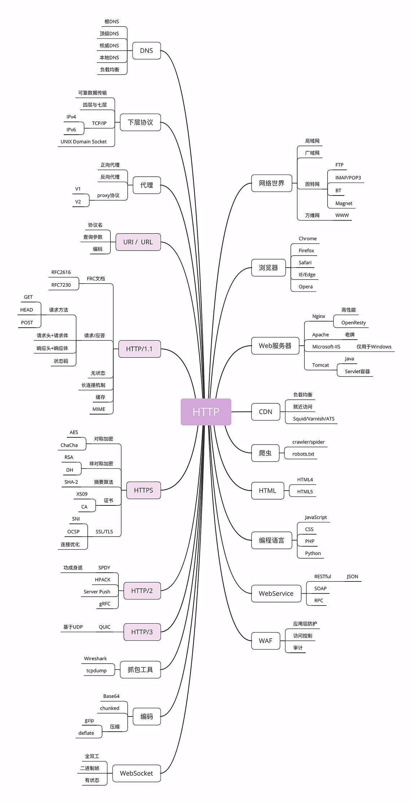

-   互联网上绝大部分资源都使用 `HTTP` 协议传输；
-   浏览器是 HTTP 协议里的请求方，即 `User Agent`；
-   服务器是 HTTP 协议里的应答方，常用的有 `Apache` 和 `Nginx`；
-   `CDN` 位于浏览器和服务器之间，主要起到缓存加速的作用；
-   爬虫是另一类 `User Agent`，是自动访问网络资源的程序。
-   `TCP/IP` 是网络世界最常用的协议，`HTTP` 通常运行在 `TCP/IP` 提供的可靠传输基础上
-   `DNS` 域名是 `IP` 地址的等价替代，需要用域名解析实现到 `IP` 地址的映射；
-   `URI` 是用来标记互联网上资源的一个名字，由"协议名 + 主机名 + 路径"构成，俗称 URL；
-   `HTTPS` 相当于"`HTTP+SSL/TLS+TCP/IP`"，为 `HTTP` 套了一个安全的外壳；
-   代理是 `HTTP` 传输过程中的"中转站"，可以实现缓存加速、负载均衡等功能

### 3 HTTP分层

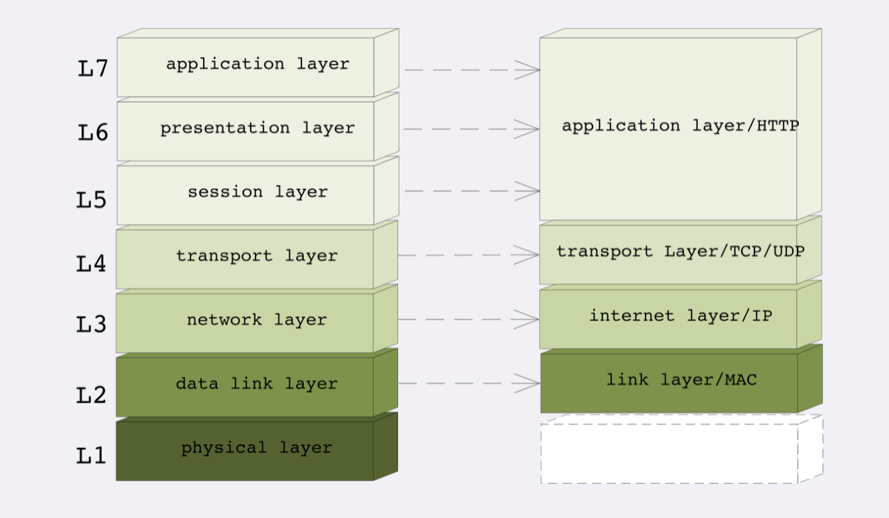 
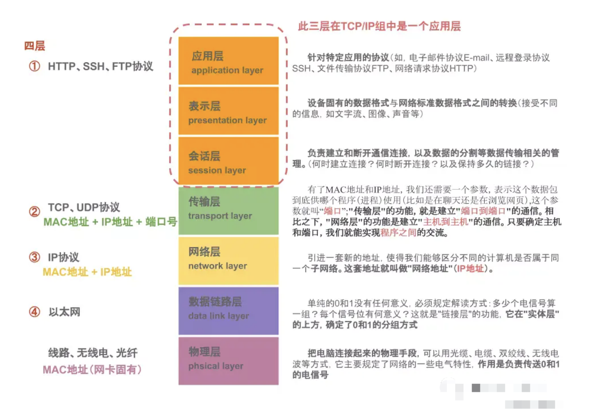

-   第一层：物理层，`TCP/IP` 里无对应；
-   第二层：数据链路层，对应 `TCP/IP` 的链接层；
-   第三层：网络层，对应 `TCP/IP` 的网际层；
-   第四层：传输层，对应 `TCP/IP` 的传输层；
-   第五、六、七层：统一对应到 `TCP/IP` 的应用层

总结

-   `TCP/IP` 分为四层，核心是二层的 `IP` 和三层的 `TCP`，`HTTP` 在第四层；
-   `OSI` 分为七层，基本对应 `TCP/IP`，`TCP` 在第四层，`HTTP` 在第七层；
-   `OSI` 可以映射到 `TCP/IP`，但这期间一、五、六层消失了；
-   日常交流的时候我们通常使用 `OSI` 模型，用四层、七层等术语；
-   `HTTP` 利用 `TCP/IP`协议栈逐层打包再拆包，实现了数据传输，但下面的细节并不可见

> 有一个辨别四层和七层比较好的（但不是绝对的）小窍门，"两个凡是"：凡是由操作系统负责处理的就是四层或四层以下，否则，凡是需要由应用程序（也就是你自己写代码）负责处理的就是七层

### 4 HTTP报文是什么样子的

HTTP 协议的请求报文和响应报文的结构基本相同，由三大部分组成

-   起始行（start line）：描述请求或响应的基本信息；
-   头部字段集合（header）：使用 `key-value` 形式更详细地说明报文；
-   消息正文（entity）：实际传输的数据，它不一定是纯文本，可以是图片、视频等二进制数据

> 这其中前两部分起始行和头部字段经常又合称为"请求头"或"响应头"，消息正文又称为"实体"，但与"header"对应，很多时候就直接称为"body"。

一个完整的 HTTP 报文就像是下图的这个样子，注意在 header 和 body 之间有一个"空行"

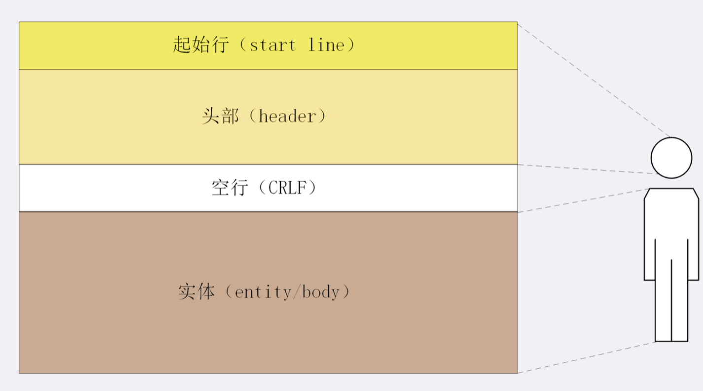

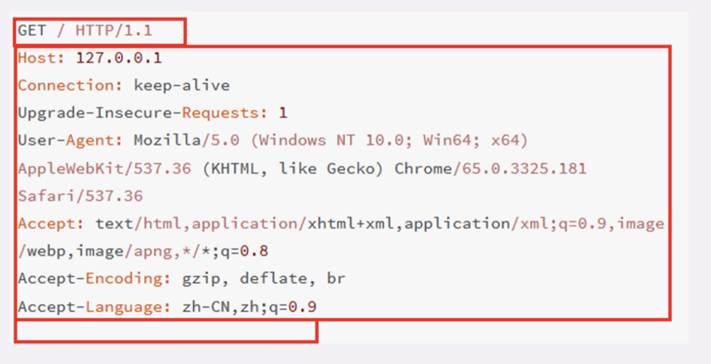

### 5 HTTP之URL


-   `URI` 是用来唯一标记服务器上资源的一个字符串，通常也称为 URL；
-   `URI` 通常由 `scheme`、`host:port`、`path` 和 `query` 四个部分组成，有的可以省略；
-   `scheme` 叫"方案名"或者"协议名"，表示资源应该使用哪种协议来访问；
-   "`host:port`"表示资源所在的主机名和端口号；
-   `path` 标记资源所在的位置；
-   `query` 表示对资源附加的额外要求；
-   在 `URI` 里对"`@&/`"等特殊字符和汉字必须要做编码，否则服务器收到 `HTTP`报文后会无法正确处理

### 6 HTTP实体数据

1\. 数据类型与编码

-   text：即文本格式的可读数据，我们最熟悉的应该就是 `text/html` 了，表示超文本文档，此外还有纯文本 `text/plain`、样式表 `text/css` 等。
-   `image`：即图像文件，有 `image/gif`、`image/jpeg`、`image/png` 等。
-   `audio/video`：音频和视频数据，例如 `audio/mpeg`、`video/mp4` 等。
-   `application`：数据格式不固定，可能是文本也可能是二进制，必须由上层应用程序来解释。常见的有 `application/json`，`application/javascript`、`application/pdf` 等，另外，如果实在是不知道数据是什么类型，像刚才说的"黑盒"，就会是 `application/octet-stream`，即不透明的二进制数据

> 但仅有 `MIME type` 还不够，因为 `HTTP` 在传输时为了节约带宽，有时候还会压缩数据，为了不要让浏览器继续"猜"，还需要有一个"Encoding type"，告诉数据是用的什么编码格式，这样对方才能正确解压缩，还原出原始的数据。

比起 `MIME type` 来说，`Encoding type` 就少了很多，常用的只有下面三种

-   `gzip`：`GNU zip` 压缩格式，也是互联网上最流行的压缩格式；
-   `deflate`：`zlib`（`deflate`）压缩格式，流行程度仅次于 `gzip`；
-   `br`：一种专门为 `HTTP` 优化的新压缩算法（`Brotli`）

2\. 数据类型使用的头字段

有了 `MIME type` 和 `Encoding type`，无论是浏览器还是服务器就都可以轻松识别出 `body` 的类型，也就能够正确处理数据了。

`HTTP` 协议为此定义了两个 `Accept` 请求头字段和两个 `Content` 实体头字段，用于客户端和服务器进行"内容协商"。也就是说，客户端用 `Accept` 头告诉服务器希望接收什么样的数据，而服务器用 `Content` 头告诉客户端实际发送了什么样的数据


> `Accept`字段标记的是客户端可理解的 `MIME` type，可以用","做分隔符列出多个类型，让服务器有更多的选择余地，例如下面的这个头：

```
Accept: text/html,application/xml,image/webp,image/png

```

这就是告诉服务器："我能够看懂 HTML、XML 的文本，还有 `webp` 和 `png` 的图片，请给我这四类格式的数据"。

相应的，服务器会在响应报文里用头字段`Content-Type`告诉实体数据的真实类型：

```
Content-Type: text/html
Content-Type: image/png

```

这样浏览器看到报文里的类型是"text/html"就知道是 HTML 文件，会调用排版引擎渲染出页面，看到"image/png"就知道是一个 PNG 文件，就会在页面上显示出图像。

Accept-Encoding字段标记的是客户端支持的压缩格式，例如上面说的 gzip、deflate 等，同样也可以用","列出多个，服务器可以选择其中一种来压缩数据，实际使用的压缩格式放在响应头字段`Content-Encoding`里

```
Accept-Encoding: gzip, deflate, br
Content-Encoding: gzip

```

不过这两个字段是可以省略的，如果请求报文里没有 `Accept-Encoding` 字段，就表示客户端不支持压缩数据；如果响应报文里没有 `Content-Encoding` 字段，就表示响应数据没有被压缩

3\. 语言类型使用的头字段

同样的，HTTP 协议也使用 `Accept` 请求头字段和 `Content` 实体头字段，用于客户端和服务器就语言与编码进行"内容协商"。

`Accept-Language`字段标记了客户端可理解的自然语言，也允许用","做分隔符列出多个类型，例如：

```
Accept-Language: zh-CN, zh, en

```

这个请求头会告诉服务器："最好给我 `zh-CN` 的汉语文字，如果没有就用其他的汉语方言，如果还没有就给英文"。

相应的，服务器应该在响应报文里用头字段`Content-Language`告诉客户端实体数据使用的实际语言类型

```
Content-Language: zh-CN

```

-   字符集在 `HTTP` 里使用的请求头字段是`Accept-Charset`，但响应头里却没有对应的 `Content-Charset`，而是在`Content-Type`字段的数据类型后面用"`charset=xxx`"来表示，这点需要特别注意。
-   例如，浏览器请求 `GBK` 或 `UTF-8` 的字符集，然后服务器返回的是 `UTF-8` 编码，就是下面这样

```
Accept-Charset: gbk, utf-8
Content-Type: text/html; charset=utf-8

```

不过现在的浏览器都支持多种字符集，通常不会发送 `Accept-Charset`，而服务器也不会发送 `Content-Language`，因为使用的语言完全可以由字符集推断出来，所以在请求头里一般只会有 `Accept-Language` 字段，响应头里只会有 `Content-Type`字段


4\. 内容协商的质量值

在 HTTP 协议里用 `Accept`、`Accept-Encoding`、`Accept-Language` 等请求头字段进行内容协商的时候，还可以用一种特殊的"q"参数表示权重来设定优先级，这里的"q"是"quality factor"的意思。

权重的最大值是 1，最小值是 0.01，默认值是 1，如果值是 0 就表示拒绝。具体的形式是在数据类型或语言代码后面加一个";"，然后是"q=value"。

这里要提醒的是";"的用法，在大多数编程语言里";"的断句语气要强于","，而在 HTTP 的内容协商里却恰好反了过来，";"的意义是小于","的。

例如下面的 Accept 字段：

```
Accept: text/html,application/xml;q=0.9,*/*;q=0.8

```

它表示浏览器最希望使用的是 HTML 文件，权重是 1，其次是 XML 文件，权重是 0.9，最后是任意数据类型，权重是0.8。服务器收到请求头后，就会计算权重，再根据自己的实际情况优先输出 HTML 或者 XML

5\. 内容协商的结果

内容协商的过程是不透明的，每个 Web 服务器使用的算法都不一样。但有的时候，服务器会在响应头里多加一个Vary字段，记录服务器在内容协商时参考的请求头字段，给出一点信息，例如：

```
Vary: Accept-Encoding,User-Agent,Accept

```

这个 `Vary` 字段表示服务器依据了 `Accept-Encoding`、`User-Agent` 和 `Accept` 这三个头字段，然后决定了发回的响应报文。

`Vary` 字段可以认为是响应报文的一个特殊的"版本标记"。每当 `Accept` 等请求头变化时，`Vary` 也会随着响应报文一起变化。也就是说，同一个 `URI` 可能会有多个不同的"版本"，主要用在传输链路中间的代理服务器实现缓存服务，这个之后讲"HTTP 缓存"时还会再提到

6\. 小结


-   数据类型表示实体数据的内容是什么，使用的是 `MIME type`，相关的头字段是 `Accept`和 `Content-Type`；
-   数据编码表示实体数据的压缩方式，相关的头字段是 `Accept-Encoding` 和 `Content-Encoding`；
-   语言类型表示实体数据的自然语言，相关的头字段是 `Accept-Language` 和 `Content-Language`；
-   字符集表示实体数据的编码方式，相关的头字段是 `Accept-Charset`和 Content-Type；
-   客户端需要在请求头里使用 `Accept` 等头字段与服务器进行"内容协商"，要求服务器返回最合适的数据； `Accept` 等头字段可以用","顺序列出多个可能的选项，还可以用"`;q=`"参数来精确指定权重

### 7 谈一谈HTTP协议优缺点

> 超文本传输协议，HTTP 是一个在计算机世界里专门在两点之间传输文字、图片、音频、视频等超文本数据的约定和规范。

-   HTTP 特点
    -   灵活可扩展。一个是语法上只规定了基本格式，空格分隔单词，换行分隔字段等。另外一个就是传输形式上不仅可以传输文本，还可以传输图片，视频等任意数据。
    -   请求-应答模式，通常而言，就是一方发送消息，另外一方要接受消息，或者是做出相应等。
    -   可靠传输，HTTP是基于TCP/IP，因此把这一特性继承了下来。
    -   无状态，这个分场景回答即可。
-   HTTP 缺点
    -   无状态，有时候，需要保存信息，比如像购物系统，需要保留下顾客信息等等，另外一方面，有时候，无状态也会减少网络开销，比如类似直播行业这样子等，这个还是分场景来说。
    -   明文传输，即协议里的报文(主要指的是头部)不使用二进制数据，而是文本形式。这让HTTP的报文信息暴露给了外界，给攻击者带来了便利。
    -   队头阻塞，当http开启长连接时，共用一个`TCP`连接，当某个请求时间过长时，其他的请求只能处于阻塞状态，这就是队头阻塞问题。

http 无状态无连接

-   `http` 协议对于事务处理没有记忆能力
-   对同一个`url`请求没有上下文关系
-   每次的请求都是独立的，它的执行情况和结果与前面的请求和之后的请求是无直接关系的，它不会受前面的请求应答情况直接影响，也不会直接影响后面的请求应答情况
-   服务器中没有保存客户端的状态，客户端必须每次带上自己的状态去请求服务器
-   人生若只如初见，请求过的资源下一次会继续进行请求

http协议无状态中的 状态 到底指的是什么？！

-   【状态】的含义就是：客户端和服务器在某次会话中产生的数据
-   那么对应的【无状态】就意味着：这些数据不会被保留
-   通过增加`cookie`和`session`机制，现在的网络请求其实是有状态的
-   在没有状态的`http`协议下，服务器也一定会保留你每次网络请求对数据的修改，但这跟保留每次访问的数据是不一样的，保留的只是会话产生的结果，而没有保留会话

### 8 说一说HTTP 的请求方法

-   HTTP1.0定义了三种请求方法： GET, POST 和 HEAD方法
-   HTTP1.1新增了五种请求方法：OPTIONS, PUT, DELETE, TRACE 和 CONNECT

`http/1.1`规定了以下请求方法(注意，都是大写):

-   GET： 请求获取Request-URI所标识的资源
-   POST： 在Request-URI所标识的资源后附加新的数据
-   HEAD： 请求获取由Request-URI所标识的资源的响应消息报头
-   PUT： 请求服务器存储一个资源，并用Request-URI作为其标识（修改数据）
-   DELETE： 请求服务器删除对应所标识的资源
-   TRACE： 请求服务器回送收到的请求信息，主要用于测试或诊断
-   CONNECT： 建立连接隧道，用于代理服务器
-   OPTIONS： 列出可对资源实行的请求方法，用来跨域请求

> 从应用场景角度来看，Get 多用于无副作用，幂等的场景，例如搜索关键字。Post 多用于副作用，不幂等的场景，例如注册。

options 方法有什么用

-   OPTIONS 请求与 HEAD 类似，一般也是用于客户端查看服务器的性能。
-   这个方法会请求服务器返回该资源所支持的所有 HTTP 请求方法，该方法会用'*'来代替资源名称，向服务器发送 OPTIONS 请求，可以测试服务器功能是否正常。
-   JS 的 XMLHttpRequest对象进行 CORS 跨域资源共享时，对于复杂请求，就是使用 OPTIONS 方法发送嗅探请求，以判断是否有对指定资源的访问权限。

### 9 谈一谈GET 和 POST 的区别

本质上，只是语义上的区别，GET 用于获取资源，POST 用于提交资源。

具体差别👇

-   从缓存角度看，GET 请求后浏览器会主动缓存，POST 默认情况下不能。
-   从参数角度来看，GET请求一般放在URL中，因此不安全，POST请求放在请求体中，相对而言较为安全，但是在抓包的情况下都是一样的。
-   从编码角度看，GET请求只能经行URL编码，只能接受ASCII码，而POST支持更多的编码类型且不对数据类型限值。
-   GET请求幂等，POST请求不幂等，幂等指发送 M 和 N 次请求（两者不相同且都大于1），服务器上资源的状态一致。
-   GET请求会一次性发送请求报文，POST请求通常分为两个TCP数据包，首先发 header 部分，如果服务器响应 100(continue)， 然后发 body 部分。

### 10 谈一谈队头阻塞问题

什么是队头阻塞？

对于每一个HTTP请求而言，这些任务是会被放入一个任务队列中串行执行的，一旦队首任务请求太慢时，就会阻塞后面的请求处理，这就是`HTTP队头阻塞`问题。

有什么解决办法吗👇

并发连接

> 我们知道对于一个域名而言，是允许分配多个长连接的，那么可以理解成增加了任务队列，也就是说不会导致一个任务阻塞了该任务队列的其他任务，在`RFC规范`中规定客户端最多并发2个连接，不过实际情况就是要比这个还要多，举个例子，Chrome中是6个。

域名分片

-   顾名思义，我们可以在一个域名下分出多个二级域名出来，而它们最终指向的还是同一个服务器，这样子的话就可以并发处理的任务队列更多，也更好的解决了队头阻塞的问题。
-   举个例子，比如`TianTian.com`，可以分出很多二级域名，比如`Day1.TianTian.com`，`Day2.TianTian.com`,`Day3.TianTian.com`,这样子就可以有效解决队头阻塞问题。

### 11 谈一谈HTTP数据传输

大概遇到的情况就分为定长数据 与 不定长数据的处理吧。

定长数据

对于定长的数据包而言，发送端在发送数据的过程中，需要设置`Content-Length`,来指明发送数据的长度。

> 当然了如果采用了Gzip压缩的话，Content-Length设置的就是压缩后的传输长度。

我们还需要知道的是👇

-   `Content-Length`如果存在并且有效的话，则必须和消息内容的传输长度完全一致，也就是说，如果过短就会截断，过长的话，就会导致超时。
-   如果采用短链接的话，直接可以通过服务器关闭连接来确定消息的传输长度。
-   那么在HTTP/1.0之前的版本中，Content-Length字段可有可无,因为一旦服务器关闭连接，我们就可以获取到传输数据的长度了。
-   在HTTP/1.1版本中，如果是Keep-alive的话，chunked优先级高于`Content-Length`,若是非Keep-alive，跟前面情况一样，Content-Length可有可无。

那怎么来设置`Content-Length`

举个例子来看看👇

```
const server = require('http').createServer();
server.on('request', (req, res) => {
  if(req.url === '/index') {
  	// 设置数据类型
    res.setHeader('Content-Type', 'text/plain');
    res.setHeader('Content-Length', 10);
    res.write("你好，使用的是Content-Length设置传输数据形式");
  }
})

server.listen(3000, () => {
  console.log("成功启动--TinaTian");
})

```

不定长数据

> 现在采用最多的就是HTTP/1.1版本，来完成传输数据，在保存Keep-alive状态下，当数据是不定长的时候，我们需要设置新的头部字段👇

```
Transfer-Encoding: chunked

```

通过chunked机制，可以完成对不定长数据的处理，当然了，你需要知道的是

-   如果头部信息中有`Transfer-Encoding`,优先采用Transfer-Encoding里面的方法来找到对应的长度。
-   如果设置了Transfer-Encoding，那么Content-Length将被忽视。
-   使用长连接的话，会持续的推送动态内容。

那我们来模拟一下吧👇

```
const server = require('http').createServer();
server.on('request', (req, res) => {
  if(req.url === '/index') {
  	// 设置数据类型
    res.setHeader('Content-Type', 'text/html; charset=utf8');
    res.setHeader('Content-Length', 10);
    res.setHeader('Transfer-Encoding', 'chunked');

    res.write("你好，使用的是Transfer-Encoding设置传输数据形式");
    setTimeout(() => {
      res.write("第一次传输数据给您<br/>");
    }, 1000);
    res.write("骚等一下");
    setTimeout(() => {
      res.write("第一次传输数据给您");
      res.end()
    }, 3000);
  }
})

server.listen(3000, () => {
  console.log("成功启动--TinaTian");
})

```

> 上面使用的是nodejs中`http`模块，有兴趣的小伙伴可以去试一试，以上就是HTTP对定长数据和不定长数据传输过程中的处理手段。

### 12 cookie 和 session

-   `session`： 是一个抽象概念，开发者为了实现中断和继续等操作，将 `user agent`和 `server` 之间一对一的交互，抽象为"会话"，进而衍生出"会话状态"，也就是 `session` 的概念
-   `cookie`：它是一个世纪存在的东西，`http` 协议中定义在 `header` 中的字段，可以认为是 `session` 的一种后端无状态实现

> 现在我们常说的 `session`，是为了绕开 `cookie` 的各种限制，通常借助 `cookie`本身和后端存储实现的，一种更高级的会话状态实现

`session` 的常见实现要借助`cookie`来发送 `sessionID`

### 13 介绍一下HTTPS和HTTP区别

> HTTPS 要比 HTTPS 多了 secure 安全性这个概念，实际上， HTTPS 并不是一个新的应用层协议，它其实就是 HTTP + TLS/SSL 协议组合而成，而安全性的保证正是 SSL/TLS 所做的工作。

SSL

安全套接层（Secure Sockets Layer）

TLS

（传输层安全，Transport Layer Security）

现在主流的版本是 TLS/1.2, 之前的 TLS1.0、TLS1.1 都被认为是不安全的，在不久的将来会被完全淘汰。

HTTPS 就是身披了一层 SSL 的 HTTP。

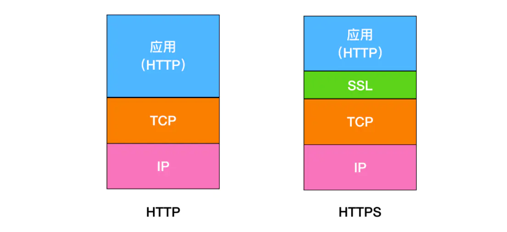

那么区别有哪些呢👇

-   HTTP 是明文传输协议，HTTPS 协议是由 SSL+HTTP 协议构建的可进行加密传输、身份认证的网络协议，比 HTTP 协议安全。
-   HTTPS比HTTP更加安全，对搜索引擎更友好，利于SEO,谷歌、百度优先索引HTTPS网页。
-   HTTPS标准端口443，HTTP标准端口80。
-   HTTPS需要用到SSL证书，而HTTP不用。

我觉得记住以下两点HTTPS主要作用就行👇

1.  对数据进行加密，并建立一个信息安全通道，来保证传输过程中的数据安全;
2.  对网站服务器进行真实身份认证。

HTTPS的缺点

-   证书费用以及更新维护。
-   HTTPS 降低一定用户访问速度（实际上优化好就不是缺点了）。
-   HTTPS 消耗 CPU 资源，需要增加大量机器。

### 14 HTTPS握手过程

-   第一步，客户端给出协议版本号、一个客户端生成的随机数（Client random），以及客户端支持的加密方法
-   第二步，服务端确认双方使用的加密方法，并给出数字证书、以及一个服务器生成的随机数
-   第三步，客户端确认数字证书有效，然后生成一个新的随机数（Premaster secret），并使用数字证书中的公钥，加密这个随机数，发给服务端
-   第四步，服务端使用自己的私钥，获取客户端发来的随机数（即Premaster secret）。
-   第五步，客户端和服务端根据约定的加密方法，使用前面的三个随机数，生成"对话密钥"（session key），用来加密接下来的整个对话过程

总结

-   客户端发起 HTTPS 请求，服务端返回证书，客户端对证书进行验证，验证通过后本地生成用于构造对称加密算法的随机数
-   通过证书中的公钥对随机数进行加密传输到服务端（随机对称密钥），服务端接收后通过私钥解密得到随机对称密钥，之后的数据交互通过对称加密算法进行加解密。（既有对称加密，也有非对称加密）

### 15 介绍一个HTTPS工作原理

我们可以把HTTPS理解成HTTPS = HTTP + SSL/TLS

> TLS/SSL 的功能实现主要依赖于三类基本算法：`散列函数` 、`对称加密`和`非对称加密`，其利用非对称加密实现身份认证和密钥协商，对称加密算法采用协商的密钥对数据加密，基于散列函数验证信息的完整性。

1\. 对称加密

> 加密和解密用同一个秘钥的加密方式叫做对称加密。Client客户端和Server端共用一套密钥，这样子的加密过程似乎很让人理解，但是随之会产生一些问题。

问题一: WWW万维网有许许多多的客户端，不可能都用秘钥A进行信息加密，这样子很不合理，所以解决办法就是使用一个客户端使用一个密钥进行加密。

问题二:既然不同的客户端使用不同的密钥，那么对称加密的密钥如何传输？ 那么解决的办法只能是一端生成一个秘钥，然后通过HTTP传输给另一端，那么这样子又会产生新的问题。

问题三: 这个传输密钥的过程，又如何保证加密？如果被中间人拦截，密钥也会被获取, 那么你会说对密钥再进行加密，那又怎么保存对密钥加密的过程，是加密的过程？

到这里，我们似乎想明白了，使用对称加密的方式，行不通，所以我们需要采用非对称加密👇

2\. 非对称加密

> 通过上面的分析，对称加密的方式行不通，那么我们来梳理一下非对称加密。采用的算法是RSA，所以在一些文章中也会看见传统RSA握手，基于现在TLS主流版本是1.2，所以接下来梳理的是TLS/1.2握手过程。

非对称加密中，我们需要明确的点是👇

-   有一对秘钥，公钥和私钥。
-   公钥加密的内容，只有私钥可以解开，私钥加密的内容，所有的公钥都可以解开，这里说的公钥都可以解开，指的是一对秘钥。
-   公钥可以发送给所有的客户端，私钥只保存在服务器端。

3\. 主要工作流程

梳理起来，可以把TLS 1.2 握手过程分为主要的五步👇

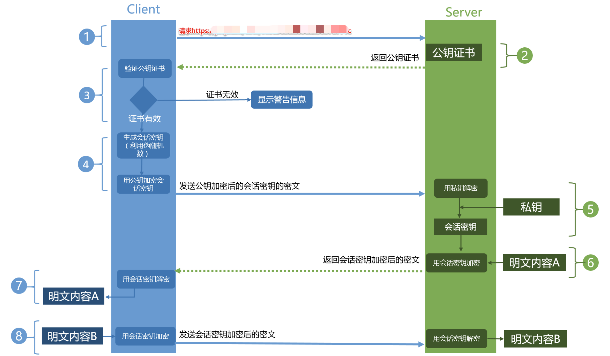

-   步骤一：Client发起一个HTTPS请求，连接443端口。这个过程可以理解成是请求公钥的过程。
-   步骤二：Server端收到请求后，通过第三方机构私钥加密，会把数字证书（也可以认为是公钥证书）发送给Client。
-   步骤三：
    -   浏览器安装后会自动带一些权威第三方机构公钥，使用匹配的公钥对数字签名进行解密。
    -   根据签名生成的规则对网站信息进行本地签名生成，然后两者比对。
    -   通过比对两者签名，匹配则说明认证通过，不匹配则获取证书失败。
-   步骤四：在安全拿到服务器公钥后，客户端Client随机生成一个对称密钥，使用服务器公钥（证书的公钥）加密这个对称密钥，发送给Server(服务器)。
-   步骤五：Server(服务器)通过自己的私钥，对信息解密，至此得到了对称密钥，此时两者都拥有了相同的对称密钥。

接下来，就可以通过该对称密钥对传输的信息加密/解密啦，从上面图举个例子👇

-   Client用户使用该对称密钥加密'明文内容B',发送给Server(服务器)
-   Server使用该对称密钥进行解密消息，得到明文内容B。

接下来考虑一个问题，如果公钥被中间人拿到纂改怎么办呢？

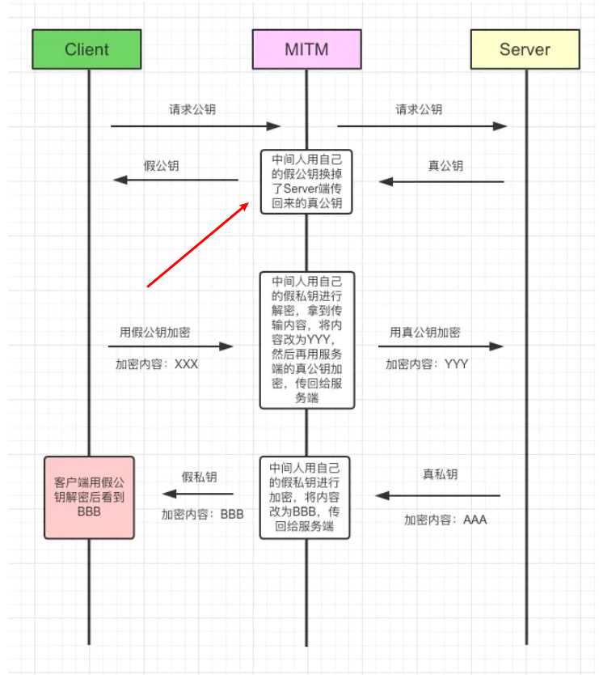

客户端可能拿到的公钥是假的，解决办法是什么呢？

3\. 第三方认证

客户端无法识别传回公钥是中间人的，还是服务器的，这是问题的根本，我们是不是可以通过某种规范可以让客户端和服务器都遵循某种约定呢？那就是通过第三方认证的方式

在HTTPS中，通过 证书 + 数字签名来解决这个问题。

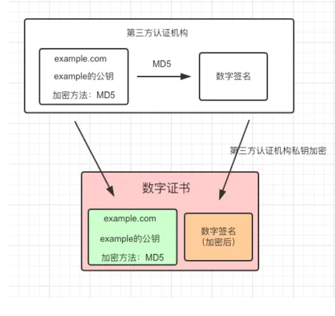

这里唯一不同的是，假设对网站信息加密的算法是MD5，通过MD5加密后，然后通过第三方机构的私钥再次对其加密，生成数字签名。

这样子的话，数字证书包含有两个特别重要的信息👉某网站公钥+数字签名

> 我们再次假设中间人截取到服务器的公钥后，去替换成自己的公钥，因为有数字签名的存在，这样子客户端验证发现数字签名不匹配，这样子就防止中间人替换公钥的问题。

那么客户端是如何去对比两者数字签名的呢？

-   浏览器会去安装一些比较权威的第三方认证机构的公钥，比如VeriSign、Symantec以及GlobalSign等等。
-   验证数字签名的时候，会直接从本地拿到相应的第三方的公钥，对私钥加密后的数字签名进行解密得到真正的签名。
-   然后客户端利用签名生成规则进行签名生成，看两个签名是否匹配，如果匹配认证通过，不匹配则获取证书失败。

4\. 数字签名作用

> 数字签名：将网站的信息，通过特定的算法加密，比如MD5,加密之后，再通过服务器的私钥进行加密，形成加密后的数字签名。

第三方认证机构是一个公开的平台，中间人可以去获取。

如果没有数字签名的话，这样子可以就会有下面情况👇

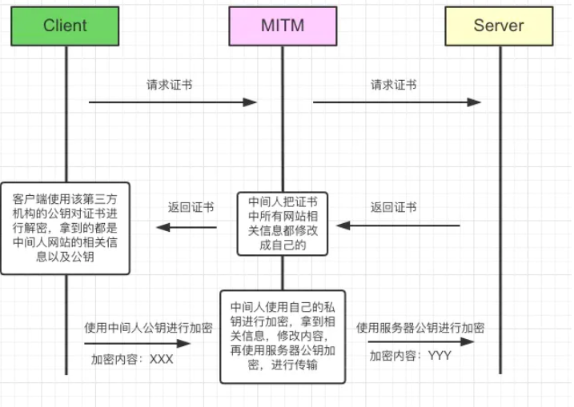

从上面我们知道，如果只是对网站信息进行第三方机构私钥加密的话，还是会受到欺骗。

因为没有认证，所以中间人也向第三方认证机构进行申请，然后拦截后把所有的信息都替换成自己的，客户端仍然可以解密，并且无法判断这是服务器的还是中间人的，最后造成数据泄露。

5\. 总结

-   HTTPS就是使用SSL/TLS协议进行加密传输
-   大致流程：客户端拿到服务器的公钥（是正确的），然后客户端随机生成一个对称加密的秘钥，使用该公钥加密，传输给服务端，服务端再通过解密拿到该对称秘钥，后续的所有信息都通过该对称秘钥进行加密解密，完成整个HTTPS的流程。
-   第三方认证，最重要的是数字签名，避免了获取的公钥是中间人的。

### 16 SSL 连接断开后如何恢复

一共有两种方法来恢复断开的 SSL 连接，一种是使用 session ID，一种是 session ticket。

通过session ID

使用 session ID 的方式，每一次的会话都有一个编号，当对话中断后，下一次重新连接时，只要客户端给出这个编号，服务器如果有这个编号的记录，那么双方就可以继续使用以前的秘钥，而不用重新生成一把。目前所有的浏览器都支持这一种方法。但是这种方法有一个缺点是，session ID 只能够存在一台服务器上，如果我们的请求通过负载平衡被转移到了其他的服务器上，那么就无法恢复对话。

通过session ticket

另一种方式是 session ticket 的方式，session ticket 是服务器在上一次对话中发送给客户的，这个 ticket 是加密的，只有服务器能够解密，里面包含了本次会话的信息，比如对话秘钥和加密方法等。这样不管我们的请求是否转移到其他的服务器上，当服务器将 ticket 解密以后，就能够获取上次对话的信息，就不用重新生成对话秘钥了。

### 17 谈一谈你对HTTP/2理解

> 首先补充一下，http 和 https 的区别，相比于 http,https 是基于 ssl 加密的 http 协议

简要概括:`http2.0` 是基于 1999 年发布的 `http1.0` 之后的首次更新

-   提升访问速度(可以对于，请求资源所需时间更少，访问速度更快，相比 http1.0)
-   允许多路复用:多路复用允许同时通过单一的 HTTP/2 连接发送多重请求-响应信息。改 善了:在 `http1.1` 中，浏览器客户端在同一时间，针对同一域名下的请求有一定数量限 制(连接数量)，超过限制会被阻塞
-   二进制分帧:HTTP2.0 会将所有的传输信息分割为更小的信息或者帧，并对他们进行二 进制编码
-   首部压缩
-   服务器端推送

头部压缩

> HTTP 1.1版本会出现 User-Agent、Cookie、Accept、Server、Range 等字段可能会占用几百甚至几千字节，而 Body 却经常只有几十字节，所以导致头部偏重。

HTTP 2.0 使用 `HPACK` 算法进行压缩。

多路复用

-   HTTP 1.x 中，如果想并发多个请求，必须使用多个 TCP 链接，且浏览器为了控制资源，还会对单个域名有 6-8个的TCP链接请求限制。

HTTP2中：

-   同域名下所有通信都在单个连接上完成。
-   单个连接可以承载任意数量的双向数据流。
-   数据流以消息的形式发送，而消息又由一个或多个帧组成，多个帧之间可以乱序发送，因为根据帧首部的流标识可以重新组装，也就是`Stream ID`，流标识符，有了它，接收方就能从乱序的二进制帧中选择ID相同的帧，按照顺序组装成请求/响应报文。

服务器推送

浏览器发送一个请求，服务器主动向浏览器推送与这个请求相关的资源，这样浏览器就不用发起后续请求。

相比较http/1.1的优势👇

-   推送资源可以由不同页面共享
-   服务器可以按照优先级推送资源
-   客户端可以缓存推送的资源
-   客户端可以拒收推送过来的资源

二进制分帧

之前是明文传输，不方便计算机解析，对于回车换行符来说到底是内容还是分隔符，都需要内部状态机去识别，这样子效率低，HTTP/2采用二进制格式，全部传输01串，便于机器解码。

这样子一个报文格式就被拆分为一个个二进制帧，用Headers帧存放头部字段，Data帧存放请求体数据。这样子的话，就是一堆乱序的二进制帧，它们不存在先后关系，因此不需要排队等待，解决了HTTP队头阻塞问题。

在客户端与服务器之间，双方都可以互相发送二进制帧，这样子双向传输的序列，称为`流`，所以HTTP/2中以流来表示一个TCP连接上进行多个数据帧的通信，这就是多路复用概念。

> 那乱序的二进制帧，是如何组装成对于的报文呢？

-   所谓的乱序，值的是不同ID的Stream是乱序的，对于同一个Stream ID的帧是按顺序传输的。
-   接收方收到二进制帧后，将相同的Stream ID组装成完整的请求报文和响应报文。
-   二进制帧中有一些字段，控制着`优先级`和`流量控制`等功能，这样子的话，就可以设置数据帧的优先级，让服务器处理重要资源，优化用户体验。

HTTP2的缺点

-   TCP 以及 TCP+TLS建立连接的延时,HTTP/2使用TCP协议来传输的，而如果使用HTTPS的话，还需要使用TLS协议进行安全传输，而使用TLS也需要一个握手过程,在传输数据之前，导致我们需要花掉 3～4 个 RTT。
-   TCP的队头阻塞并没有彻底解决。在HTTP/2中，多个请求是跑在一个TCP管道中的。但当HTTP/2出现丢包时，整个 TCP 都要开始等待重传，那么就会阻塞该TCP连接中的所有请求。

### 18 HTTP3

> Google 在推SPDY的时候就已经意识到了这些问题，于是就另起炉灶搞了一个基于 UDP 协议的"QUIC"协议，让HTTP跑在QUIC上而不是TCP上。主要特性如下：

-   实现了类似TCP的流量控制、传输可靠性的功能。虽然UDP不提供可靠性的传输，但QUIC在UDP的基础之上增加了一层来保证数据可靠性传输。它提供了数据包重传、拥塞控制以及其他一些TCP中存在的特性
-   实现了快速握手功能。由于QUIC是基于UDP的，所以QUIC可以实现使用0-RTT或者1-RTT来建立连接，这意味着QUIC可以用最快的速度来发送和接收数据。
-   集成了TLS加密功能。目前QUIC使用的是TLS1.3，相较于早期版本TLS1.3有更多的优点，其中最重要的一点是减少了握手所花费的RTT个数。
-   多路复用，彻底解决TCP中队头阻塞的问题。

### 19 HTTP/1.0 HTTP1.1 HTTP2.0版本之间的差异

-   HTTP 0.9：1991年,原型版本，功能简陋，只有一个命令GET,只支持纯文本内容，该版本已过时。
-   HTTP 1.0
    -   任何格式的内容都可以发送，这使得互联网不仅可以传输文字，还能传输图像、视频、二进制等文件。
    -   除了GET命令，还引入了POST命令和HEAD命令。
    -   http请求和回应的格式改变，除了数据部分，每次通信都必须包括头信息（HTTP header），用来描述一些元数据。
    -   只使用 header 中的 If-Modified-Since 和 Expires 作为缓存失效的标准。
    -   不支持断点续传，也就是说，每次都会传送全部的页面和数据。
    -   通常每台计算机只能绑定一个 IP，所以请求消息中的 URL 并没有传递主机名（hostname）
-   HTTP 1.1 http1.1是目前最为主流的http协议版本，从1999年发布至今，仍是主流的http协议版本。
    -   引入了持久连接（ persistent connection），即TCP连接默认不关闭，可以被多个请求复用，不用声明Connection: keep-alive。长连接的连接时长可以通过请求头中的 `keep-alive` 来设置
    -   引入了管道机制（ pipelining），即在同一个TCP连接里，客户端可以同时发送多个 请求，进一步改进了HTTP协议的效率。
    -   HTTP 1.1 中新增加了 E-tag，If-Unmodified-Since, If-Match, If-None-Match 等缓存控制标头来控制缓存失效。
    -   支持断点续传，通过使用请求头中的 `Range` 来实现。
    -   使用了虚拟网络，在一台物理服务器上可以存在多个虚拟主机（Multi-homed Web Servers），并且它们共享一个IP地址。
    -   新增方法：PUT、 PATCH、 OPTIONS、 DELETE。
-   http1.x版本问题
    -   在传输数据过程中，所有内容都是明文，客户端和服务器端都无法验证对方的身份，无法保证数据的安全性。
    -   HTTP/1.1 版本默认允许复用TCP连接，但是在同一个TCP连接里，所有数据通信是按次序进行的，服务器通常在处理完一个回应后，才会继续去处理下一个，这样子就会造成队头阻塞。
    -   http/1.x 版本支持Keep-alive，用此方案来弥补创建多次连接产生的延迟，但是同样会给服务器带来压力，并且的话，对于单文件被不断请求的服务，Keep-alive会极大影响性能，因为它在文件被请求之后还保持了不必要的连接很长时间。
-   HTTP 2.0
    -   `二进制分帧` 这是一次彻底的二进制协议，头信息和数据体都是二进制，并且统称为"帧"：头信息帧和数据帧。
    -   `头部压缩` HTTP 1.1版本会出现 User-Agent、Cookie、Accept、Server、Range 等字段可能会占用几百甚至几千字节，而 Body 却经常只有几十字节，所以导致头部偏重。HTTP 2.0 使用 `HPACK` 算法进行压缩。
    -   `多路复用` 复用TCP连接，在一个连接里，客户端和浏览器都可以同时发送多个请求或回应，且不用按顺序一一对应，这样子解决了队头阻塞的问题。
    -   `服务器推送` 允许服务器未经请求，主动向客户端发送资源，即服务器推送。
    -   `请求优先级` 可以设置数据帧的优先级，让服务端先处理重要资源，优化用户体验。

### 20 DNS如何工作的

> DNS 的作用就是通过域名查询到具体的 IP。DNS 协议提供的是一种主机名到 IP 地址的转换服务，就是我们常说的域名系统。是应用层协议，通常该协议运行在UDP协议之上，使用的是53端口号。

因为 IP 存在数字和英文的组合（IPv6），很不利于人类记忆，所以就出现了域名。你可以把域名看成是某个 IP 的别名，DNS 就是去查询这个别名的真正名称是什么。

当你在浏览器中想访问 `www.google.com` 时，会通过进行以下操作：

-   本地客户端向服务器发起请求查询 IP 地址
-   查看浏览器有没有该域名的 IP 缓存
-   查看操作系统有没有该域名的 IP 缓存
-   查看 Host 文件有没有该域名的解析配置
-   如果这时候还没得话，会通过直接去 DNS 根服务器查询，这一步查询会找出负责 `com` 这个一级域名的服务器
-   然后去该服务器查询 `google.com` 这个二级域名
-   接下来查询 `www.google.com` 这个三级域名的地址
-   返回给 DNS 客户端并缓存起来

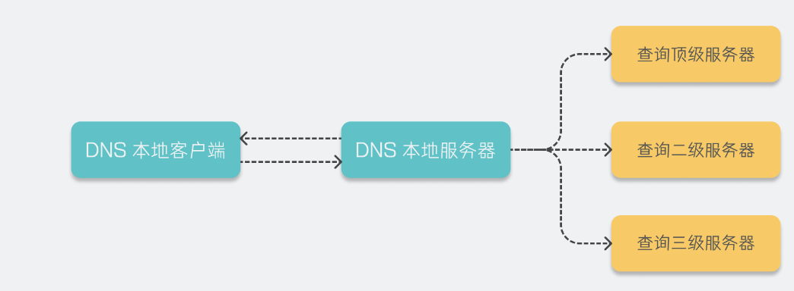

我们通过一张图来看看它的查询过程吧👇


这张图很生动的展示了DNS在本地DNS服务器是如何查询的，一般向本地DNS服务器发送请求是递归查询的

本地 DNS 服务器向其他域名服务器请求的过程是迭代查询的过程👇

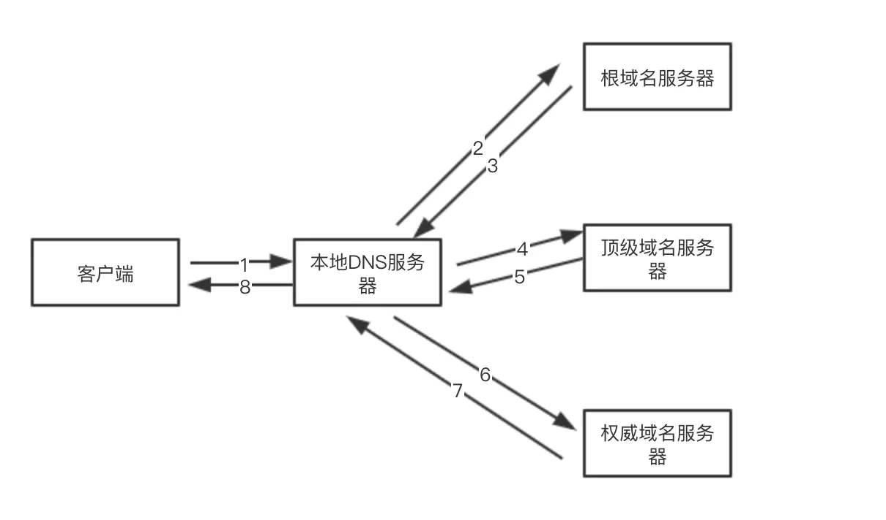

递归查询和迭代查询

-   递归查询指的是查询请求发出后，域名服务器代为向下一级域名服务器发出请求，最后向用户返回查询的最终结果。使用递归 查询，用户只需要发出一次查询请求。
-   迭代查询指的是查询请求后，域名服务器返回单次查询的结果。下一级的查询由用户自己请求。使用迭代查询，用户需要发出 多次的查询请求。

所以一般而言，本地服务器查询是递归查询，而本地 DNS 服务器向其他域名服务器请求的过程是迭代查询的过程

DNS缓存

缓存也很好理解，在一个请求中，当某个DNS服务器收到一个DNS回答后，它能够回答中的信息缓存在本地存储器中。返回的资源记录中的 TTL 代表了该条记录的缓存的时间。

DNS实现负载平衡

它是如何实现负载均衡的呢？首先我们得清楚DNS 是可以用于在冗余的服务器上实现负载平衡。

原因： 这是因为一般的大型网站使用多台服务器提供服务，因此一个域名可能会对应 多个服务器地址。

举个例子来说👇

-   当用户发起网站域名的 DNS 请求的时候，DNS 服务器返回这个域名所对应的服务器 IP 地址的集合
-   在每个回答中，会循环这些 IP 地址的顺序，用户一般会选择排在前面的地址发送请求。
-   以此将用户的请求均衡的分配到各个不同的服务器上，这样来实现负载均衡。

DNS 为什么使用 UDP 协议作为传输层协议？

> DNS 使用 UDP 协议作为传输层协议的主要原因是为了避免使用 TCP 协议时造成的连接时延

-   为了得到一个域名的 IP 地址，往往会向多个域名服务器查询，如果使用 TCP 协议，那么每次请求都会存在连接时延，这样使 DNS 服务变得很慢。
-   大多数的地址查询请求，都是浏览器请求页面时发出的，这样会造成网页的等待时间过长。

总结

-   DNS域名系统，是应用层协议，运行UDP协议之上，使用端口43。
-   查询过程，本地查询是递归查询，依次通过浏览器缓存 `--->>` 本地hosts文件 `--->>` 本地DNS解析器 `--->>`本地DNS服务器 `--->>` 其他域名服务器请求。 接下来的过程就是迭代过程。
-   递归查询一般而言，发送一次请求就够，迭代过程需要用户发送多次请求。

### 21 短轮询、长轮询和 WebSocket 间的区别

1\. 短轮询

短轮询的基本思路:

-   浏览器每隔一段时间向浏览器发送 http 请求，服务器端在收到请求后，不论是否有数据更新，都直接进行 响应。
-   这种方式实现的即时通信，本质上还是浏览器发送请求，服务器接受请求的一个过程，通过让客户端不断的进行请求，使得客户端能够模拟实时地收到服务器端的数据的变化。

优缺点👇

-   优点是比较简单，易于理解。
-   缺点是这种方式由于需要不断的建立 http 连接，严重浪费了服务器端和客户端的资源。当用户增加时，服务器端的压力就会变大，这是很不合理的。

2\. 长轮询

长轮询的基本思路:

-   首先由客户端向服务器发起请求，当服务器收到客户端发来的请求后，服务器端不会直接进行响应，而是先将 这个请求挂起，然后判断服务器端数据是否有更新。
-   如果有更新，则进行响应，如果一直没有数据，则到达一定的时间限制才返回。客户端 JavaScript 响应处理函数会在处理完服务器返回的信息后，再次发出请求，重新建立连接。

优缺点👇

-   长轮询和短轮询比起来，它的优点是明显减少了很多不必要的 http 请求次数，相比之下节约了资源。
-   长轮询的缺点在于，连接挂起也会导致资源的浪费

3\. WebSocket

-   WebSocket 是 Html5 定义的一个新协议，与传统的 http 协议不同，该协议允许由服务器主动的向客户端推送信息。
-   使用 WebSocket 协议的缺点是在服务器端的配置比较复杂。WebSocket 是一个全双工的协议，也就是通信双方是平等的，可以相互发送消息。

### 22 说一说正向代理和反向代理

正向代理

我们常说的代理也就是指正向代理，正向代理的过程，它隐藏了真实的请求客户端，服务端不知道真实的客户端是谁，客户端请求的服务都被代理服务器代替来请求。

反向代理

这种代理模式下，它隐藏了真实的服务端，当我们向一个网站发起请求的时候，背后可能有成千上万台服务器为我们服务，具体是哪一台，我们不清楚，我们只需要知道反向代理服务器是谁就行，而且反向代理服务器会帮我们把请求转发到真实的服务器那里去，一般而言反向代理服务器一般用来实现负载平衡。

负载平衡的两种实现方式？

-   一种是使用反向代理的方式，用户的请求都发送到反向代理服务上，然后由反向代理服务器来转发请求到真实的服务器上，以此来实现集群的负载平衡。
-   另一种是 DNS 的方式，DNS 可以用于在冗余的服务器上实现负载平衡。因为现在一般的大型网站使用多台服务器提供服务，因此一个域名可能会对应多个服务器地址。当用户向网站域名请求的时候，DNS 服务器返回这个域名所对应的服务器 IP 地址的集合，但在每个回答中，会循环这些 IP 地址的顺序，用户一般会选择排在前面的地址发送请求。以此将用户的请求均衡的分配到各个不同的服务器上，这样来实现负载均衡。这种方式有一个缺点就是，由于 DNS 服务器中存在缓存，所以有可能一个服务器出现故障后，域名解析仍然返回的是那个 IP 地址，就会造成访问的问题。

### 23 介绍一下Connection:keep-alive

什么是keep-alive

我们知道HTTP协议采用"请求-应答"模式，当使用普通模式，即非KeepAlive模式时，每个请求/应答客户和服务器都要新建一个连接，完成 之后立即断开连接（HTTP协议为无连接的协议）；

当使用Keep-Alive模式（又称持久连接、连接重用）时，Keep-Alive功能使客户端到服 务器端的连接持续有效，当出现对服务器的后继请求时，Keep-Alive功能避免了建立或者重新建立连接。

为什么要使用keep-alive

keep-alive技术的创建目的，能在多次HTTP之前重用同一个TCP连接，从而减少创建/关闭多个 TCP 连接的开销（包括响应时间、CPU 资源、减少拥堵等），参考如下示意图

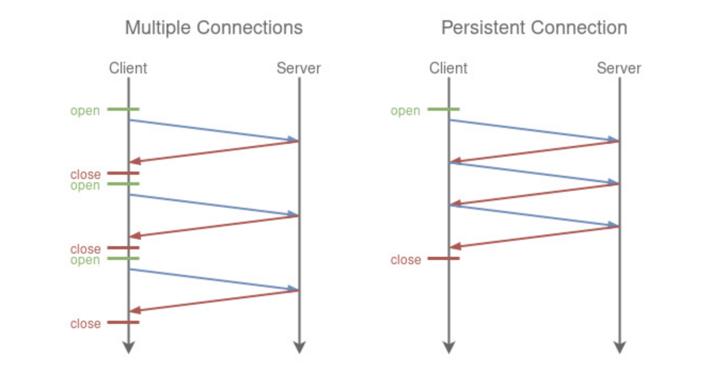

客户端如何开启

> 在HTTP/1.0协议中，默认是关闭的，需要在http头加入"Connection: Keep-Alive"，才能启用Keep-Alive；

```
Connection: keep-alive

```

> http 1.1中默认启用Keep-Alive，如果加入"Connection: close "，才关闭。

```
Connection: close

```

目前大部分浏览器都是用http1.1协议，也就是说默认都会发起Keep-Alive的连接请求了，所以是否能完成一个完整的Keep- Alive连接就看服务器设置情况。

### 24 http/https 协议总结

1.0 协议缺陷:

-   无法复用链接，完成即断开，重新慢启动和 `TCP 3`次握手
-   `head of line blocking`: 线头阻塞，导致请求之间互相影响

1.1 改进:

-   长连接(默认 `keep-alive`)，复用
-   `host` 字段指定对应的虚拟站点
-   新增功能:
    -   断点续传
    -   身份认证
    -   状态管理
    -   `cache` 缓存
        -   `Cache-Control`
        -   `Expires`
        -   `Last-Modified`
        -   `Etag`

2.0:

-   多路复用
-   二进制分帧层: 应用层和传输层之间
-   首部压缩
-   服务端推送

https: 较为安全的网络传输协议

-   证书(公钥)
-   `SSL` 加密
-   端口 `443`

TCP:

-   三次握手
-   四次挥手
-   滑动窗口: 流量控制
-   拥塞处理
    -   慢开始
    -   拥塞避免
    -   快速重传
    -   快速恢复

缓存策略: 可分为 强缓存 和 协商缓存

-   `Cache-Control/Expires`: 浏览器判断缓存是否过期，未过期时，直接使用强缓存，`Cache-Control`的 `max-age` 优先级高于 `Expires`
-   当缓存已经过期时，使用协商缓存
    -   唯一标识方案: `Etag`(`response` 携带) & `If-None-Match`(`request`携带，上一次返回的 `Etag`): 服务器判断资源是否被修改
    -   最后一次修改时间: `Last-Modified(response) & If-Modified-Since`(`request`，上一次返回的`Last-Modified`)
        -   如果一致，则直接返回 304 通知浏览器使用缓存
        -   如不一致，则服务端返回新的资源
-   `Last-Modified` 缺点：
    -   周期性修改，但内容未变时，会导致缓存失效
    -   最小粒度只到 `s`， `s` 以内的改动无法检测到
-   `Etag` 的优先级高于`Last-Modified`

### 25 TCP为什么要三次握手

> 客户端和服务端都需要直到各自可收发，因此需要三次握手

-   第一次握手成功让服务端知道了客户端具有发送能力
-   第二次握手成功让客户端知道了服务端具有接收和发送能力，但此时服务端并不知道客户端是否接收到了自己发送的消息
-   所以第三次握手就起到了这个作用。`经过三次通信后，服务端


> 你可以能会问，2 次握手就足够了？。但其实不是，因为服务端还没有确定客户端是否准备好了。比如步骤 3 之后，服务端马上给客户端发送数据，这个时候客户端可能还没有准备好接收数据。因此还需要增加一个过程


> TCP有6种标示:SYN(建立联机) ACK(确认) PSH(传送) FIN(结束) RST(重置) URG(紧急)

举例：已失效的连接请求报文段

-   `client`发送了第一个连接的请求报文，但是由于网络不好，这个请求没有立即到达服务端，而是在某个网络节点中滞留了，直到某个时间才到达`server`
-   本来这已经是一个失效的报文，但是`server`端接收到这个请求报文后，还是会想`client`发出确认的报文，表示同意连接。
-   假如不采用三次握手，那么只要`server`发出确认，新的建立就连接了，但其实这个请求是失效的请求，`client`是不会理睬`server`的确认信息，也不会向服务端发送确认的请求
-   但是`server`认为新的连接已经建立起来了，并一直等待`client`发来数据，这样，server的很多资源就没白白浪费掉了
-   采用三次握手就是为了防止这种情况的发生，server会因为收不到确认的报文，就知道`client`并没有建立连接。这就是三次握手的作用

三次握手过程中可以携带数据吗

-   第一次、第二次握手不可以携带数据，因为一握二握时还没有建立连接，会让服务器容易受到攻击
-   而第三次握手，此时客户端已经处于 `ESTABLISHED (已建立连接状态)` ，对于客户端来说，已经建立起连接了，并且也已经知道服务器的接收、发送能力是正常的了，所以能携带数据也是没问题的。

为什么建立连接只通信了三次，而断开连接却用了四次？

-   客户端要求断开连接，发送一个断开的请求，这个叫作（FIN）。
-   服务端收到请求，然后给客户端一个 ACK，作为 FIN 的响应。
-   这里你需要思考一个问题，可不可以像握手那样马上传 FIN 回去？
-   其实这个时候服务端不能马上传 FIN，因为断开连接要处理的问题比较多，比如说服务端可能还有发送出去的消息没有得到 ACK；也有可能服务端自己有资源要释放。因此断开连接不能像握手那样操作------将两条消息合并。所以，`服务端经过一个等待，确定可以关闭连接了，再发一条 FIN 给客户端`。
-   客户端收到服务端的 FIN，同时客户端也可能有自己的事情需要处理完，比如客户端有发送给服务端没有收到 ACK 的请求，客户端自己处理完成后，再给服务端发送一个 ACK。


> 为了确保数据能够完成传输。因为当服务端收到客户端的 FIN 报文后，发送的 ACK 报文只是用来应答的，并不表示服务端也希望立即关闭连接。

当只有服务端把所有的报文都发送完了，才会发送 FIN 报文，告诉客户端可以断开连接了，因此在断开连接时需要四次挥手。

-   关闭连接时，当收到对方的FIN报文通知时，它仅仅表示对方没有数据发送给你了；但未必你所有的数据都全部发送给对方了
-   所以你未必会马上关闭`SOCKET`,也即你可能还需要发送一些数据给对方之后，再发送FIN报文给对方来表示你同意现在可以关闭连接了，所以它这里的`ACK`报文和FIN报文多数情况下都是分开发送的。

### 26 为什么要有 WebSocket

已经有了被广泛应用的 HTTP 协议，为什么要再出一个 WebSocket 呢？它有哪些好处呢？

> 其实 WebSocket 与 HTTP/2 一样，都是为了解决 HTTP 某方面的缺陷而诞生的。HTTP/2 针对的是"队头阻塞"，而 `WebSocket 针对的是"请求 - 应答"通信模式`。

那么，"请求 - 应答"有什么不好的地方呢？

-   "请求 - 应答"是一种"半双工"的通信模式，虽然可以双向收发数据，但同一时刻只能一个方向上有动作，传输效率低。更关键的一点，它是一种"被动"通信模式，服务器只能"被动"响应客户端的请求，无法主动向客户端发送数据。
-   虽然后来的 HTTP/2、HTTP/3 新增了 Stream、Server Push 等特性，但"请求 - 应答"依然是主要的工作方式。这就导致 HTTP 难以应用在动态页面、即时消息、网络游戏等要求"实时通信"的领域。
-   在 WebSocket 出现之前，在浏览器环境里用 JavaScript 开发实时 Web 应用很麻烦。因为浏览器是一个"受限的沙盒"，不能用 TCP，只有 HTTP 协议可用，所以就出现了很多"变通"的技术，"轮询"（polling）就是比较常用的的一种。
-   简单地说，轮询就是不停地向服务器发送 HTTP 请求，问有没有数据，有数据的话服务器就用响应报文回应。如果轮询的频率比较高，那么就可以近似地实现"实时通信"的效果。
-   但轮询的缺点也很明显，反复发送无效查询请求耗费了大量的带宽和 CPU 资源，非常不经济。
-   所以，为了克服 HTTP"请求 - 应答"模式的缺点，WebSocket 就"应运而生"了

WebSocket 的特点

-   WebSocket 是一个真正"全双工"的通信协议，与 TCP 一样，客户端和服务器都可以随时向对方发送数据
-   WebSocket `采用了二进制帧结构`，语法、语义与 HTTP 完全不兼容，但因为它的主要运行环境是浏览器，为了便于推广和应用，就不得不"搭便车"，在使用习惯上尽量向 HTTP 靠拢，这就是它名字里"Web"的含义。
-   服务发现方面，WebSocket 没有使用 TCP 的"IP 地址 + 端口号"，而是延用了 HTTP 的 URI 格式，但开头的协议名不是"http"，引入的是两个新的名字："ws"和"wss"，分别表示明文和加密的 WebSocket 协议。
-   `WebSocket 的默认端口也选择了 80 和 443`，因为现在互联网上的防火墙屏蔽了绝大多数的端口，只对 HTTP 的 80、443 端口"放行"，所以 WebSocket 就可以"伪装"成 HTTP 协议，比较容易地"穿透"防火墙，与服务器建立连接

```
ws://www.chrono.com
ws://www.chrono.com:8080/srv
wss://www.chrono.com:445/im?user_id=xxx

```

WebSocket 的握手

> 和 TCP、TLS 一样，WebSocket 也要有一个握手过程，然后才能正式收发数据。

这里它还是搭上了 HTTP 的"便车"，利用了 HTTP 本身的"协议升级"特性，"伪装"成 HTTP，这样就能绕过浏览器沙盒、网络防火墙等等限制，这也是 WebSocket 与 HTTP 的另一个重要关联点。

WebSocket 的握手是一个标准的 HTTP GET 请求，但要带上两个协议升级的专用头字段：

-   "Connection: Upgrade"，表示要求协议"升级"；
-   "Upgrade: websocket"，表示要"升级"成 WebSocket 协议。

另外，为了防止普通的 HTTP 消息被"意外"识别成 WebSocket，握手消息还增加了两个额外的认证用头字段（所谓的"挑战"，Challenge）：

-   `Sec-WebSocket-Key`：一个 Base64 编码的 16 字节随机数，作为简单的认证密钥；
-   `Sec-WebSocket-Version`：协议的版本号，当前必须是 13。


> 服务器收到 HTTP 请求报文，看到上面的四个字段，就知道这不是一个普通的 GET 请求，而是 WebSocket 的升级请求，于是就不走普通的 HTTP 处理流程，而是构造一个特殊的"101 Switching Protocols"响应报文，通知客户端，接下来就不用 HTTP 了，全改用 WebSocket 协议通信

小结

浏览器是一个"沙盒"环境，有很多的限制，不允许建立 TCP 连接收发数据，而有了 WebSocket，我们就可以在浏览器里与服务器直接建立"TCP 连接"，获得更多的自由。

不过自由也是有代价的，WebSocket 虽然是在应用层，但使用方式却与"TCP Socket"差不多，过于"原始"，用户必须自己管理连接、缓存、状态，开发上比 HTTP 复杂的多，所以是否要在项目中引入 WebSocket 必须慎重考虑。

-   `HTTP` 的"请求 - 应答"模式不适合开发"实时通信"应用，效率低，难以实现动态页面，所以出现了 WebSocket；
-   `WebSocket` 是一个"全双工"的通信协议，相当于对 TCP 做了一层"薄薄的包装"，让它运行在浏览器环境里；
-   `WebSocket` 使用兼容 HTTP 的 URI 来发现服务，但定义了新的协议名"ws"和"wss"，端口号也沿用了 `80 和 443`；
-   `WebSocket` 使用二进制帧，结构比较简单，特殊的地方是有个"掩码"操作，客户端发数据必须掩码，服务器则不用；
-   `WebSocket` 利用 HTTP 协议实现连接握手，发送 GET 请求要求"协议升级"，握手过程中有个非常简单的认证机制，目的是防止误连接。

### 27 UDP和TCP有什么区别

-   TCP协议在传送数据段的时候要给段标号；UDP协议不
-   TCP协议可靠；UDP协议不可靠
-   TCP协议是面向连接；UDP协议采用无连接
-   TCP协议负载较高，采用虚电路；UDP采用无连接
-   TCP协议的发送方要确认接收方是否收到数据段（3次握手协议）
-   TCP协议采用窗口技术和流控制


