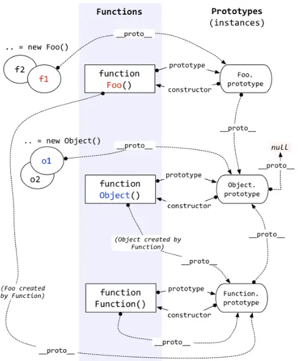

# <center>JS 原型链</center>

## 1. 概念

- `__proto__`属性（一个对象），是每个对象基本都有的隐式属性，在这边暂时称为【隐式原型】
  - 特例：`Object.create(null)`生成的对象没有
- `prototype`属性（一个对象），是每个函数基本都有的显示属性，在这边暂时称为【显示原型】
  - 特例：bind 生成的函数 和 箭头函数 没有
- 函数也可以看做对象，即下图中的`Foo.__proto__ == Function.prototype`

## 2. 神图祭天



- `foo instanceof Foo`，判定条件，若`foo.__proto__[.__proto__ * n] == Foo.prototype`，其中左侧可能有多个，即：不一定是儿子，孙子、重孙子判定也是 true
- `new`操作符的内部实现
  ```js
  //类似于下面的函数
  function newFunc(constructor) {
    var foo = {};
    foo.__proto__ = constructor.prototype; //构造条件的来源
    constructor.apply(foo, Array.prototype.slice.call(arguments, 1)); //构造函数this指向问题的根源
    return foo;
  }
  ```
- `Object.create()`内部实现

  ```js
  Object.create = function (bar, propertiesObject) {
    function Foo() {}
    Foo.prototype = bar;
    return new Foo();
  };

  //Object.create结合new操作符来看
  //Foo.prototype = bar; foo.__proto__ = Foo.prototype;
  //foo.__proto__ = bar;  //即：创建一个新对象，使用现有的对象来提供新创建的对象的__proto__

  //若传递的是foo是Foo.prototype，bar是Bar.prototype，则可以得到如下关系
  //Foo.prototype.__proto__ = Bar.prototype
  //foo.__proto__.__proto__ = Bar.prototype
  //所以通过Foo实例化的foo对象，能通过隐式原型链，找到Bar函数原型上的内容，从而实现继承
  ```

## 3. 结论

- 被构造判定条件：
  实例 foo 的【隐式原型】（`__proto__`）等于构造函数 Foo 的【显示原型】（`prototype`）
  即：`foo.__proto__ == Foo.prototype`
- 继承判定条件：
  - 若`Foo.prototype.__proto__ == Bar.prototype`，则说明 Foo 继承自 Bar
  - 等价于`foo.__proto__.__proto__ == bar.__proto__`
  - Object.create 可以用于实现继承，证明请看上面

## 4. 继承 ES5 实现

```js
//ES5类
function Person(name, age) {
  //私有属性放置地
  this.name = name;
  this.age = age;
}
Person.prototype.show = function () {
  //公有属性和函数放置地
  console.log(`${this.name} is ${this.age} years old.`);
};

var lawson = new Person('Lawson', 18);
lawson.show(); //Lawson is 18 years old.
```

```js
//ES5继承
function Student(name, age, level) {
  this.level = level;
  Person.call(this, name, age);
}
//Object.create实现原型式继承
//后面的参数将constructor导正
Student.prototype = Object.create(Person.prototype, {
  constructor: {
    value: Student,
  },
});
//先调用父类方法，再实现自己的内容
Student.prototype.show = function () {
  Person.prototype.show.call(this);
  console.log(`level is: ${this.level}`);
};

var nion = new Student('Nion', 23, 4);
nion.show(); //Nion is 23 years old. level is: 4
```

## 5. 其他

```js
function Person(name) {
  if (name) {
    this.name = name;
  }
}
Person.prototype.name = 'Lawson';

var nionPer = new Person('Nion');
console.log('nionPer is:', nionPer.name); //nionPer is: Nion
var defaultPer = new Person();
console.log('defaultPer is:', defaultPer.name); //defaultPer is: Lawson

function Student(age) {
  this.age = age;
}
Student.prototype.age = 18;

var nionStu = new Student(18);
console.log('nionStu is:', nionStu.age); //nionStu is: 18
var defaultStu = new Student();
console.log('defaultStu is:', defaultStu.age); //defaultStu is: undefined
```

- 构造函数的值优先于原型链的值
- 若不加以判断，默认传的值是 undefined

参考文献：
https://www.zhihu.com/question/36440948
