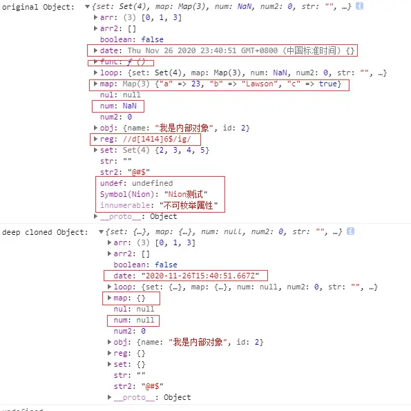
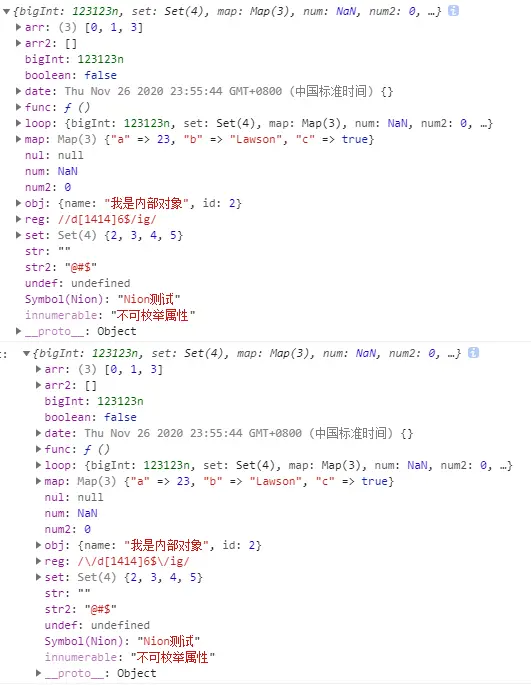

# <center>【JS】深拷贝</center>

## 1. 前置知识

[原型链](../JS基础/原型链.md)
[判定数据类型](../JS基础/数据类型判定.md)
[对象遍历](./对象的遍历.md)

## 2. 浅拷贝和深拷贝

### 2.1 浅拷贝

浅拷贝操作：基本类型拷贝值，非基本类型拷贝引用

```js
let data = {
  name: 'Lawson',
  age: 18,
  favourite: ['tennis', 'book', 'game'],
};

let dataClone = Object.assign({}, data);

dataClone.age = 30;
// { name: 'Lawson', age: 18, favourite: [ 'tennis', 'book', 'game' ] }
console.log('after change primitive type, data is:', data);

// { name: 'Lawson', age: 30, favourite: [ 'tennis', 'book', 'game' ] }
console.log('after change primitive type, dataClone is:', dataClone);

dataClone.favourite.push('hiking');
// { name: 'Lawson', age: 18, favourite: [ 'tennis', 'book', 'game', 'hiking' ] }
console.log('after change reference type, data is:', data);

// { name: 'Lawson', age: 30, favourite: [ 'tennis', 'book', 'game', 'hiking' ]}
console.log('after change reference type, dataClone is:', dataClone);

dataClone.favourite = []; //引用类型属性脱钩
//{ name: 'Lawson', age: 18, favourite: [ 'tennis', 'book', 'game', 'hiking' ]}
console.log('after unhook reference type, data is:', data);

//{ name: 'Lawson', age: 30, favourite: [] }
console.log('after unhook reference type, dataClone is:', dataClone);
```

- Object.assign 是浅拷贝
- ...扩展运算符和 Object.assign 一样，也是浅拷贝

### 2.2 深拷贝

深拷贝操作：基本类型拷贝值，非基本类型重新生成一个新的对象

#### 2.2.1 JSON.parse(JSON.stringify())

```js
let testObj = {
  bigInt: BigInt(123123), //JSON.parse(JSON.stringify())转换不了，会报错
  set: new Set([2, 3, 3, 4, 2, 5]),
  map: new Map([
    ['a', 23],
    ['b', 'Lawson'],
    ['c', true],
  ]),
  num: NaN,
  num2: 0,
  str: '',
  str2: '@#$',
  boolean: false,
  undef: undefined,
  nul: null,
  obj: {
    name: '我是内部对象',
    id: 2,
  },
  arr: [0, 1, 3],
  arr2: [],
  func: function () {
    console.log('我是一个函数');
  },
  date: new Date(),
  reg: new RegExp('/d[1414]6$/ig'),
  [Symbol('Nion')]: 'Nion测试',
};
Object.defineProperty(testObj, 'innumerable', {
  enumerable: false,
  value: '不可枚举属性',
});
let loopObj = Object.create(testObj, Object.getOwnPropertyDescriptors(testObj));
testObj.loop = loopObj;

console.log('original Object: ', testObj);
console.log('deep cloned Object: ', JSON.parse(JSON.stringify(testObj)));
```



- `BigInt` 类型转换不了
- `Date` 类型变成了 `String`
- `map` 类型错误
- `NaN` 转换错误
- 自循环错误
- 正则错误
- `function` 丢失
- `undefined` 丢失
- `Symbol` 丢失
- 描述性内容丢失

#### 2.2.2 自定义递归深拷贝

```js
//判定当前对象是否为复杂对象
const isComplexDataType = (obj) => {
  return (typeof obj === 'object' || typeof obj === 'function') && obj !== null;
};
let deepClone = function (obj, alreadyMap = new WeakMap()) {
  //缓存中是否已经存在
  if (alreadyMap.has(obj)) {
    return alreadyMap.get(obj);
  }
  //若对象是非自定义类型，则直接返回重新构造的对象
  let checkedType = [Date, RegExp, Set, Map, WeakMap, WeakSet]; //当前支持的深拷贝类型，可扩展
  if (checkedType.includes(obj.constructor)) {
    return new obj.constructor(obj); //用相应的构造器，重新构造一遍对象
  }

  //下面都是自定义类型的了
  //若对象有修饰符相关的属性，获取，并用继承的方式进行赋值
  let allDesc = Object.getOwnPropertyDescriptors(obj); //获取所有有键的特性
  let cloneObj = Object.create(Object.getPrototypeOf(obj), allDesc); //继承原型
  alreadyMap.set(obj, cloneObj);
  //操作对象键值对
  for (let key of Reflect.ownKeys(obj)) {
    //遍历所有属性，包括不可枚举和symbol属性
    //非函数的引用类型，递归调用
    cloneObj[key] = isComplexDataType(obj[key]) && typeof obj[key] !== 'function' ? deepClone(obj[key], alreadyMap) : obj[key];
  }
  return cloneObj;
};
```


