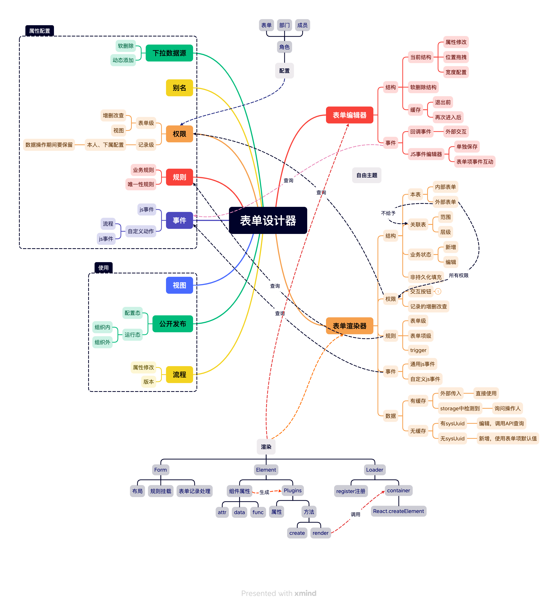

# 
表单设计器-概述

## 1. 说明

[xmind 源文件](../../assets/experience/form-design.xmind)

## 2. 介绍

作用：数据采集、数据分析

### 2.1 表单编辑器

- 组件介绍

  - 基础组件
    - 基本数据录入
  - 复杂组件
    - 复杂数据录入
  - 计算组件
    - 不入库，前端计算；导出时，后端也同逻辑计算
  - 关联组件
    - 表的关联关系
  - 布局组件

- 交互介绍

  - 拖拽
  - 主列
  - 复制
  - 删除

- 属性配置

  - code
  - 默认值
  - 数据源
  - 校验规则
  - 显示模式

### 2.2 JS 事件编辑器

- 钩子
- 自定义函数

### 2.3 自定义选项集

- 软删除
- 顺序

### 2.4 规则

- 业务规则
- 唯一性规则

### 2.5 表单渲染器

- 嵌套结构
- 权限
- 规则
- 事件
