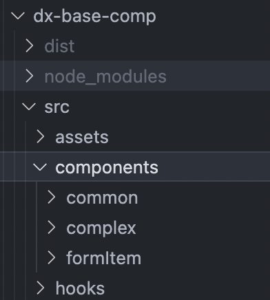

# <center>表单设计器-渲染</center>

## 1. 基础说明

- 何为元素（Element），何为组件(Component)

  - 元素

  ```tsx
  <div>Hello, World!</div>
  ```

  - 组件

  ```tsx
  function comp() {
    return <div>Hello, World!</div>;
  }
  ```

- `React.createElement` 和 `JSX` 的关系

```tsx
const element = React.createElement(
  'div', // 组件或字符串
  {
    className: 'container',
  },
  'Hello, World!'
);
```

```tsx
<div className="container">Hello, World!</div>
```

- `React.cloneElement`

```tsx
const originalElement = <button className="original">Click me!</button>;
...
const clonedElement = React.cloneElement(
  originalElement // 元素,
  {
  className: 'modified',
  onClick: handleClick,
  },
  ['children']
);
```

- `React.Children`
  - `React.Children.map(children, function(child, index))`该方法对子元素进行遍历，返回一个新的数组
  - `React.Children.forEach(children, function(child, index))`该方法对子元素进行遍历，执行指定的函数，没有返回值
  - `React.Children.count(children)`该方法返回子元素的数量
  - `React.Children.only(children)`该方法验证子元素是否仅有一个，并返回该子元素。如果子元素不止一个或不存在，将抛出错误
  - `React.Children.toArray(children)`该方法将子元素转换为一个数组

## 2. 组件拆解

### 2.1 元组件

基本每一种类型的组件都有自己的【元组件】



### 2.2 commonAttr

- attr
- data
- func

### 2.3 渲染器组件

- 表单模式
- 单元格模式

### 2.4 编辑器组件

- 拟态组件
- 属性组件

### 2.5 其他

- `pluginRnIns` 实例，用于检索对应的【运行态】组件
- `pluginEdIns` 实例，用于检索对应的【配置态】组件
- `compAttrIns` 实例，用于检索对应组件的属性
- render 包的 `initLoader`，用于注册自定义【运行态】组件和初始化内部【运行态】组件
- editor 包的 `initLoader`，用于注册自定义【配置态】组件和初始化内部【配置态】组件
