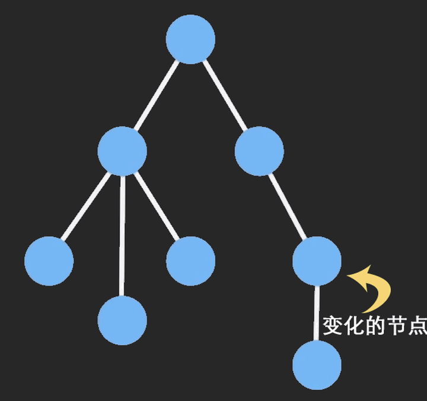

# <center><h1>性能优化-state</h1></center>

## 1. 说明

> 以下针对的都是 hooks 中的 useState

- 直接修改 state 的值无法刷新页面
- `useState` 的参数只在初始化时有效，若需根据外部的变更调整 state，请结合 `useEffect` 来更新 state
- 调用 set 函数 后，当前事件中 state 还是旧值。(即使在同步事件中)
- setState 没有渲染后的回调函数(和 class 写法不一致)，只有传递函数的模式

```ts
setState((prevState) => (prevState += 1));
```

## 2. state 类型

- 尽量使用 `基本类型` 属性，比较时方便
- 若必须使用复杂对象，或多个基本属性有联动，则建议使用`reducer`来统一管理

```ts
export const RnRecordReduder = (state: IRnRecordState, action: IRnRecordAction): IRnRecordState => {
  switch (action.type) {
    case 'SET_FORM_VALUE': {
      ...
    }
    case 'SET_RELATION_VALUE': {
      ...
    }
    default: {
      return state;
    }
  }
};
...
const [store, dispatch] = useReducer(RnRecordReduder, {
  initialData,
  formValue: cloneDeep(initialData),
  onChangeFormValue,
});
...
dispatch({
  type: 'SET_RELATION_VALUE',
  value: (preState: Map<string, Record<string, any>>) =>
    update(preState || new Map<string, Record<string, any>>(), { $add: [[element.id, selRelation]] }),
});
```

- 修改复杂大对象时，尽量使用`immutability-helper`，可以保证除了修改点和父级点之外的点没有变动；进而减少子组件的 re-render
  

## 3. 使用中的 tips

- 调用 set 函数时，传递函数
  - 函数参数可以拿到上一次的 state 值；
  - 可以防止高频次操作，state 状态不对的情况（比如勾选和取消勾选的列表显示）

```tsx
const [curSelValue, setSelValue] = useState<IUserSelectAttr[]>([]); // 当前选中的用户
...

const handleChange = (event: CheckboxChangeEvent, selItem: IUserSelectAttr) => {
  ...
  setSelValue((prevSelValue) => {
    return prevSelValue.concat(selItem);
  });
  ...
};

```

- React 接管事件中(合成事件等)，setState 是异步更新的且会合并，即多次 setState，只会有一次 re-render，且 re-render 时拿到的 state 是上次的 state;

- 非 React 接管事件中(包含生命周期)，比如 `Promise`、`setTimeout`、`addEventListener` 等，setState 是同步更新且不会合并，多次 setState 会产生多次 re-render（$\color{red}React18$ 后都会合并更新，并只 re-render 一次; $\color{red}React18$ 之前，可以尝试使用`unstable_batchupdate`）

> 上述两者需要结合 [demo](https://github.com/lhz87127855/react-cli-demo) 来理解

- 高频次修改 state 时，看情况使用【防抖】或【节流】

## 4. 其他

- 计算 state，使用·来计算出数据，以保证计算数据的不变性的方式，降低 re-render(注意依赖)
  - useMemo
  - useCreation
- 不希望某个 state，或被解构的属性作为依赖项，但是希望在 useMemo 或 useEffect 中使用时，可以考虑使用`useLatest`; 以降低可能发生变动的源头的方式，来降低 re-render 的可能性

```tsx
// 当前成员的联动值
const chainUser: IUserSelectAttr = useCreation(() => {
  ...
}, [formValue, defaultValue, defaultMode]);

const chainUserLst = useLatest(chainUser);

// 联动数据发生修改，则同步更新当前成员值
useEffect(() => {
  ...
  onChange?.(chainUserLst.current);
  ...
}, [chainUser?.userCode, defaultMode]);
```

- 为了解决异步数据 undefined 的问题，一般需要设置 isLoading 状态，来区分两种渲染 div; 此时需要注意 setLoading 要放在最后，因为很有可能当前处于同步更新中，不会 `batchUpdate`
