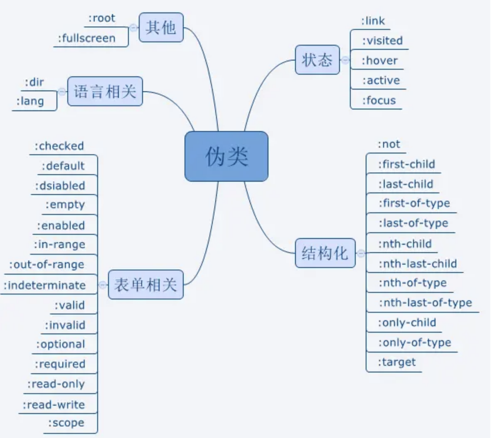
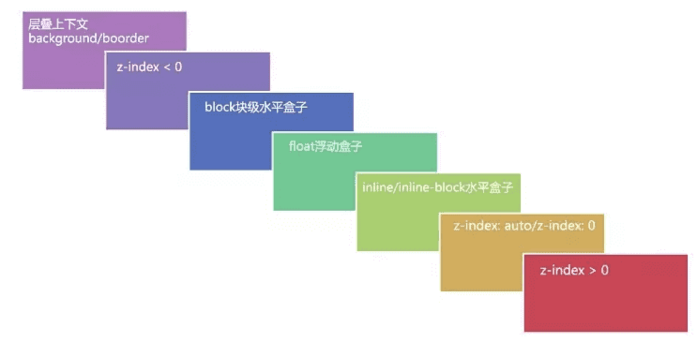

CSS模块
===

------------------------------------------------------------------------------------------


1 盒模型
-------------------------------------------------------------------------------------------------------------------------

`content`（元素内容） + `padding`（内边距） + `border`（边框） + `margin`（外边距）

> 页面渲染时，`dom` 元素所采用的 布局模型。可通过`box-sizing`进行设置。根据计算宽高的区域可分为

box-sizing

-   `content-box`：默认值，总宽度 = `margin` + `border` + `padding` + `width`
-   `border-box`：盒子宽度包含 `padding` 和 `border`，`总宽度 = margin + width`
-   `inherit`：从父元素继承 `box-sizing` 属性

2 BFC
-------------------------------------------------------------------------------------------------

> 块级格式化上下文，是一个独立的渲染区域，让处于 `BFC` 内部的元素与外部的元素相互隔离，使内外元素的定位不会相互影响。

> IE下为 `Layout`，可通过 `zoom:1` 触发

触发条件:

-   根元素
-   `position: absolute/fixed`
-   `display: inline-block / table`
-   `float` 元素
-   `ovevflow !== visible`

规则:

-   属于同一个 `BFC` 的两个相邻 `Box` 垂直排列
-   属于同一个 `BFC` 的两个相邻 `Box` 的 `margin` 会发生重叠
-   `BFC` 中子元素的 `margin box` 的左边， 与包含块 (BFC) `border box`的左边相接触 (子元素 `absolute` 除外)
-   `BFC` 的区域不会与 `float` 的元素区域重叠
-   计算 `BFC` 的高度时，浮动子元素也参与计算
-   文字层不会被浮动层覆盖，环绕于周围

应用:

-   阻止`margin`重叠
-   可以包含浮动元素 ------ 清除内部浮动(清除浮动的原理是两个`div`都位于同一个 `BFC` 区域之中)
-   自适应两栏布局
-   可以阻止元素被浮动元素覆盖

3 层叠上下文
---------------------------------------------------------------------------------------------------------------------------------------------

> 元素提升为一个比较特殊的图层，在三维空间中 (z轴) 高出普通元素一等。

触发条件

-   根层叠上下文(`html`)
-   `position`
-   `css3`属性
    -   `flex`
    -   `transform`
    -   `opacity`
    -   `filter`
    -   `will-change`
    -   `webkit-overflow-scrolling`

层叠等级：层叠上下文在z轴上的排序

-   在同一层叠上下文中，层叠等级才有意义
-   `z-index`的优先级最高


4 居中布局
-----------------------------------------------------------------------------------------------------------------------------------

### 左右居中

-   行内元素: `text-align: center`
-   定宽块状元素: 左右 `margin` 值为 `auto`
-   不定宽块状元素: `table`布局，`position + transform`

```
/* 方案1 */
.wrap {
  text-align: center
}
.center {
  display: inline;
  /* or */
  /* display: inline-block; */
}
/* 方案2 */
.center {
  width: 100px;
  margin: 0 auto;
}
/* 方案2 */
.wrap {
  position: relative;
}
.center {
  position: absulote;
  left: 50%;
  transform: translateX(-50%);
}

```

### 上下垂直居中

-   定高：`margin`，`position + margin`(负值)
-   不定高：`position` + `transform`，`flex`，`IFC + vertical-align:middle`

```
/* 定高方案1 */
.center {
  height: 100px;
  margin: 50px 0;
}
/* 定高方案2 */
.center {
  height: 100px;
  position: absolute;
  top: 50%;
  margin-top: -25px;
}
/* 不定高方案1 */
.center {
  position: absolute;
  top: 50%;
  transform: translateY(-50%);
}
/* 不定高方案2 */
.wrap {
  display: flex;
  align-items: center;
}
.center {
  width: 100%;
}
/* 不定高方案3 */
/* 设置 inline-block 则会在外层产生 IFC，高度设为 100% 撑开 wrap 的高度 */
.wrap::before {
  content: '';
  height: 100%;
  display: inline-block;
  vertical-align: middle;
}
.wrap {
  text-align: center;
}
.center {
  display: inline-block;
  vertical-align: middle;
}

```

5 选择器权重计算方式
-------------------------------------------------------------------------------------------------------------------------------------------------------------------------------------

> !important > 内联样式 = 外联样式 > ID选择器 > 类选择器 = 伪类选择器 = 属性选择器 > 元素选择器 = 伪元素选择器 > 通配选择器 = 后代选择器 = 兄弟选择器

1.  属性后面加`!import`会覆盖页面内任何位置定义的元素样式
2.  作为`style`属性写在元素内的样式
3.  `id`选择器
4.  类选择器
5.  标签选择器
6.  通配符选择器（`*`）
7.  浏览器自定义或继承

同一级别：后写的会覆盖先写的

> css选择器的解析原则：选择器定位DOM元素是从右往左的方向，这样可以尽早的过滤掉一些不必要的样式规则和元素

6 清除浮动
-----------------------------------------------------------------------------------------------------------------------------------

1.  在浮动元素后面添加 `clear:both`的空 `div` 元素

```
<div class="container">
    <div class="left"></div>
    <div class="right"></div>
    <div style="clear:both"></div>
</div>

```

1.  给父元素添加 `overflow:hidden` 或者 `auto` 样式，触发`BFC`

```
<div class="container">
    <div class="left"></div>
    <div class="right"></div>
</div>

```

```
.container{
    width: 300px;
    background-color: #aaa;
    overflow:hidden;
    zoom:1;   /*IE6*/
}

```

1.  使用伪元素，也是在元素末尾添加一个点并带有 `clear: both` 属性的元素实现的。

```
<div class="container clearfix">
    <div class="left"></div>
    <div class="right"></div>
</div>

```

```
.clearfix{
    zoom: 1; /*IE6*/
}
.clearfix:after{
    content: ".";
    height: 0;
    clear: both;
    display: block;
    visibility: hidden;
}

```

> 推荐使用第三种方法，不会在页面新增div，文档结构更加清晰

7 link 与 @import 的区别
--------------------------------------------------------------------------------------------------------------------------------------------------------------

-   `link`功能较多，可以定义 `RSS`，定义 `Rel` 等作用，而`@import`只能用于加载 `css`
-   当解析到`link`时，页面会同步加载所引的 `css`，而`@import`所引用的 `css` 会等到页面加载完才被加载
-   `@import`需要 `IE5` 以上才能使用
-   `link`可以使用 `js` 动态引入，`@import`不行

8 CSS3的新特性
-------------------------------------------------------------------------------------------------------------------------------------------

-   `transition`：过渡
-   `transform`: 旋转、缩放、移动或倾斜
-   `animation`: 动画
-   `gradient`: 渐变
-   `box-shadow`: 阴影
-   `border-radius`: 圆角
-   `word-break`: `normal|break-all|keep-all`; 文字换行(默认规则|单词也可以换行|只在半角空格或连字符换行)
-   `text-overflow`: 文字超出部分处理
-   `text-shadow`: 水平阴影，垂直阴影，模糊的距离，以及阴影的颜色。
-   `box-sizing`: `content-box|border-box` 盒模型
-   媒体查询 `@media screen and (max-width: 960px) {}`还有打印`print`

transition和animation的区别

> `Animation`和`transition`大部分属性是相同的，他们都是随时间改变元素的属性值，他们的主要区别是`transition`需要触发一个事件才能改变属性，而`animation`不需要触发任何事件的情况下才会随时间改变属性值，并且`transition`为2帧，从`from .... to`，而`animation`可以一帧一帧的

9 CSS动画和过渡
---------------------------------------------------------------------------------------------------------------------------------------------------

### animation / keyframes

-   `animation-name`: 动画名称，对应`@keyframes`
-   `animation-duration`: 间隔
-   `animation-timing-function`: 曲线
-   `animation-delay`: 延迟
-   `animation-iteration-count`: 次数
    -   `infinite`: 循环动画
-   `animation-direction`: 方向
    -   `alternate`: 反向播放
-   `animation-fill-mode`: 静止模式
    -   `forwards`: 停止时，保留最后一帧
    -   `backwards`: 停止时，回到第一帧
    -   `both`: 同时运用 `forwards / backwards`
-   常用钩子: `animationend`

> 动画属性: 尽量使用动画属性进行动画，能拥有较好的性能表现

-   `translate`
-   `scale`
-   `rotate`
-   `skew`
-   `opacity`
-   `color`

### transform

-   位移属性 translate( x , y )
-   旋转属性 rotate()
-   缩放属性 scale()
-   倾斜属性 skew()

### transition

-   transition-property（过渡的属性的名称）。
-   transition-duration（定义过渡效果花费的时间,默认是 0）。
-   transition-timing-function:linear(匀速) ease(慢速开始，然后变快，然后慢速结束)（规定过渡效果的时间曲线，最常用的是这两个）。
-   transition-delay（规定过渡效果何时开始。默认是 0）

> 般情况下，我们都是写一起的，比如：transition： width 2s ease 1s

### 关键帧动画animation

> 一个关键帧动画，最少包含两部分，animation 属性及属性值（动画的名称和运行方式运行时间等）。@keyframes（规定动画的具体实现过程）

animation 属性可以拆分为

-   animation-name 规定@keyframes 动画的名称。
-   animation-duration 规定动画完成一个周期所花费的秒或毫秒。默认是 0。
-   animation-timing-function 规定动画的速度曲线。默认是 "ease"，常用的还有linear，同transtion 。
-   animation-delay 规定动画何时开始。默认是 0。
-   animation-iteration-count 规定动画被播放的次数。默认是 1，但我们一般用infinite，一直播放

> 而@keyframes的使用方法，可以是from->to（等同于0%和100%），也可以是从0%->100%之间任意个的分层设置。我们通过下面一个稍微复杂点的demo来看一下，基本上用到了上面说到的大部分知识

```
eg:
   @keyframes mymove
  {
      from {top:0px;}
      to {top:200px;}
  }

等同于：

@keyframes mymove
{
 0%   {top:0px;}
 25%  {top:200px;}
 50%  {top:100px;}
 75%  {top:200px;}
 100% {top:0px;}
}

```

### 用css3动画使一个图片旋转

```
#loader {

    display: block;

    position: relative;

    -webkit-animation: spin 2s linear infinite;

    animation: spin 2s linear infinite;

}

@-webkit-keyframes spin {

    0%   {

        -webkit-transform: rotate(0deg);

        -ms-transform: rotate(0deg);

        transform: rotate(0deg);

    }

    100% {

        -webkit-transform: rotate(360deg);

        -ms-transform: rotate(360deg);

        transform: rotate(360deg);

    }

}

@keyframes spin {

    0%   {

        -webkit-transform: rotate(0deg);

        -ms-transform: rotate(0deg);

        transform: rotate(0deg);

    }

    100% {

        -webkit-transform: rotate(360deg);

        -ms-transform: rotate(360deg);

        transform: rotate(360deg);

    }

}

```

10 有哪些方式（CSS）可以隐藏页面元素
-----------------------------------------------------------------------------------------------------------------------------------------------------------------------------------------------------------------------------------------

-   `opacity:0`：本质上是将元素的透明度将为0，就看起来隐藏了，但是依然占据空间且可以交互
-   `visibility:hidden`: 与上一个方法类似的效果，占据空间，但是不可以交互了
-   `overflow:hidden`: 这个只隐藏元素溢出的部分，但是占据空间且不可交互
-   `display:none`: 这个是彻底隐藏了元素，元素从文档流中消失，既不占据空间也不交互，也不影响布局
-   `z-index:-9999`: 原理是将层级放到底部，这样就被覆盖了，看起来隐藏了
-   `transform: scale(0,0)`: 平面变换，将元素缩放为0，但是依然占据空间，但不可交互

11 em、px、rem区别
---------------------------------------------------------------------------------------------------------------------------------------------------

-   `px`：绝对单位，页面按精确像素展示。
-   `em`：相对单位，基准点为父节点字体的大小，如果自身定义了`font-size`按自身来计算（浏览器默认字体是`16px`），整个页面内1em不是一个固定的值。
-   `rem`：相对单位，可理解为"`root em`", 相对根节点html的字体大小来计算，`CSS3`新加属性，`chrome/firefox/IE9+`支持

12 flex
-----------------------------------------------------------------------------------------------------

### 使用过flex布局吗？flex-grow和flex-shrink属性有什么用？

-   `flex-grow`：项目的放大比例，默认为0，即如果存在剩余空间，也不放大。
-   `flex-shrink`：项目的缩小比例，默认为1，即如果空间不足，该项目将缩小

13 关于伪类 LVHA 的解释
-------------------------------------------------------------------------------------------------------------------------------------------------------------------------------

> a标签有四种状态：链接访问前、链接访问后、鼠标滑过、激活，分别对应四种伪类:`link`、`:visited`、`:hover`、`:active`；

当链接未访问过时：

-   当鼠标滑过a链接时，满足`:link`和`:hover`两种状态，要改变a标签的颜色，就必须将`:hover`伪类在`:link`伪 类后面声明；
-   当鼠标点击激活a链接时，同时满足`:link`、`:hover`、`:active`三种状态，要显示a标签激活时的样式（`:active`）， 必须将`:active`声明放到`:link`和`:hover`之后。因此得出`LVHA`这个顺序。
-   当链接访问过时，情况基本同上，只不过需要将`:link`换成`:visited`。

> 这个顺序能不能变？可以，但也只有`:link`和`:visited`可以交换位置，因为一个链接要么访问过要么没访问过，不可能同时满足，也就不存在覆盖的问题。

14 calc函数
-------------------------------------------------------------------------------------------------------------------------

> calc函数是css3新增的功能，可以使用`calc()`计算`border、margin、pading、font-size`和width等属性设置动态值

```
#div1 {
    position: absolute;
    left: 50px;
    width: calc( 100% / (100px * 2) );
    /* 兼容写法 */
    width: -moz-calc( 100% / (100px * 2) );
    width: -webkit-calc( 100% / (100px * 2) );
    border: 1px solid black;
}

```

注意点：

-   需要注意的是，运算符前后都需要保留一个空格，例如：`width: calc(100% - 10px)`;
-   `calc()`函数支持 `"+"`, "`-"`, `"*"`, `"/"` 运算;
-   对于不支持 `calc()`的浏览器，整个属性值表达式将被忽略。不过我们可以对那些不支持`calc()`的浏览器，使用一个固定值作为回退。

15 伪类和伪元素
---------------------------------------------------------------------------------------------------------------------------------------------------------

> `css`引入伪类和伪元素概念是为了格式化文档树以外的信息。也就是说，伪类和伪元素都是用来修饰不在文档树中的部分

伪类

> 伪类存在的意义是为了通过选择器找到那些不存在DOM树中的信息以及不能被常规CSS选择器获取到的信息

1.  获取不存在与DOM树中的信息。比如a标签的`:link`、`visited`等，这些信息不存在与DOM树结构中，只能通过CSS选择器来获取；
2.  获取不能被常规CSS选择器获取的信息。比如：要获取第一个子元素，我们无法用常规的CSS选择器获取，但可以通过 `:first-child` 来获取到。



伪元素

> 伪元素用于创建一些不在文档树中的元素，并为其添加样式。比如说，我们可以通过`:before`来在一个元素前增加一些文本，并为这些文本添加样式。虽然用户可以看到这些文本，但是这些文本实际上不在文档树中。常见的伪元素有：`::before`，`::after`，`::first-line`，`::first-letter`，`::selection`、`::placeholder`等

> 因此，伪类与伪元素的区别在于：有没有创建一个文档树之外的元素

::after和:after的区别

-   在实际的开发工作中，我们会看到有人把伪元素写成`:after`，这实际是 `CSS2` 与`CSS3`新旧标准的规定不同而导致的。
-   `CSS2` 中的伪元素使用1个冒号，在 `CSS3` 中，为了区分伪类和伪元素，规定伪元素使用2个冒号。所以，对于 CSS2 标准的老伪元素，比如`:first-line`，`:first-letter`，`:before`，`:after`，写一个冒号浏览器也能识别，但对于 CSS3 标准的新伪元素，比如`::selection`，就必须写2个冒号了

CSS3新增伪类有那些？

-   `p:first-of-type` 选择属于其父元素的首个`<p>`元素的每个`<p>` 元素。
-   `p:last-of-type` 选择属于其父元素的最后 `<p>` 元素的每个`<p>` 元素。
-   `p:only-of-type` 选择属于其父元素唯一的 `<p>`元素的每个 `<p>` 元素。
-   `p:only-child` 选择属于其父元素的唯一子元素的每个 `<p>` 元素。
-   `p:nth-child(2)` 选择属于其父元素的第二个子元素的每个 `<p>` 元素。
-   `:after` 在元素之前添加内容,也可以用来做清除浮动。
-   `:before` 在元素之后添加内容
-   `:enabled`
-   `:disabled` 控制表单控件的禁用状态。
-   `:checked` 单选框或复选框被选中

16 浏览器是怎样解析 CSS 选择器的
-------------------------------------------------------------------------------------------------------------------------------------------------------------------------------------------------------------------------------

-   样式系统从关键选择器开始匹配，然后左移查找规则选择器的祖先元素。只要选择器的子树一直在工作，样式系统就会持续左移，直到和规则匹配，或者是因为不匹配而放弃该规则。
-   试想一下，如果采用从左至右的方式读取CSS规则，那么大多数规则读到最后（最右）才会发现是不匹配的，这样做会费时耗能， 最后有很多都是无用的；而如果采取从右向左的方式，那么只要发现最右边选择器不匹配，就可以直接舍弃了，避免了许多无效匹配。

17 浏览器如何判断是否支持 webp 格式图片
---------------------------------------------------------------------------------------------------------------------------------------------------------------------------------------------------------------------------------------------------------------

-   宽高判断法。通过创建`image`对象，将其`src`属性设置为`webp`格式的图片，然后在`onload`事件中获取图片的宽高，如 果能够获取，则说明浏览器支持`webp`格式图片。如果不能获取或者触发了`onerror`函数，那么就说明浏览器不支持webp格 式的图片
-   canvas判断方法。我们可以动态的创建一个`canvas`对象，通过`canvas`的`toDataURL`将设置为webp格式，然后判断 返回值中是否含有`image/webp`字段，如果包含则说明支持`WebP`，反之则不支持

18 CSS加载问题
-------------------------------------------------------------------------------------------------------------------------------------------

根据页面渲染流程可得知：

-   `css`加载不会阻塞DOM树的解析;
-   `css`加载会阻塞DOM树的渲染；
-   `css`加载会阻塞后面js语句的执行

19 文字单超出显示省略号
-------------------------------------------------------------------------------------------------------------------------------------------------------------------------------------------------

```
div {
	width: 200px;
	overflow: hidden;
	white-space: nowrap;
	text-overflow: ellipsis;
}

```

文字多行超出显示省略号

```
div {
	width: 200px;
	display: -webkit-box;
	-webkit-box-orient: vertical;
	-webkit-line-clamp: 3;
	overflow: hidden;
}

```

该方法适用于WebKit浏览器及移动端。

跨浏览器兼容方案：

```
p {
    position:relative;
    line-height:1.4em;
    /* 3 times the line-height to show 3 lines */
    height:4.2em;
    overflow:hidden;
}
p::after {
    content:"...";
    font-weight:bold;
    position:absolute;
    bottom:0;
    right:0;
    padding:0 20px 1px 45px;
}

```

20 页面变灰
-------------------------------------------------------------------------------------------------------------------------------------

```
body {
	filter: grayscale(100%); /* 百分比或者 0~1 */
}

```

21 CSS中可继承的属性
-------------------------------------------------------------------------------------------------------------------------------------------------------------------------

> 可继承的只有：`颜色`、`文字`、`字体间距`、`行高对齐方式`，`列表样式`。

所有元素可继承：`visibility`和`cursor`。

-   内联元素可继承：
    -   letter-spacing
    -   word-spacing
    -   white-space
    -   line-height
    -   color
    -   font
    -   font-family
    -   font-size
    -   font-style
    -   font-variant
    -   font-weight
    -   text-decoration
    -   text-transform
    -   direction
-   块状：`text-indent`和`text-align`。
-   列表元素可继承：`list-style`、`list-style-type`、`list-style-position`、`list-style-image`

22 常规流(文档流)是个怎样的排列关系
-------------------------------------------------------------------------------------------------------------------------------------------------------------------------------------------------------------------------------------------------------

将窗体自上而下分成一行一行,并在每行中按从左至右的挨次排放元素。

23 inline-block的使用场景
-----------------------------------------------------------------------------------------------------------------------------------------------------------------------

1.  要设置某些子元素在一行或者多行内显示，尤其是排列方向一致的情况下，应尽量用`inline-block`。
2.  希望若干个元素平行排列，且在父元素中居中排列，此时可以用`inline-block`，且给父元素设`text-align: center`。
3.  `inline-block`可以用一排`a {display: inline-block}`实现横向导航栏，无论是居左的导航栏还是居右的都适用。

对于第一种和第三种情况虽然都可以使用`float`来实现，不过`inline-block`会比它好一些，原因如下：

-   浮动会脱离文档流，导致父元素高度塌陷

24 position: fixed什么时候会失效？
-------------------------------------------------------------------------------------------------------------------------------------------------------------------------------------------------

我们知道，设置了`position: fixed`固定定位属性的元素会脱离文档流，达到"超然脱俗"的境界。

> 也就是说此时给这种元素设置`top, left, right, bottom`等属性是根据浏览器窗口定位的，与其上级元素的位置无关。

但是有一种情况例外：

-   若是设置了`position: fixed`属性的元素，它的祖先元素设置了`transform`属性则会导致固定定位属性失效。
-   只要你的`transform`设置的不是`none`，都会影响到`position: fixed`，因为此时就会相对于祖先元素指定坐标，而不是浏览器窗口。

注意，这个特性表现，目前只在Chrome浏览器/FireFox浏览器下有。IE浏览器，包括IE11, `fixed`还是`fixed`的表现。

25 说一下回流和重绘
-----------------------------------------------------------------------------------------------------------------------------------------------------------------------------

回流：

触发条件：当我们对 DOM 结构的修改引发 DOM 几何尺寸变化的时候，会发生`回流`的过程。

例如以下操作会触发回流：

1.一个 DOM 元素的几何属性变化，常见的几何属性有`width`、`height`、`padding`、`margin`、`left`、`top`、`border` 等等, 这个很好理解。 2. 使 DOM 节点发生`增减`或者`移动`。 3. 读写 `offset`族、`scroll`族和`client`族属性的时候，浏览器为了获取这些值，需要进行回流操作。 4. 调用 `window.getComputedStyle` 方法。

> 回流过程：由于DOM的结构发生了改变，所以需要从生成DOM这一步开始，重新经过`样式计算`、`生成布局树`、`建立图层树`、再到`生成绘制列表`以及之后的显示器显示这整一个渲染过程走一遍，开销是非常大的。

重绘：

触发条件：

-   当 DOM 的修改导致了样式的变化，并且没有影响几何属性的时候，会导致`重绘`(`repaint`)。
-   重绘过程：由于没有导致 DOM 几何属性的变化，因此元素的位置信息不需要更新，所以当发生重绘的时候，会跳过`生存布局树`和`建立图层树`的阶段，直接到`生成绘制列表`，然后继续进行分块、生成位图等后面一系列操作。

如何避免触发回流和重绘：

1.  避免频繁使用 style，而是采用修改`class`的方式。
2.  将动画效果应用到`position`属性为`absolute`或`fixed`的元素上。
3.  也可以先为元素设置`display: none`，操作结束后再把它显示出来。因为在`display`属性为`none`的元素上进行的DOM操作不会引发回流和重绘
4.  使用`createDocumentFragment`进行批量的 DOM 操作。
5.  对于 resize、scroll 等进行防抖/节流处理。
6.  避免频繁读取会引发回流/重绘的属性，如果确实需要多次使用，就用一个变量缓存起来。
7.  利用 CSS3 的`transform`、`opacity`、`filter`这些属性可以实现合成的效果，也就是`CPU`加速。

26 GPU加速的原因
-----------------------------------------------------------------------------------------------------------------------------------------------------

> 在合成的情况下，会直接跳过布局和绘制流程，直接进入`非主线程`处理的部分，即直接交给`合成线程`处理。交给它处理有两大好处:

1.  能够充分发挥`GPU`的优势。合成线程生成位图的过程中会调用线程池，并在其中使用`GPU`进行加速生成，而 `GPU` 是擅长处理位图数据的。
2.  没有占用主线程的资源，即使主线程卡住了，效果依然能够流畅地展示。

27 说说will-change
---------------------------------------------------------------------------------------------------------------------------------------

> `will-change`是`CSS3`新增的标准属性，它的作用很单纯，就是`"增强页面渲染性能"`，当我们在通过某些行为触发页面进行大面积绘制的时候，浏览器往往是没有准备，只能被动的使用CUP去计算和重绘，由于事先没有准备，对于一些复杂的渲染可能会出现掉帧、卡顿等情况。而`will-change`则是在真正的行为触发之前告诉浏览器可能要进行重绘了，相当于浏览器把CUP拉上了，能从容的面对接下来的变形。

常用的语法主要有：

-   `whil-change: scroll-position;` 即将开始滚动
-   `will-change: contents;` 内容要动画或者变化了
-   `will-transform;` transform相关的属性要变化了(常用)

注意：

-   `will-change`虽然可以开启加速，但是一定要适度使用
-   开启加速的代价为手机的耗电量会增加
-   使用时遵循最小化影响原则，可以对伪元素开启加速，独立渲染
-   可以写在伪类中，例如`hover`中，这样移出元素的时候就会自动`remove`掉`will-change`了
-   如果使用`JS`添加了`will-change`，注意要及时`remove`掉，方式就是`style.willChange = 'auto'`

28 z-index和background的覆盖关系
-------------------------------------------------------------------------------------------------------------------------------------------------------------------------------------------



29 移动端中css你是使用什么单位
---------------------------------------------------------------------------------------------------------------------------------------------------------------------------------------------------------------------------

比较常用的：

-   `em`：定义字体大小时以父级的字体大小为基准；定义长度单位时以当前字体大小为基准。例父级`font-size: 14px`，则子级`font-size: 1em;`为`font-size: 14px;`；若定义长度时，子级的字体大小如果为`14px`，则子级`width: 2em;`为`width: 24px`。
-   `rem`：以根元素的字体大小为基准。例如`html`的`font-size: 14px`，则子级`1rem = 14px`。
-   `%`：以父级的宽度为基准。例父级`width: 200px`，则子级`width: 50%;height:50%;`为`width: 100px;height: 100px;`
-   `vw和vh`：基于视口的宽度和高度(视口不包括浏览器的地址栏工具栏和状态栏)。例如视口宽度为`1000px`，则`60vw = 600px;`
-   `vmin和vmax`：`vmin`为当前`vw` 和`vh`中较小的一个值；`vmax`为较大的一个值。例如视口宽度`375px`，视口高度`812px`，则`100vmin = 375px;`，`100vmax = 812px;`

不常用的：

-   `ex和ch`：`ex`以字符`"x"`的高度为基准；例如`1ex`表示和字符`"x"`一样长。`ch`以数字`"0"`的宽度为基准；例如`2ch`表示和2个数字`"0"`一样长。

移动端布局总结：

1.  移动端布局的方式主要使用rem和flex，可以结合各自的优点，比如flex布局很灵活，但是字体的大小不好控制，我们可以使用rem和媒体查询控制字体的大小，媒体查询视口的大小，然后不同的上视口大小下设置设置`html`的`font-size`。
2.  可单独制作移动端页面也可响应式pc端移动端共用一个页面。没有好坏，视情况而定，因势利导

30 rem和em的区别
-----------------------------------------------------------------------------------------------------------------------------------------------

em:

> 定义字体大小时以父级的字体大小为基准；定义长度单位时以当前字体大小为基准。例父级`font-size: 14px`，则子级`font-size: 1em;`为`font-size: 14px;`；若定义长度时，子级的字体大小如果为`14px`，则子级`width: 2em;`为`width: 24px`。

rem:

以根元素的字体大小为基准。例如`html`的`font-size: 14px`，则子级`1rem = 14px`。

31 在移动端中怎样初始化根元素的字体大小
---------------------------------------------------------------------------------------------------------------------------------------------------------------------------------------------------------------------------------------------------------------------------------

一个简易版的初始化根元素字体大小。

页面开头处引入下面这段代码，用于动态计算`font-size`：

(假设你需要的`1rem = 20px`)

```
(function () {
  var html = document.documentElement;
  function onWindowResize() {
    html.style.fontSize = html.getBoundingClientRect().width / 20 + 'px';
  }
  window.addEventListener('resize', onWindowResize);
  onWindowResize();
})();

```

-   `document.documentElement`：获取`document`的根元素
-   `html.getBoundingClientRect().width`：获取`html`的宽度(窗口的宽度)
-   监听`window`的`resize`事件

一般还需要配合一个`meta`头：

```
<meta name="viewport" content="width=device-width, initial-scale=1.0, minimum-sacle=1.0, maximum-scale=1.0, user-scalable=no" />

```

32 移动端中不同手机html默认的字体大小都是一样的吗
-----------------------------------------------------------------------------------------------------------------------------------------------------------------------------------------------------------------------------------------------------------------------------------------------------------------------

> 如果没有人为取改变根元素字体大小的话，默认是`1rem = 16px`；根元素默认的字体大小是`16px`。

33 编程题
---------------------------------------------------------------------------------------------------------------------------

### 画一条 0.5px 的线

-   采用 meta viewport 的方式 `<meta name="viewport" content="initial-scale=1.0, maximum-scale=1.0, user-scalable=no" />`
-   采用 `border-image` 的方式
-   采用 `transform: scale()` 的方式

### 如何画一个三角形

三角形原理:边框的均分原理

```
div {
  width:0px;
  height:0px;
  border-top:10px solid red;
  border-right:10px solid transparent;
  border-bottom:10px solid transparent;
  border-left:10px solid transparent;
}

```

### 圆？半圆？椭圆？

```
div {
  width: 100px;
  height: 100px;
  background-color: red;
  margin-top: 20px;
}
.box1 { /* 圆 */
  /* border-radius: 50%; */
  border-radius: 50px;
}
.box2 { /* 半圆 */
  height: 50px;
  border-radius: 50px 50px 0 0;
}
.box3 { /* 椭圆 */
  height: 50px;
  border-radius: 50px/25px; /* x轴/y轴 */
}

```

### 左边定宽，右边自适应方案

> float + margin，float + calc

```
/* 方案1 */
.left {
  width: 120px;
  float: left;
}
.right {
  margin-left: 120px;
}
/* 方案2 */
.left {
  width: 120px;
  float: left;
}
.right {
  width: calc(100% - 120px);
  float: left;
}

```

### 左右两边定宽，中间自适应

> float，float + calc, 圣杯布局（设置BFC，margin负值法），flex

```
.wrap {
  width: 100%;
  height: 200px;
}
.wrap > div {
  height: 100%;
}
/* 方案1 */
.left {
  width: 120px;
  float: left;
}
.right {
  float: right;
  width: 120px;
}
.center {
  margin: 0 120px;
}
/* 方案2 */
.left {
  width: 120px;
  float: left;
}
.right {
  float: right;
  width: 120px;
}
.center {
  width: calc(100% - 240px);
  margin-left: 120px;
}
/* 方案3 */
.wrap {
  display: flex;
}
.left {
  width: 120px;
}
.right {
  width: 120px;
}
.center {
  flex: 1;
}

```

### 如何实现左侧宽度固定，右侧宽度自适应的布局

```
<div class="box">
  <div class="box-left"></div>
  <div class="box-right"></div>
</div>

```

利用float + margin实现

```
.box {
 height: 200px;
}

.box > div {
  height: 100%;
}

.box-left {
  width: 200px;
  float: left;
  background-color: blue;
}

.box-right {
  margin-left: 200px;
  background-color: red;
}

```

利用calc计算宽度

```
.box {
 height: 200px;
}

.box > div {
  height: 100%;
}

.box-left {
  width: 200px;
  float: left;
  background-color: blue;
}

.box-right {
  width: calc(100% - 200px);
  float: right;
  background-color: red;
}

```

利用float + overflow实现

```
.box {
 height: 200px;
}

.box > div {
  height: 100%;
}

.box-left {
  width: 200px;
  float: left;
  background-color: blue;
}

.box-right {
  overflow: hidden;
  background-color: red;
}

```

利用flex实现

```
.box {
  height: 200px;
  display: flex;
}

.box > div {
  height: 100%;
}

.box-left {
  width: 200px;
  background-color: blue;
}

.box-right {
  flex: 1; // 设置flex-grow属性为1，默认为0
  overflow: hidden;
  background-color: red;
}

```

### 两边宽度固定中间自适应的三栏布局

> 圣杯布局和双飞翼布局是前端工程师需要日常掌握的重要布局方式。两者的功能相同，都是为了实现一个两侧宽度固定，中间宽度自适应的三栏布局。

圣杯布局

```
<style>
body{
    min-width: 550px;
}
#container{
    padding-left: 200px;
    padding-right: 150px;
}
#container .column{
    float: left;
}
#center{
    width: 100%;
}
#left{
    width: 200px;
    margin-left: -100%;
    position: relative;
    right: 200px;
}
#right{
    width: 150px;
    margin-right: -150px;
}
</style>
<div id="container">
    <div id="center" class="column">center</div>
    <div id="left" class="column">left</div>
    <div id="right" class="column">right</div>
</div>

```

双飞翼布局

```
<style>
body {
    min-width: 500px;
}
#container {
    width: 100%;
}
.column {
    float: left;
}
#center {
    margin-left: 200px;
    margin-right: 150px;
}
#left {
    width: 200px;
    margin-left: -100%;
}
#right {
    width: 150px;
    margin-left: -150px;
}
</style>
<div id="container" class="column">
    <div id="center">center</div>
</div>
<div id="left" class="column">left</div>
<div id="right" class="column">right</div>

```

### CSS画圆半圆扇形三角梯形

```
div{
    margin: 50px;
    width: 100px;
    height: 100px;
    background: red;
}
/* 半圆 */
.half-circle{
    height: 50px;
    border-radius: 50px 50px 0 0;
}
/* 扇形 */
.sector{
    border-radius: 100px 0 0;
}
/* 三角 */
.triangle{
    width: 0px;
    height: 0px;
    background: none;
    border: 50px solid red;
    border-color: red transparent transparent transparent;
}
/* 梯形 */
.ladder{
    width: 50px;
    height: 0px;
    background: none;
    border: 50px solid red;
    border-color: red transparent transparent transparent;
}

```
