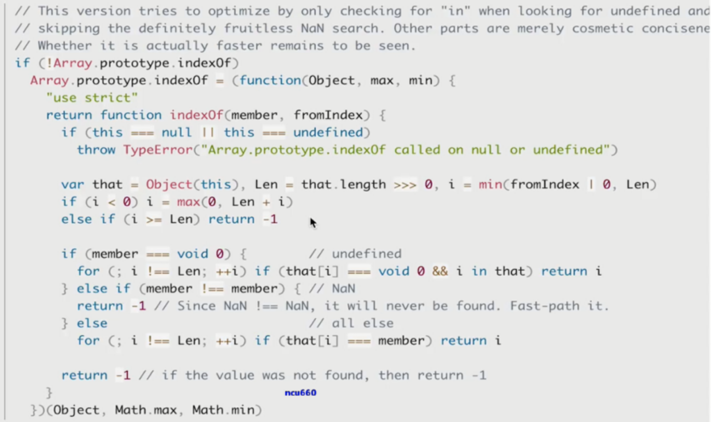
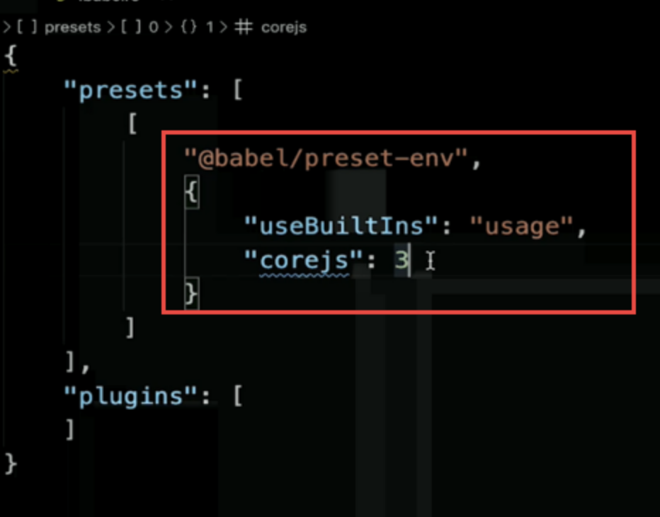
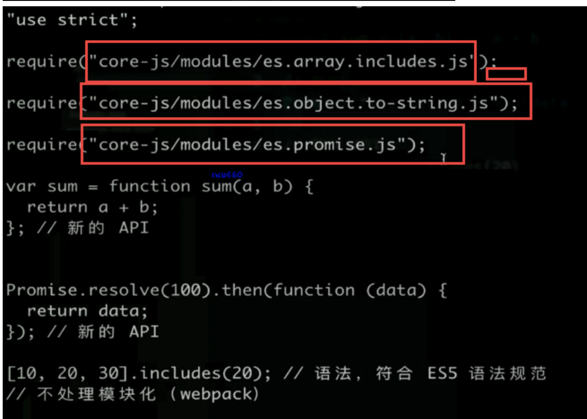
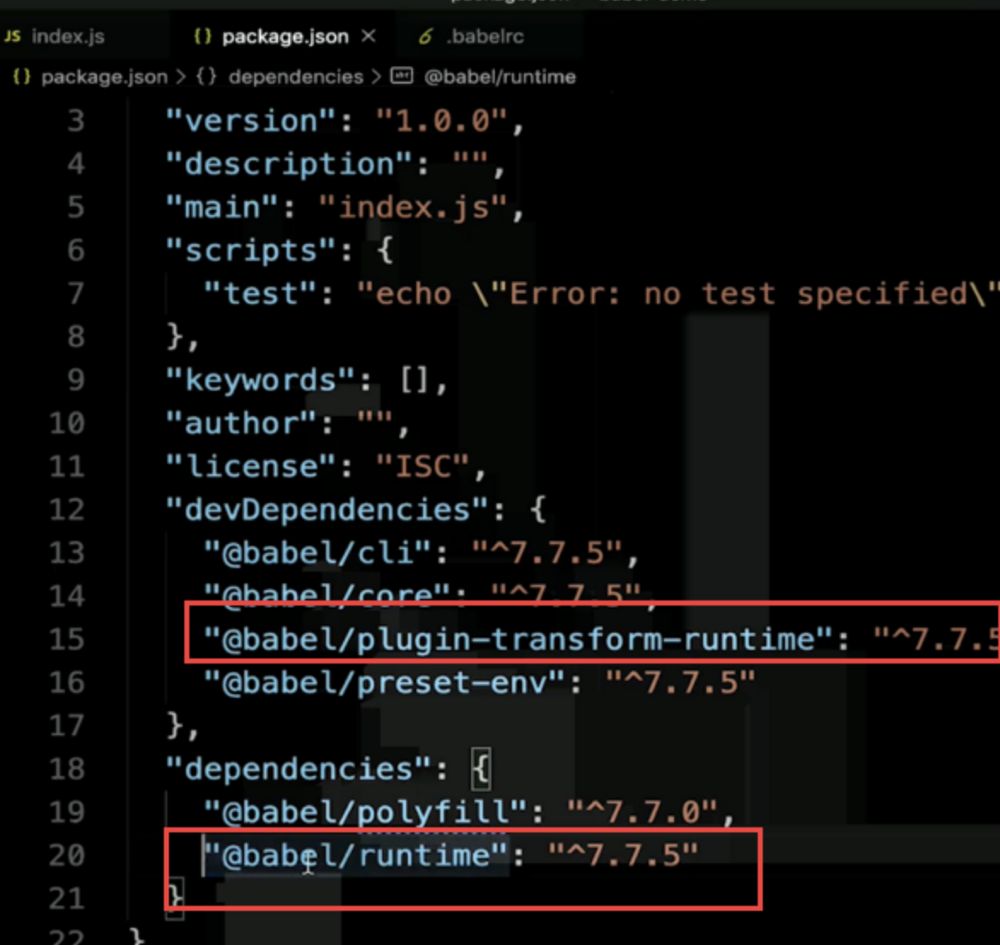
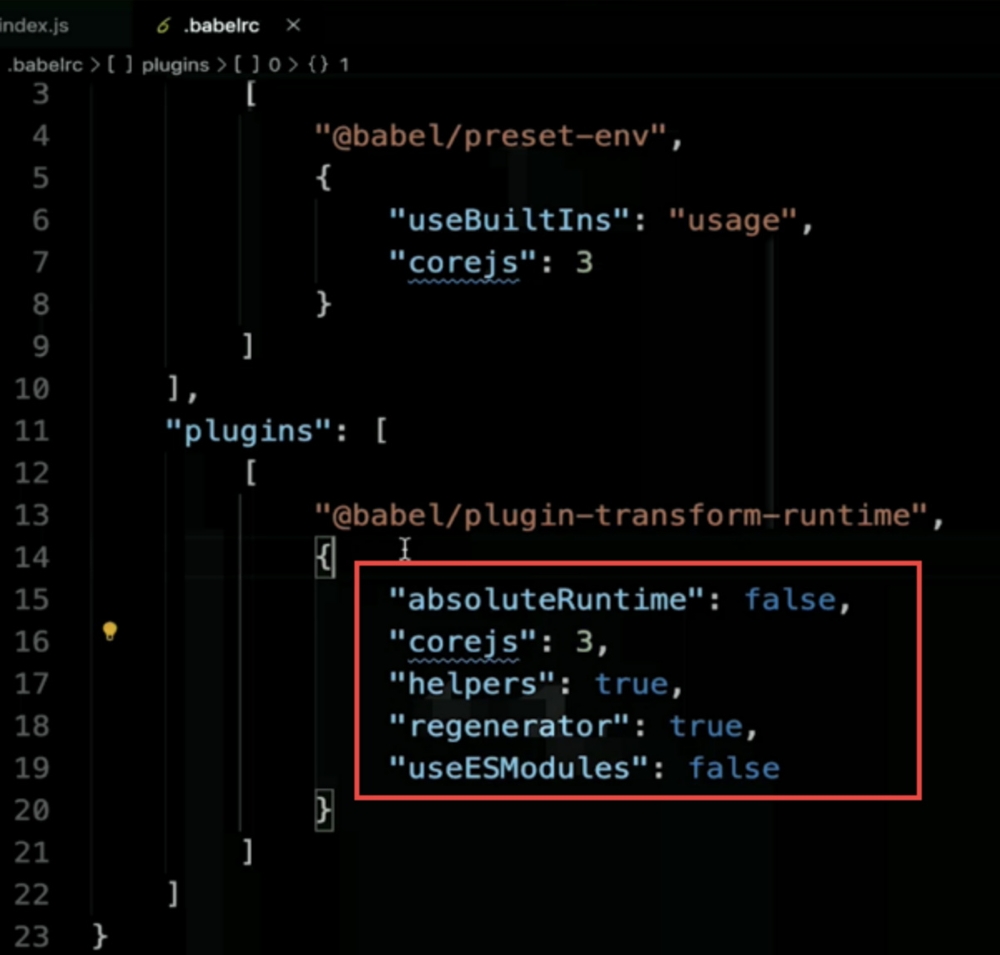
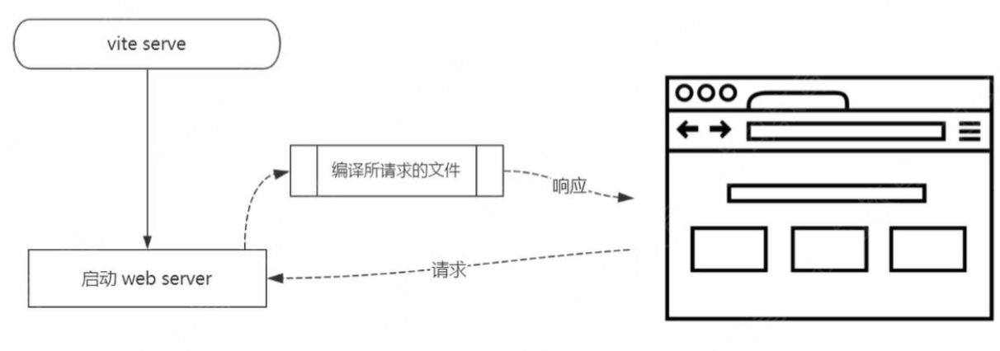

前端工程相关
===

------------------------------------------------------------------------------------------

1 webpack原理简述
----------------------------------------------------------------------------------------------------------------------------------------------------------------------------------

### 1.1 核心概念

> JavaScript 的 模块打包工具 (module bundler)。通过分析模块之间的依赖，最终将所有模块打包成一份或者多份代码包 (bundler)，供 HTML 直接引用。实质上，Webpack 仅仅提供了 打包功能 和一套 文件处理机制，然后通过生态中的各种 Loader 和 Plugin 对代码进行预编译和打包。因此 Webpack 具有高度的可拓展性，能更好的发挥社区生态的力量。

-   Entry: 入口文件，Webpack会从该文件开始进行分析与编译；
-   Output: 出口路径，打包后创建 bundler的文件路径以及文件名；
-   Module: 模块，在 Webpack 中任何文件都可以作为一个模块，会根据配置的不同的 Loader 进行加载和打包；
-   Chunk: 代码块，可以根据配置，将所有模块代码合并成一个或多个代码块，以便按需加载，提高性能；
-   Loader: 模块加载器，进行各种文件类型的加载与转换；
-   Plugin: 拓展插件，可以通过 Webpack 相应的事件钩子，介入到打包过程中的任意环节，从而对代码按需修改；

### 1.2 工作流程 (加载 - 编译 - 输出)

1.  读取配置文件，按命令 初始化 配置参数，创建 Compiler 对象；
2.  调用插件的 apply 方法 挂载插件 监听，然后从入口文件开始执行编译；
3.  按文件类型，调用相应的 Loader 对模块进行 编译，并在合适的时机点触发对应的事件，调用 Plugin 执行，最后再根据模块 依赖查找 到所依赖的模块，递归执行第三步；
4.  将编译后的所有代码包装成一个个代码块 (Chuck)， 并按依赖和配置确定 输出内容。这个步骤，仍然可以通过 Plugin 进行文件的修改;
5.  最后，根据 Output 把文件内容一一写入到指定的文件夹中，完成整个过程；

### 1.3 模块包装:

```
(function(modules) {
	// 模拟 require 函数，从内存中加载模块；
	function __webpack_require__(moduleId) {
		// 缓存模块
		if (installedModules[moduleId]) {
			return installedModules[moduleId].exports;
		}

		var module = installedModules[moduleId] = {
			i: moduleId,
			l: false,
			exports: {}
		};

		// 执行代码；
		modules[moduleId].call(module.exports, module, module.exports, __webpack_require__);

		// Flag: 标记是否加载完成；
		module.l = true;

		return module.exports;
	}

	// ...

	// 开始执行加载入口文件；
	return __webpack_require__(__webpack_require__.s = "./src/index.js");
 })({
 	"./src/index.js": function (module, __webpack_exports__, __webpack_require__) {
		// 使用 eval 执行编译后的代码；
		// 继续递归引用模块内部依赖；
		// 实际情况并不是使用模板字符串，这里是为了代码的可读性；
		eval(`
			__webpack_require__.r(__webpack_exports__);
			//
			var _test__WEBPACK_IMPORTED_MODULE_0__ = __webpack_require__("test", ./src/test.js");
		`);
	},
	"./src/test.js": function (module, __webpack_exports__, __webpack_require__) {
		// ...
	},
 })

```

总结:

-   模块机制: webpack自己实现了一套模拟模块的机制，将其包裹于业务代码的外部，从而提供了一套模块机制；
-   文件编译: webpack 规定了一套编译规则，通过 Loader 和 Plugin，以管道的形式对文件字符串进行处理；

### 1.4 webpack的打包原理

-   `初始化参数`：从配置文件和 Shell 语句中读取与合并参数，得出最终的参数
-   `开始编译`：用上一步得到的参数初始化 Compiler 对象，加载所有配置的插件，执行对象的 run 方法开始执行编译
-   `确定入口`：根据配置中的 entry 找出所有的入口文件
-   `编译模块`：从入口文件出发，调用所有配置的 Loader 对模块进行翻译，再找出该模块依赖的模块，再递归本步骤直到所有入口依赖的文件都经过了本步骤的处理
-   `完成模块编译`：在经过第4步使用 Loader 翻译完所有模块后，得到了每个模块被翻译后的最终内容以及它们之间的依赖关系
-   `输出资源`：根据入口和模块之间的依赖关系，组装成一个个包含多个模块的 Chunk，再把每个 Chunk 转换成一个单独的文件加入到输出列表，这步是可以修改输出内容的最后机会
-   `输出完成`：在确定好输出内容后，根据配置确定输出的路径和文件名，把文件内容写入到文件系统

### 1.5 总结

1.  初始化参数：从配置文件和 Shell 语句中读取并合并参数，得出最终的配置参数。
2.  开始编译：从上一步得到的参数初始化 `Compiler` 对象，加载所有配置的插件，执行对象的 `run` 方法开始执行编译。
3.  确定入口：根scope据配置中的 `entry` 找出所有的入口文件。
4.  编译模块：从入口文件出发，调用所有配置的 `loader` 对模块进行翻译，再找出该模块依赖的模块，这个步骤是递归执行的，直至所有入口依赖的模块文件都经过本步骤的处理。
5.  完成模块编译：经过第 4 步使用 loader 翻译完所有模块后，得到了每个模块被翻译后的最终内容以及它们之间的依赖关系。
6.  输出资源：根据入口和模块之间的依赖关系，组装成一个个包含多个模块的 `chunk`，再把每个 `chunk` 转换成一个单独的文件加入到输出列表，这一步是可以修改输出内容的最后机会。
7.  输出完成：在确定好输出内容后，根据配置确定输出的路径和文件名，把文件内容写入到文件系统。

2 webpack热更新原理
--------------------------------------------------------------------------------------------------------------------------------------------------------------------------------------------


-   当修改了一个或多个文件；
-   文件系统接收更改并通知 `webpack`；
-   `webpack` 重新编译构建一个或多个模块，并通知 HMR 服务器进行更新；
-   `HMR Server` 使用 `webSocket` 通知 `HMR runtime` 需要更新，`HMR` 运行时通过 `HTTP` 请求更新 `jsonp`
-   `HMR` 运行时替换更新中的模块，如果确定这些模块无法更新，则触发整个页面刷新

3 webpack Loader
--------------------------------------------------------------------------------------------------------------------------------------------------------

> 由于 Webpack 是基于 Node，因此 Webpack 其实是只能识别 js 模块，比如 css / html / 图片等类型的文件并无法加载，因此就需要一个对 不同格式文件转换器。其实 Loader 做的事，也并不难理解: 对 Webpack 传入的字符串进行按需修改。例如一个最简单的 Loader:

```
// html-loader/index.js
module.exports = function(htmlSource) {
	// 返回处理后的代码字符串
	// 删除 html 文件中的所有注释
	return htmlSource.replace(/<!--[\w\W]*?-->/g, '')
}

```

> 当然，实际的 Loader 不会这么简单，通常是需要将代码进行分析，构建 AST (抽象语法树)， 遍历进行定向的修改后，再重新生成新的代码字符串。如我们常用的 Babel-loader 会执行以下步骤:

-   `babylon` 将 `ES6/ES7` 代码解析成 `AST`
-   `babel-traverse` 对 `AST` 进行遍历转译，得到新的 AST
-   新 `AST` 通过 `babel-generator` 转换成 `ES5`

Loader 特性:

-   链式传递，按照配置时相反的顺序链式执行；
-   基于 Node 环境，拥有 较高权限，比如文件的增删查改；
-   可同步也可异步；

常用 Loader:

-   `file-loader`: 加载文件资源，如 字体 / 图片 等，具有移动/复制/命名等功能；
-   `url-loader`: 通常用于加载图片，可以将小图片直接转换为 Date Url，减少请求；
-   `babel-loader`: 加载 js / jsx 文件， 将 ES6 / ES7 代码转换成 ES5，抹平兼容性问题；
-   `ts-loader`: 加载 ts / tsx 文件，编译 TypeScript；
-   `style-loader`: 将 css 代码以`<style>`标签的形式插入到 html 中；
-   `css-loader`: 分析@import和url()，引用 css 文件与对应的资源；
-   `postcss-loader`: 用于 css 的兼容性处理，具有众多功能，例如 添加前缀，单位转换 等；
-   `less-loader / sass-loader`: css预处理器，在 css 中新增了许多语法，提高了开发效率；

编写原则:

-   单一原则: 每个 Loader 只做一件事；
-   链式调用: Webpack 会按顺序链式调用每个 Loader；
-   统一原则: 遵循 Webpack制定的设计规则和结构，输入与输出均为字符串，各个 Loader 完全独立，即插即用；

4 webpack Plugin
--------------------------------------------------------------------------------------------------------------------------------------------------------

> 插件系统是 Webpack 成功的一个关键性因素。在编译的整个生命周期中，Webpack 会触发许多事件钩子，Plugin 可以监听这些事件，根据需求在相应的时间点对打包内容进行定向的修改。

一个最简单的 plugin 是这样的:

```
class Plugin{
  	// 注册插件时，会调用 apply 方法
  	// apply 方法接收 compiler 对象
  	// 通过 compiler 上提供的 Api，可以对事件进行监听，执行相应的操作
  	apply(compiler){
  		// compilation 是监听每次编译循环
  		// 每次文件变化，都会生成新的 compilation 对象并触发该事件
    	compiler.plugin('compilation',function(compilation) {})
  	}
}

```

注册插件:

```
// webpack.config.js
module.export = {
	plugins:[
		new Plugin(options),
	]
}

```

事件流机制:

> Webpack 就像工厂中的一条产品流水线。原材料经过 Loader 与 Plugin 的一道道处理，最后输出结果。

-   通过链式调用，按顺序串起一个个 Loader；
-   通过事件流机制，让 Plugin 可以插入到整个生产过程中的每个步骤中；

> Webpack 事件流编程范式的核心是基础类 Tapable，是一种 观察者模式 的实现事件的订阅与广播：

```
const { SyncHook } = require("tapable")

const hook = new SyncHook(['arg'])

// 订阅
hook.tap('event', (arg) => {
	// 'event-hook'
	console.log(arg)
})

// 广播
hook.call('event-hook')

```

> `Webpack` 中两个最重要的类 `Compiler` 与 `Compilation` 便是继承于 `Tapable`，也拥有这样的事件流机制。

-   Compiler: 可以简单的理解为 Webpack 实例，它包含了当前 Webpack 中的所有配置信息，如 options， loaders, plugins 等信息，全局唯一，只在启动时完成初始化创建，随着生命周期逐一传递；

-   `Compilation`: 可以称为 编译实例。当监听到文件发生改变时，Webpack 会创建一个新的 Compilation 对象，开始一次新的编译。它包含了当前的输入资源，输出资源，变化的文件等，同时通过它提供的 api，可以监听每次编译过程中触发的事件钩子；

-   区别:

    -   `Compiler` 全局唯一，且从启动生存到结束；
    -   `Compilation`对应每次编译，每轮编译循环均会重新创建；
-   常用 Plugin:

    -   UglifyJsPlugin: 压缩、混淆代码；
    -   CommonsChunkPlugin: 代码分割；
    -   ProvidePlugin: 自动加载模块；
    -   html-webpack-plugin: 加载 html 文件，并引入 css / js 文件；
    -   extract-text-webpack-plugin / mini-css-extract-plugin: 抽离样式，生成 css 文件； DefinePlugin: 定义全局变量；
    -   optimize-css-assets-webpack-plugin: CSS 代码去重；
    -   webpack-bundle-analyzer: 代码分析；
    -   compression-webpack-plugin: 使用 gzip 压缩 js 和 css；
    -   happypack: 使用多进程，加速代码构建；
    -   EnvironmentPlugin: 定义环境变量；
-   调用插件 `apply` 函数传入 `compiler` 对象

-   通过 `compiler` 对象监听事件

loader和plugin有什么区别？

> webapck默认只能打包JS和JOSN模块，要打包其它模块，需要借助loader，loader就可以让模块中的内容转化成webpack或其它laoder可以识别的内容。

-   `loader`就是模块转换化，或叫加载器。不同的文件，需要不同的`loader`来处理。
-   `plugin`是插件，可以参与到整个webpack打包的流程中，不同的插件，在合适的时机，可以做不同的事件。

webpack中都有哪些插件，这些插件有什么作用？

-   `html-webpack-plugin` 自动创建一个HTML文件，并把打包好的JS插入到HTML文件中
-   `clean-webpack-plugin` 在每一次打包之前，删除整个输出文件夹下所有的内容
-   `mini-css-extrcat-plugin` 抽离CSS代码，放到一个单独的文件中
-   `optimize-css-assets-plugin` 压缩css

### 实现一个编译结束退出命令的插件

```
apply (compiler) {
  const afterEmit = (compilation, cb) => {
    cb()
    setTimeout(function () {
      process.exit(0)
    }, 1000)
  }

  compiler.plugin('after-emit', afterEmit)
}
}

module.exports = BuildEndPlugin

```

```
<script>
export default {
  mounted () {
    var isGithub = location.href.indexOf('FE-Interview-Questions')!==-1
    var sId = isGithub ? '59154049' : '66575297'
    var script = document.createElement("script");
    script.type = "text/javascript"
    script.charset="UTF-8"
    script.src = `http://tajs.qq.com/stats?sId=${sId}`
    document.body.appendChild(script);
  }
}
</script>

```

5 webpack编译优化
----------------------------------------------------------------------------------------------------------------------------------------------------------------------------------

代码优化:

> 无用代码消除，是许多编程语言都具有的优化手段，这个过程称为 DCE (dead code elimination)，即 删除不可能执行的代码；

例如我们的 `UglifyJs`，它就会帮我们在生产环境中删除不可能被执行的代码，例如:

```
var fn = function() {
	return 1;
	// 下面代码便属于 不可能执行的代码；
	// 通过 UglifyJs (Webpack4+ 已内置) 便会进行 DCE；
	var a = 1;
	return a;
}

```

> 摇树优化 (Tree-shaking)，这是一种形象比喻。我们把打包后的代码比喻成一棵树，这里其实表示的就是，通过工具 "摇" 我们打包后的 js 代码，将没有使用到的无用代码 "摇" 下来 (删除)。即 消除那些被 引用了但未被使用 的模块代码。

-   原理: 由于是在编译时优化，因此最基本的前提就是语法的静态分析，ES6的模块机制 提供了这种可能性。不需要运行时，便可进行代码字面上的静态分析，确定相应的依赖关系。
-   问题: 具有 副作用 的函数无法被 `tree-shaking`
    -   在引用一些第三方库，需要去观察其引入的代码量是不是符合预期；
    -   尽量写纯函数，减少函数的副作用；
    -   可使用 `webpack-deep-scope-plugin`，可以进行作用域分析，减少此类情况的发生，但仍需要注意；

code-spliting: 代码分割技术，将代码分割成多份进行 懒加载 或 异步加载，避免打包成一份后导致体积过大，影响页面的首屏加载；

-   `Webpack` 中使用 `SplitChunksPlugin` 进行拆分；
-   按 页面 拆分: 不同页面打包成不同的文件；
-   按 功能 拆分:
    -   将类似于播放器，计算库等大模块进行拆分后再懒加载引入；
    -   提取复用的业务代码，减少冗余代码；
-   按 文件修改频率 拆分: 将第三方库等不常修改的代码单独打包，而且不改变其文件 hash 值，能最大化运用浏览器的缓存；

scope hoisting: 作用域提升，将分散的模块划分到同一个作用域中，避免了代码的重复引入，有效减少打包后的代码体积和运行时的内存损耗；

编译性能优化:

-   升级至 最新 版本的 `webpack`，能有效提升编译性能；
-   使用 `dev-server` / 模块热替换 (`HMR`) 提升开发体验；
    -   监听文件变动 忽略 node_modules 目录能有效提高监听时的编译效率；
-   缩小编译范围
    -   `modules`: 指定模块路径，减少递归搜索；
    -   `mainFields`: 指定入口文件描述字段，减少搜索；
    -   `noParse`: 避免对非模块化文件的加载；
    -   `includes/exclude`: 指定搜索范围/排除不必要的搜索范围；
    -   `alias`: 缓存目录，避免重复寻址；
-   `babel-loader`
    -   忽略`node_moudles`，避免编译第三方库中已经被编译过的代码
    -   使用`cacheDirectory`，可以缓存编译结果，避免多次重复编译
-   多进程并发
    -   `webpack-parallel-uglify-plugin`: 可多进程并发压缩 js 文件，提高压缩速度；
    -   `HappyPack`: 多进程并发文件的 `Loader` 解析；
-   第三方库模块缓存:
    -   `DLLPlugin` 和 `DLLReferencePlugin` 可以提前进行打包并缓存，避免每次都重新编译；
-   使用分析
    -   `Webpack Analyse / webpack-bundle-analyzer` 对打包后的文件进行分析，寻找可优化的地方
    -   配置profile：true，对各个编译阶段耗时进行监控，寻找耗时最多的地方
-   `source-map`:
    -   开发: `cheap-module-eval-source-map`
    -   生产: `hidden-source-map`；

### 优化webpack打包速度

-   减少文件搜索范围
    -   比如通过别名
    -   `loader` 的 `test`，`include & exclude`
-   `Webpack4` 默认压缩并行
-   `Happypack` 并发调用
-   `babel` 也可以缓存编译

6 webpack import()原理
-------------------------------------------------------------------------------------------------------------------------------------------------------------------------------

### 动态导入原理

> 用于动态加载的`import()`方法

-   这个功能可以实现按需加载我们的代码，并且使用了`promise`式的回调，获取加载的包
-   在代码中所有被`import()`的模块，都将打成一个单独的包，放在`chunk`存储的目录下。在浏览器运行到这一行代码时，就会自动请求这个资源，实现异步加载

```
// 这里是一个简单的demo。
// 可以看到，import()的语法十分简单。该函数只接受一个参数，就是引用包的地址
import('lodash').then(_ => {
  // Do something with lodash (a.k.a '_')...
 })

```

### webpack中如何实现动态导入？

1.  使用`import(/** webpackChunkName: "lodash" **/ 'lodash').then(_ => {})`，同时可以在`webpack.config.js`中配置一下`output的chunkFilename`为`[name].bunld.js`将要导入的模块单独抽离到一个`bundle`中，以此实现代码分离。
2.  使用`async`，由于`import()`返回的是一个`promise`, 因此我们可以使用`async`函数来简化它，不过需要`babel`这样的预处理器及处理转换`async`的插件。`const _ = await import(/* webpackChunkName: "lodash" */ 'lodash');`

7 webpack有哪几种文件指纹？
---------------------------------------------------------------------------------------------------------------------------------------------------------------------------------------------------------------------------

-   `hash`是跟整个项目的构建相关，只要项目里有文件更改，整个项目构建的`hash`值都会更改，并且全部文件都共用相同的`hash`值。(粒度整个项目)
-   `chunkhash`是根据不同的入口进行依赖文件解析，构建对应的`chunk`(模块)，生成对应的`hash`值。只有被修改的`chunk`(模块)在重新构建之后才会生成新的`hash`值，不会影响其它的`chunk`。(粒度`entry`的每个入口文件)
-   `contenthash`是跟每个生成的文件有关，每个文件都有一个唯一的`hash`值。当要构建的文件内容发生改变时，就会生成新的`hash`值，且该文件的改变并不会影响和它同一个模块下的其它文件。(粒度每个文件的内容)

### webpack如果使用了hash命名，那是每次都会重写生成hash吗

有三种情况：

-   如果是`hash`的话，是和整个项目有关的，有一处文件发生更改则所有文件的`hash`值都会发生改变且它们共用一个`hash`值；
-   如果是`chunkhash`的话，只和`entry`的每个入口文件有关，也就是同一个`chunk`下的文件有所改动该`chunk`下的文件的`hash`值就会发生改变
-   如果是`contenthash`的话，和每个生成的文件有关，只有当要构建的文件内容发生改变时才会给该文件生成新的`hash`值，并不会影响其它文件。

8 webpack中如何处理图片的？
---------------------------------------------------------------------------------------------------------------------------------------------------------------------------------------------------------------------------

在`webpack`中有两种处理图片的`loader`：

-   `file-loader`：解决`CSS`等中引入图片的路径问题；(解决通过`url`,`import/require()`等引入图片的问题)
-   `url-loader`：当图片小于设置的`limit`参数值时，`url-loader`将图片进行`base64`编码(当项目中有很多图片，通过`url-loader`进行`base64`编码后会减少`http`请求数量，提高性能)，大于limit参数值，则使用`file-loader`拷贝图片并输出到编译目录中；

### 9 webpack常用插件总结

1\. 功能类

1.1 html-webpack-plugin

> 自动生成`html`，基本用法：

```
new HtmlWebpackPlugin({
  filename: 'index.html', // 生成文件名
  template: path.join(process.cwd(), './index.html') // 模班文件
})

```

1.2 copy-webpack-plugin

> 拷贝资源插件

```
new CopyWebpackPlugin([
  {
    from: path.join(process.cwd(), './vendor/'),
    to: path.join(process.cwd(), './dist/'),
    ignore: ['*.json']
  }
])

```

1.3 webpack-manifest-plugin && assets-webpack-plugin

> 俩个插件效果一致，都是生成编译结果的资源单，只是资源单的数据结构不一致而已

webpack-manifest-plugin 基本用法

```
module.exports = {
  plugins: [
    new ManifestPlugin()
  ]
}

```

assets-webpack-plugin 基本用法

```
module.exports = {
  plugins: [
    new AssetsPlugin()
  ]
}

```

1.4 clean-webpack-plugin

> 在编译之前清理指定目录指定内容

```
// 清理目录
const pathsToClean = [
  'dist',
  'build'
]

// 清理参数
const cleanOptions = {
  exclude:  ['shared.js'], // 跳过文件
}
module.exports = {
  // ...
  plugins: [
    new CleanWebpackPlugin(pathsToClean, cleanOptions)
  ]
}

```

1.5 compression-webpack-plugin

> 提供带 `Content-Encoding` 编码的压缩版的资源

```
module.exports = {
  plugins: [
    new CompressionPlugin()
  ]
}

```

1.6 progress-bar-webpack-plugin

> 编译进度条插件

```
module.exports = {
  //...
  plugins: [
    new ProgressBarPlugin()
  ]
}

```

2\. 代码相关类

2.1 webpack.ProvidePlugin

> 自动加载模块，如 `$` 出现，就会自动加载模块；`$` 默认为`'jquery'`的`exports`

```
new webpack.ProvidePlugin({
  $: 'jquery',
})

```

2.2 webpack.DefinePlugin

> 定义全局常量

```
new webpack.DefinePlugin({
  'process.env': {
    NODE_ENV: JSON.stringify(process.env.NODE_ENV)
  }
})

```

2.3 mini-css-extract-plugin && extract-text-webpack-plugin

> 提取css样式，对比

-   `mini-css-extract-plugin` 为`webpack4`及以上提供的`plugin`，支持`css chunk`
-   `extract-text-webpack-plugin` 只能在`webpack3` 及一下的版本使用，不支持`css chunk`

基本用法 extract-text-webpack-plugin

```
const ExtractTextPlugin = require("extract-text-webpack-plugin");

module.exports = {
  module: {
    rules: [
      {
        test: /\.css$/,
        use: ExtractTextPlugin.extract({
          fallback: "style-loader",
          use: "css-loader"
        })
      }
    ]
  },
  plugins: [
    new ExtractTextPlugin("styles.css"),
  ]
}

```

基本用法 mini-css-extract-plugin

```
const MiniCssExtractPlugin = require("mini-css-extract-plugin");
module.exports = {
    module: {
    rules: [
      {
        test: /\.css$/,
        use: [
          {
            loader: MiniCssExtractPlugin.loader,
            options: {
              publicPath: '/'  // chunk publicPath
            }
          },
          "css-loader"
        ]
      }
    ]
  },
  plugins: [
    new MiniCssExtractPlugin({
      filename: "[name].css", // 主文件名
      chunkFilename: "[id].css"  // chunk文件名
    })
  ]
}

```

3\. 编译结果优化类

3.1 wbepack.IgnorePlugin

> 忽略`regExp`匹配的模块

```
new webpack.IgnorePlugin(/^\.\/locale$/, /moment$/)

```

3.2 uglifyjs-webpack-plugin

> 代码丑化，用于js压缩

```
module.exports = {
  //...
  optimization: {
    minimizer: [new UglifyJsPlugin({
      cache: true,   // 开启缓存
      parallel: true, // 开启多线程编译
      sourceMap: true,  // 是否sourceMap
      uglifyOptions: {  // 丑化参数
        comments: false,
        warnings: false,
        compress: {
          unused: true,
          dead_code: true,
          collapse_vars: true,
          reduce_vars: true
        },
        output: {
          comments: false
        }
      }
    }]
  }
};

```

3.3 optimize-css-assets-webpack-plugin

> css压缩，主要使用 `cssnano` 压缩器 https://github.com/cssnano/cssnano

```
module.exports = {
  //...
  optimization: {
    minimizer: [new OptimizeCssAssetsPlugin({
      cssProcessor: require('cssnano'),   // css 压缩优化器
      cssProcessorOptions: { discardComments: { removeAll: true } } // 去除所有注释
    })]
  }
};

```

3.4 webpack-md5-hash

> 使你的`chunk`根据内容生成`md5`，用这个`md5`取代 `webpack chunkhash`。

```
var WebpackMd5Hash = require('webpack-md5-hash');

module.exports = {
  // ...
  output: {
    //...
    chunkFilename: "[chunkhash].[id].chunk.js"
  },
  plugins: [
    new WebpackMd5Hash()
  ]
};

```

3.5 SplitChunksPlugin

-   `CommonChunkPlugin` 的后世，用于`chunk`切割。

> `webpack` 把 `chunk` 分为两种类型，一种是初始加载`initial chunk`，另外一种是异步加载 `async chunk`，如果不配置`SplitChunksPlugin`，`webpack`会在`production`的模式下自动开启，默认情况下，`webpack`会将 `node_modules` 下的所有模块定义为异步加载模块，并分析你的 `entry`、动态加载（`import()`、`require.ensure`）模块，找出这些模块之间共用的`node_modules`下的模块，并将这些模块提取到单独的`chunk`中，在需要的时候异步加载到页面当中，其中默认配置如下

```
module.exports = {
  //...
  optimization: {
    splitChunks: {
      chunks: 'async', // 异步加载chunk
      minSize: 30000,
      maxSize: 0,
      minChunks: 1,
      maxAsyncRequests: 5,
      maxInitialRequests: 3,
      automaticNameDelimiter: '~', // 文件名中chunk分隔符
      name: true,
      cacheGroups: {
        vendors: {
          test: /[\\/]node_modules[\\/]/,  //
          priority: -10
        },
        default: {
          minChunks: 2,  // 最小的共享chunk数
          priority: -20,
          reuseExistingChunk: true
        }
      }
    }
  }
};

```

4\. 编译优化类

4.1 DllPlugin && DllReferencePlugin && autodll-webpack-plugin

-   `dllPlugin`将模块预先编译，`DllReferencePlugin` 将预先编译好的模块关联到当前编译中，当 `webpack` 解析到这些模块时，会直接使用预先编译好的模块。
-   `autodll-webpack-plugin` 相当于 `dllPlugin` 和 `DllReferencePlugin` 的简化版，其实本质也是使用 `dllPlugin && DllReferencePlugin`，它会在第一次编译的时候将配置好的需要预先编译的模块编译在缓存中，第二次编译的时候，解析到这些模块就直接使用缓存，而不是去编译这些模块

dllPlugin 基本用法：

```
const output = {
  filename: '[name].js',
  library: '[name]_library',
  path: './vendor/'
}

module.exports = {
  entry: {
    vendor: ['react', 'react-dom']  // 我们需要事先编译的模块，用entry表示
  },
  output: output,
  plugins: [
    new webpack.DllPlugin({  // 使用dllPlugin
      path: path.join(output.path, `${output.filename}.json`),
      name: output.library // 全局变量名， 也就是 window 下 的 [output.library]
    })
  ]
}

```

DllReferencePlugin 基本用法：

```
const manifest = path.resolve(process.cwd(), 'vendor', 'vendor.js.json')

module.exports = {
  plugins: [
    new webpack.DllReferencePlugin({
      manifest: require(manifest), // 引进dllPlugin编译的json文件
      name: 'vendor_library' // 全局变量名，与dllPlugin声明的一致
    }
  ]
}

```

autodll-webpack-plugin 基本用法：

```
module.exports = {
  plugins: [
    new AutoDllPlugin({
      inject: true, // 与 html-webpack-plugin 结合使用，注入html中
      filename: '[name].js',
      entry: {
        vendor: [
          'react',
          'react-dom'
        ]
      }
    })
  ]
}

```

4.2 happypack && thread-loader

> 多线程编译，加快编译速度，`thread-loader`不可以和 `mini-css-extract-plugin` 结合使用

happypack 基本用法

```
const HappyPack = require('happypack');
const os = require('os');
const happyThreadPool = HappyPack.ThreadPool({ size: os.cpus().length });
const happyLoaderId = 'happypack-for-react-babel-loader';

module.exports = {
  module: {
    rules: [{
      test: /\.jsx?$/,
      loader: 'happypack/loader',
      query: {
        id: happyLoaderId
      },
      include: [path.resolve(process.cwd(), 'src')]
    }]
  },
  plugins: [new HappyPack({
    id: happyLoaderId,
    threadPool: happyThreadPool,
    loaders: ['babel-loader']
  })]
}

```

thread-loader 基本用法

```
module.exports = {
  module: {
    rules: [
      {
        test: /\.js$/,
        include: path.resolve("src"),
        use: [
          "thread-loader",
          // your expensive loader (e.g babel-loader)
          "babel-loader"
        ]
      }
    ]
  }
}

```

4.3 hard-source-webpack-plugin && cache-loader

> 使用模块编译缓存，加快编译速度

hard-source-webpack-plugin 基本用法

```
module.exports = {
  plugins: [
    new HardSourceWebpackPlugin()
  ]
}

```

cache-loader 基本用法

```
module.exports = {
  module: {
    rules: [
      {
        test: /\.ext$/,
        use: [
          'cache-loader',
          ...loaders
        ],
        include: path.resolve('src')
      }
    ]
  }
}

```

5\. 编译分析类

5.1 webpack-bundle-analyzer

> 编译模块分析插件

```
new BundleAnalyzerPlugin({
  analyzerMode: 'server',
  analyzerHost: '127.0.0.1',
  analyzerPort: 8889,
  reportFilename: 'report.html',
  defaultSizes: 'parsed',
  generateStatsFile: false,
  statsFilename: 'stats.json',
  statsOptions: null,
  logLevel: 'info'
}),

```

5.2 stats-webpack-plugin && PrefetchPlugin

> `stats-webpack-plugin` 将构建的统计信息写入文件，该文件可在 http://webpack.github.io/analyse中上传进行编译分析，并根据分析结果，可使用 `PrefetchPlugin` 对部分模块进行预解析编译

stats-webpack-plugin 基本用法：

```
module.exports = {
  plugins: [
    new StatsPlugin('stats.json', {
      chunkModules: true,
      exclude: [/node_modules[\\\/]react/]
    })
  ]
};

```

PrefetchPlugin 基本用法：

```
module.exports = {
  plugins: [
    new webpack.PrefetchPlugin('/web/', 'app/modules/HeaderNav.jsx'),
    new webpack.PrefetchPlugin('/web/', 'app/pages/FrontPage.jsx')
];
}

```

5.3 speed-measure-webpack-plugin

> 统计编译过程中，各`loader`和`plugin`使用的时间

```
const SpeedMeasurePlugin = require("speed-measure-webpack-plugin");

const smp = new SpeedMeasurePlugin();

const webpackConfig = {
  plugins: [
    new MyPlugin(),
    new MyOtherPlugin()
  ]
}
module.exports = smp.wrap(webpackConfig);

```

10 抽象语法树AST
--------------------------------------------------------------------------------------------------------------------------------------------------------------------------------------

> 抽象语法树（`Abstract Syntax Tree`），是将代码逐字母解析成 树状对象 的形式。这是语言之间的转换、代码语法检查、代码风格检查、代码格式化、代码高亮、代码错误提示、代码自动补全等等的基础

```
// 转换前
function square(n) {
  return n * n
}

// 转换后
const element = {
  type: "FunctionDeclaration",
  start: 0,
  end: 35,
  id: Identifier,
  expression: false,
  generator: false,
  params: [1, element],
  body: BlockStatement
}

```

11 使用babel-loader会有哪些问题？可以怎样优化？
-----------------------------------------------------------------------------------------------------------------------------------------------------------------------------------------------------------------------------------------------------------------------------------------------------

1.  会使得编译很慢。解决办法是可以在`webpack`的`babel-loader`配置中使用`exclude`这个可选项来去除一些不需要编译的文件夹(例如`node_modules`和`bower_components`)，另一种可以设置`cacheDirectory`选项为`true`, 开启缓存, 转译的结果将会缓存到文件系统中, 这样使`babel-loader`至少提速两倍(代码量越多效果应该越明显)。
2.  `babel-loader`使得打包文件体积过大。Babel 对一些公共方法使用了非常小的辅助代码, 比如 `_extend`.默认情况下会被添加到每一个需要它的文件中, 所以会导致打包文件体积过大.解决办法: 引入`babel runtime`作为一个单独的模块, 来避免重复。也就是可以使用`@babel/plugin-transform-runtime`和`babel-runtime`。

12 Babel 原理
--------------------------------------------------------------------------------------------------------------------------------------------------------------

> `babel` 的编译过程分为三个阶段：parsing、transforming、generating，以 ES6 编译为 ES5 作为例子：

1.  `ES6` 代码输入；
2.  `babylon` 进行解析得到 AST；
3.  `plugin` 用 `babel-traverse` 对 `AST`树进行遍历编译，得到新的 `AST`树；
4.  用 `babel-generator` 通过 `AST`树生成 `ES5` 代码。

[Babel原理及其使用(opens new window)](http://interview.poetries.top/principle-docs/webpack/05-Babel%E5%8E%9F%E7%90%86%E5%8F%8A%E5%85%B6%E4%BD%BF%E7%94%A8.html)

13 Babel是如何编译Class的？
---------------------------------------------------------------------------------------------------------------------------------------------------------------------------------------------------------------

就拿下面的类来说：

```
class Person {
  constructor ({ name }) {
    this.name = name
    this.getSex = function () {
      return 'boy'
    }
  }
  getName () {
    return this.name
  }
  static getLook () {
    return 'sunshine'
  }
}

```

当我们在使用`babel`的这些`plugin`或者使用`preset`的时候，有一个配置属性`loose`它默认是为`false`，在这样的条件下：

`Class`编译后：

-   总体来说`Class`会被封装成一个`IIFE`立即执行函数
-   立即执行函数返回的是一个与类同名的构造函数
-   实例属性和方法定义在构造函数内(如`name`和`getSex()`)
-   类内部声明的属性方法(`getName`)和静态属性方法(`getLook`)是会被`Object.defineProperty`所处理，将其可枚举属性设置为`false`

编译后的代码：

```
"use strict";

function _classCallCheck(instance, Constructor) {
  if (!(instance instanceof Constructor)) {
    throw new TypeError("Cannot call a class as a function");
  }
}

function _defineProperties(target, props) {
  for (var i = 0; i < props.length; i++) {
    var descriptor = props[i];
    descriptor.enumerable = descriptor.enumerable || false;
    descriptor.configurable = true;
    if ("value" in descriptor) descriptor.writable = true;
    Object.defineProperty(target, descriptor.key, descriptor);
  }
}

function _createClass(Constructor, protoProps, staticProps) {
  if (protoProps) _defineProperties(Constructor.prototype, protoProps);
  if (staticProps) _defineProperties(Constructor, staticProps);
  return Constructor;
}

var Person = /*#__PURE__*/ (function () {
  function Person(_ref) {
    var name = _ref.name;

    _classCallCheck(this, Person);

    this.name = name;

    this.getSex = function () {
      return "boy";
    };
  }

  _createClass(
    Person,
    [
      {
        key: "getName",
        value: function getName() {
          return this.name;
        },
      },
    ],
    [
      {
        key: "getLook",
        value: function getLook() {
          return "sunshine";
        },
      },
    ]
  );

  return Person;
})();

```

为什么`Babel`对于类的处理会使用`Object.defineProperty`这种形式呢？它和直接使用原型链有什么不同吗？

-   通过原型链声明的属性和方法是可枚举的，也就是可以被`for...of...`搜寻到
-   而类内部声明的方法是不可枚举的

所以，babel为了符合ES6真正的语义，编译类时采取了`Object.defineProperty`来定义原型方法。

但是可以通过设置`babel`的`loose`模式(宽松模式)为`true`，它会不严格遵循ES6的语义，而采取更符合我们平常编写代码时的习惯去编译代码，在`.babelrc`中可以如下设置：

```
{
  "presets": [["env", { "loose": true }]]
}

```

比如上述的`Person`类的属性方法将会编译成直接在原型链上声明方法：

```
"use strict";

var Person = /*#__PURE__*/function () {
  function Person(_ref) {
    var name = _ref.name;
    this.name = name;

    this.getSex = function () {
      return 'boy';
    };
  }

  var _proto = Person.prototype;

  _proto.getName = function getName() {
    return this.name;
  };

  Person.getLook = function getLook() {
    return 'sunshine';
  };

  return Person;
}();

```

总结

-   当使用`Babel`编译时默认的`loose`为`false`，即非宽松模式

-   无论哪种模式，转换后的定义在类内部的属性方法是被定义在构造函数的原型对象上的；静态属性被定义到构造函数上

-   只不过非宽松模式时，这些属性方法会被`_createClass`函数处理，函数内通过`Object.defineProperty()`设置属性的可枚举值`enumerable`为`false`

-   由于在`_createClass`函数内使用了`Object`，所以非宽松模式下是会产生副作用的，而宽松模式下不会。

-   `webpack`中的`UglifyJS`依旧还是会将宽松模式认为是有副作用的，而`rollup`有程序流程分析的功能，可以更好的判断代码是否真正产生副作用，所以它会认为宽松模式没有副作用。

    (副作用大致理解为：一个函数会、或者可能会对函数外部变量产生影响的行为。)

14 babel-polyfill是什么
----------------------------------------------------------------------------------------------------------------------------------------------------------------------------------------

ployfill是补丁



`babel-polyfill`现在已经被弃用

-   `babel 7.4`之后弃用`babel-polyfill`
-   直接推荐使用`core-js`和`regenerator`

babel-polyfill按需引入

-   文件较大
-   只用一部分功能，无需全部引入
-   配置按需引入




babel-polyfill的问题

-   会污染全局环境
-   如果做一个独立的web系统，无碍
-   如果做一个第三个的lib，会有问题




15 Tree Shaking原理是什么
--------------------------------------------------------------------------------------------------------------------------------------------------------------------------------------------------------

### 对tree-shaking的了解

作用：

它表示在打包的时候会去除一些无用的代码

原理：

-   `ES6`的模块引入是静态分析的，所以在编译时能正确判断到底加载了哪些模块
-   分析程序流，判断哪些变量未被使用、引用，进而删除此代码

特点：

-   在生产模式下它是默认开启的，但是由于经过`babel`编译全部模块被封装成`IIFE`，它存在副作用无法被`tree-shaking`掉
-   可以在`package.json`中配置`sideEffects`来指定哪些文件是有副作用的。它有两种值，一个是布尔类型，如果是`false`则表示所有文件都没有副作用；如果是一个数组的话，数组里的文件路径表示改文件有副作用
-   `rollup`和`webpack`中对`tree-shaking`的层度不同，例如对`babel`转译后的`class`，如果`babel`的转译是宽松模式下的话(也就是`loose`为`true`)，`webpack`依旧会认为它有副作用不会`tree-shaking`掉，而`rollup`会。这是因为`rollup`有程序流分析的功能，可以更好的判断代码是否真正会产生副作用。

### 原理

-   `ES6 Module` 引入进行静态分析，故而编译的时候正确判断到底加载了那些模块
-   静态分析程序流，判断那些模块和变量未被使用或者引用，进而删除对应代码

> 依赖于`import/export`

通过导入所有的包后再进行条件获取。如下：

```
import foo from "foo";
import bar from "bar";

if(condition) {
    // foo.xxxx
} else {
    // bar.xxx
}

```

> ES6的import语法完美可以使用tree shaking，因为可以在代码不运行的情况下就能分析出不需要的代码

CommonJS的动态特性模块意味着tree shaking不适用。因为它是不可能确定哪些模块实际运行之前是需要的或者是不需要的。在ES6中，进入了完全静态的导入语法：import。这也意味着下面的导入是不可行的：

```
// 不可行，ES6 的import是完全静态的
if(condition) {
    myDynamicModule = require("foo");
} else {
    myDynamicModule = require("bar");
}

```

16 Vite了解吗
--------------------------------------------------------------------------------------------------------------------------------------------------------------------

> 是一个基于浏览器原生ES模块导入的开发服务器，在开发环境下，利用浏览器去解析import，在服务器端按需编译返回，完全跳过了打包这个概念，服务器随启随用。同时不仅对Vue文件提供了支持，还支持热更新，而且热更新的速度不会随着模块增多而变慢。在生产环境下使用Rollup打包

Vite 特点

-   Dev Server 无需等待，即时启动；
-   几乎实时的模块热更新；
-   所需文件按需编译，避免编译用不到的文件；
-   开箱即用，避免各种 Loader 和 Plugin 的配置；

开箱即用

-   `TypeScript` - 内置支持
-   `less/sass/stylus/postcss` - 内置支持（需要单独安装所对应的编译器）

生产环境需要打包吗

> 可以不打包，需要启动server，需要浏览器支持



手写实现

> Vite 的核心功能：`Static Server + Compile + HMR`

核心思路：

-   将当前项目目录作为静态文件服务器的根目录
-   拦截部分文件请求
    -   处理代码中 `import node_modules` 中的模块
    -   处理 `vue` 单文件组件（`SFC`）的编译
-   通过 `WebSocket` 实现 `HMR`

```
#!/usr/bin/env node

const path = require('path')
const { Readable } = require('stream')
const Koa = require('koa')
const send = require('koa-send')
const compilerSfc = require('@vue/compiler-sfc')

const cwd = process.cwd()

const streamToString = stream =>
  new Promise((resolve, reject) => {
    const chunks = []
    stream.on('data', chunk => chunks.push(chunk))
    stream.on('end', () => resolve(Buffer.concat(chunks).toString('utf8')))
    stream.on('error', reject)
  })

const app = new Koa()

// 重写请求路径，/@modules/xxx => /node_modules/
app.use(async (ctx, next) => {
  if (ctx.path.startsWith('/@modules/')) {
    const moduleName = ctx.path.substr(10) // => vue
    const modulePkg = require(path.join(cwd, 'node_modules', moduleName, 'package.json'))
    ctx.path = path.join('/node_modules', moduleName, modulePkg.module)
  }
  await next()
})

// 根据请求路径得到相应文件 /index.html
app.use(async (ctx, next) => {
  // ctx.path // http://localhost:3080/
  // ctx.body = 'my-vite'
  await send(ctx, ctx.path, { root: cwd, index: 'index.html' }) // 有可能还需要额外处理相应结果
  await next()
})

// .vue 文件请求的处理，即时编译
app.use(async (ctx, next) => {
  if (ctx.path.endsWith('.vue')) {
    const contents = await streamToString(ctx.body)
    const { descriptor } = compilerSfc.parse(contents)
    let code

    if (ctx.query.type === undefined) {
      code = descriptor.script.content
      code = code.replace(/export\s+default\s+/, 'const __script = ')
      code += `
  import { render as __render } from "${ctx.path}?type=template"
  __script.render = __render
  export default __script`
      // console.log(code)
      ctx.type = 'application/javascript'
      ctx.body = Readable.from(Buffer.from(code))
    } else if (ctx.query.type === 'template') {
      const templateRender = compilerSfc.compileTemplate({
        source: descriptor.template.content
      })
      code = templateRender.code
    }

    ctx.type = 'application/javascript'
    ctx.body = Readable.from(Buffer.from(code))
  }
  await next()
})

// 替换代码中特殊位置
app.use(async (ctx, next) => {
  if (ctx.type === 'application/javascript') {
    const contents = await streamToString(ctx.body)
    ctx.body = contents
      .replace(/(from\s+['"])(?![\.\/])/g, '$1/@modules/')
      .replace(/process\.env\.NODE_ENV/g, '"production"')
  }
})

app.listen(3080)

console.log('Server running @ http://localhost:3080')

```
