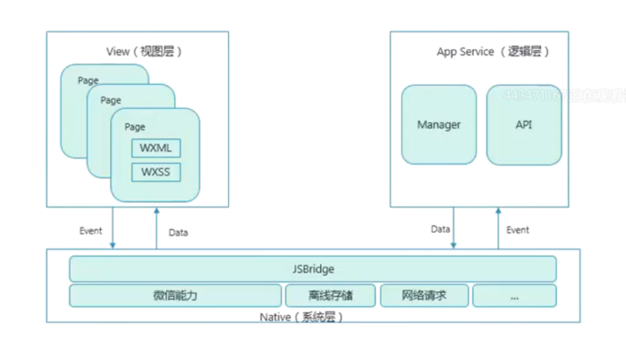
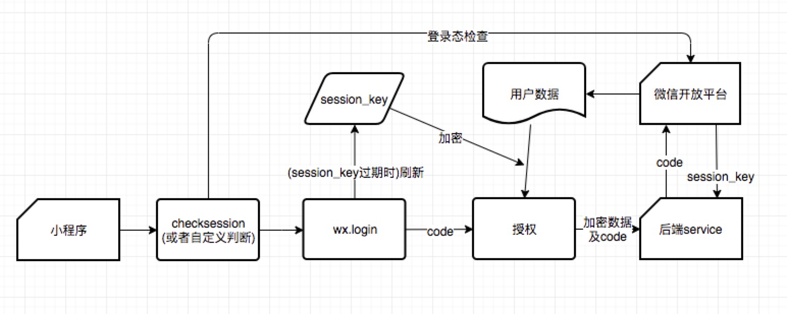
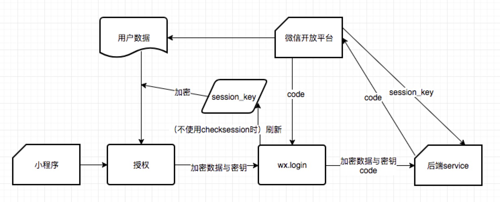
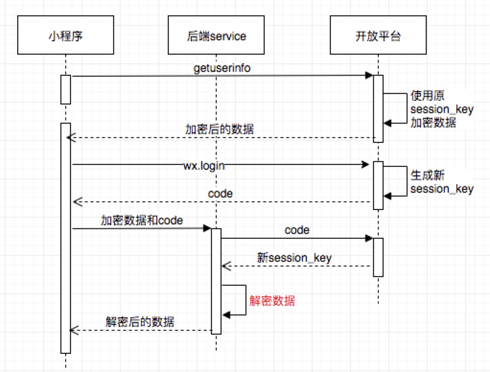
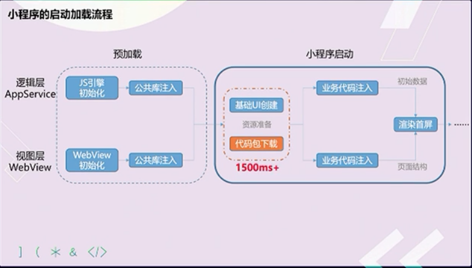
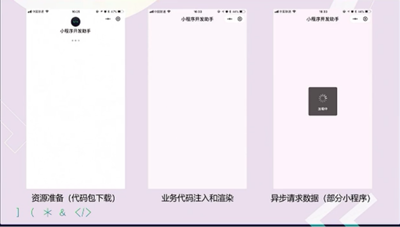
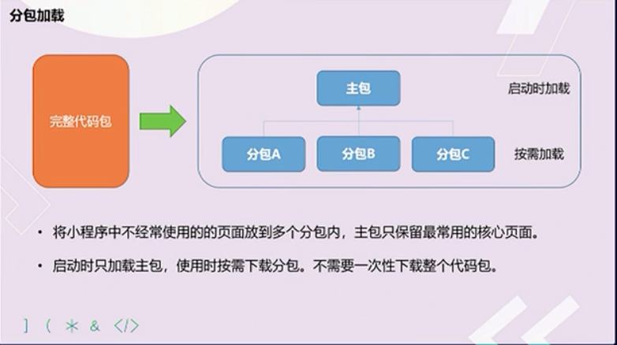
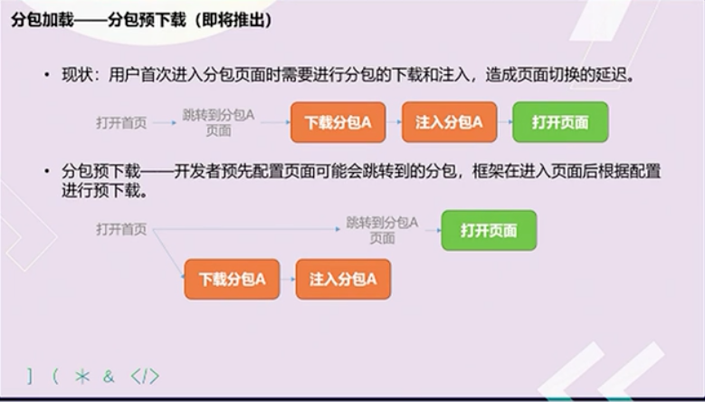
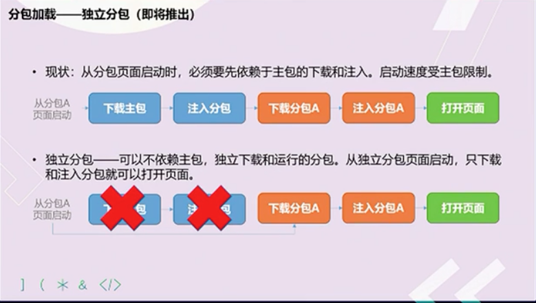
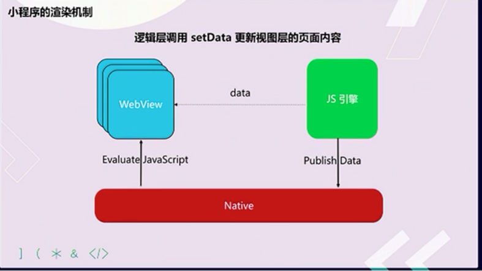

小程序模块
===

------------------------------------------------------------------------------------------

1 登录
----------------------------------------------------------------------------------------------------------------------------------------

unionid和openid

> 了解小程序登陆之前，我们写了解下小程序/公众号登录涉及到两个最关键的用户标识：

-   `OpenId` 是一个用户对于一个小程序／公众号的标识，开发者可以通过这个标识识别出用户。
-   `UnionId` 是一个用户对于同主体微信小程序／公众号／`APP`的标识，开发者需要在微信开放平台下绑定相同账号的主体。开发者可通过`UnionId`，实现多个小程序、公众号、甚至APP 之间的数据互通了。

关键Api

-   `wx.login` 官方提供的登录能力
-   `wx.checkSession`校验用户当前的`session_key`是否有效
-   `wx.authorize` 提前向用户发起授权请求
-   `wx.getUserInfo` 获取用户基本信息

登录流程设计

-   利用现有登录体系

> 直接复用现有系统的登录体系，只需要在小程序端设计用户名，密码/验证码输入页面，便可以简便的实现登录，只需要保持良好的用户体验即可

-   利用`OpenId` 创建用户体系

> `OpenId` 是一个小程序对于一个用户的标识，利用这一点我们可以轻松的实现一套基于小程序的用户体系，值得一提的是这种用户体系对用户的打扰最低，可以实现静默登录。具体步骤如下

-   小程序客户端通过 `wx.login` 获取 `code`
-   传递 `code` 向服务端，服务端拿到 code 调用微信登录凭证校验接口，微信服务器返回 `openid` 和会话密钥 `session_key` ，此时开发者服务端便可以利用 `openid` 生成用户入库，再向小程序客户端返回自定义登录态
-   小程序客户端缓存 （通过`storage`）自定义登录态（`token`），后续调用接口时携带该登录态作为用户身份标识即可

利用 Unionid 创建用户体系

> 如果想实现多个小程序，公众号，已有登录系统的数据互通，可以通过获取到用户 `unionid` 的方式建立用户体系。因为 `unionid` 在同一开放平台下的所所有应用都是相同的，通过 `unionid` 建立的用户体系即可实现全平台数据的互通，更方便的接入原有的功能，那如何获取 `unionid` 呢，有以下两种方式

-   如果户关注了某个相同主体公众号，或曾经在某个相同主体`App`、公众号上进行过微信登录授权，通过 `wx.login` 可以直接获取 到 `unionid`
-   结合 `wx.getUserInfo` 和 `<button open-type="getUserInfo"><button/>` 这两种方式引导用户主动授权，主动授权后通过返回的信息和服务端交互 (这里有一步需要服务端解密数据的过程，很简单，微信提供了示例代码) 即可拿到 `unionid` 建立用户体系， 然后由服务端返回登录态，本地记录即可实现登录，附上微信提供的最佳实践
    -   调用 `wx.login` 获取 `code`，然后从微信后端换取到 `session_key`，用于解密 `getUserInfo`返回的敏感数据
    -   使用 `wx.getSetting` 获取用户的授权情况
        -   如果用户已经授权，直接调用 `API` `wx.getUserInfo` 获取用户最新的信息；
        -   用户未授权，在界面中显示一个按钮提示用户登入，当用户点击并授权后就获取到用户的最新信息
    -   获取到用户数据后可以进行展示或者发送给自己的后端。

注意事项

-   需要获取 `unionid` 形式的登录体系，在以前（18年4月之前）是通过以下这种方式来实现，但后续微信做了调整（因为一进入小程序，主动弹起各种授权弹窗的这种形式，比较容易导致用户流失），调整为必须使用按钮引导用户主动授权的方式，这次调整对开发者影响较大，开发者需要注意遵守微信的规则，并及时和业务方沟通业务形式，不要存在侥幸心理，以防造成小程序不过审等情况

```
 wx.login(获取code) ===> wx.getUserInfo(用户授权) ===> 获取 unionid

```

-   因为小程序不存在 `cookie` 的概念， 登录态必须缓存在本地，因此强烈建议为登录态设置过期时间
-   值得一提的是如果需要支持风控安全校验，多平台登录等功能，可能需要加入一些公共参数，例如`platform`，`channel`，`deviceParam`等参数。在和服务端确定方案时，作为前端同学应该及时提出这些合理的建议，设计合理的系统。
-   `openid` ， `unionid` 不要在接口中明文传输，这是一种危险的行为，同时也很不专业

2 图片导出
------------------------------------------------------------------------------------------------------------------------------------------------------------

> 这是一种常见的引流方式，一般同时会在图片中附加一个小程序二维码。

基本原理

-   借助 `canvas` 元素，将需要导出的样式首先在 `canvas` 画布上绘制出来 （`api`基本和`h5`保持一致，但有轻微差异，使用时注意即可
-   借助微信提供的 `canvasToTempFilePath` 导出图片，最后再使用 `saveImageToPhotosAlbum` （需要授权）保存图片到本地

如何优雅实现

-   绘制出需要的样式这一步是省略不掉的。但是我们可以封装一个绘制库，包含常见图形的绘制，例如矩形，圆角矩形，圆， 扇形， 三角形， 文字，图片减少绘制代码，只需要提炼出样式信息，便可以轻松的绘制，最后导出图片存入相册。笔者觉得以下这种方式绘制更为优雅清晰一些，其实也可以使用加入一个type参数来指定绘制类型，传入的一个是样式数组，实现绘制。
-   结合上一步的实现，如果对于同一类型的卡片有多次导出需求的场景，也可以使用自定义组件的方式，封装同一类型的卡片为一个通用组件，在需要导出图片功能的地方，引入该组件即可。

```
class CanvasKit {
   constructor() {
   }
   drawImg(option = {}) {
     ...
     return this
   }
   drawRect(option = {}) {
     return this
   }
   drawText(option = {}) {
     ...
     return this
   }
   static exportImg(option = {}) {
     ...
   }
 }

 let drawer = new CanvasKit('canvasId').drawImg(styleObj1).drawText(styleObj2)
 drawer.exportImg()

```

注意事项

-   小程序中无法绘制网络图片到`canvas`上，需要通过`downLoadFile` 先下载图片到本地临时文件才可以绘制
-   通常需要绘制二维码到导出的图片上，有一种方式导出二维码时，需要携带的参数必须做编码，而且有具体的长度（`32`可见字符）限制，可以借助服务端生成 短链接 的方式来解决

3 数据统计
------------------------------------------------------------------------------------------------------------------------------------------------------------

> 数据统计作为目前一种常用的分析用户行为的方式，小程序端也是必不可少的。小程序采取的曝光，点击数据埋点其实和h5原理是一样的。但是埋点作为一个和业务逻辑不相关的需求，我们如果在每一个点击事件，每一个生命周期加入各种埋点代码，则会干扰正常的业务逻辑，和使代码变的臃肿，笔者提供以下几种思路来解决数据埋点

设计一个埋点sdk

> 小程序的代码结构是，每一个 `Page` 中都有一个 `Page` 方法，接受一个包含生命周期函数，数据的 业务逻辑对象 包装这层数据，借助小程序的底层逻辑实现页面的业务逻辑。通过这个我们可以想到思路，对`Page`进行一次包装，篡改它的生命周期和点击事件，混入埋点代码，不干扰业务逻辑，只要做一些简单的配置即可埋点，简单的代码实现如下

```
// 代码仅供理解思路
 page = function(params) {
   let keys = params.keys()
   keys.forEach(v => {
       if (v === 'onLoad') {
         params[v] = function(options) {
           stat()   //曝光埋点代码
           params[v].call(this, options)
         }
       }
       else if (v.includes('click')) {
         params[v] = funciton(event) {
           let data = event.dataset.config
           stat(data)  // 点击埋点
           param[v].call(this)
         }
       }
   })
 }

```

> 这种思路不光适用于埋点，也可以用来作全局异常处理，请求的统一处理等场景。

分析接口

> 对于特殊的一些业务，我们可以采取 接口埋点，什么叫接口埋点呢？很多情况下，我们有的`api`并不是多处调用的，只会在某一个特定的页面调用，通过这个思路我们可以分析出，该接口被请求，则这个行为被触发了，则完全可以通过服务端日志得出埋点数据，但是这种方式局限性较大，而且属于分析结果得出过程，可能存在误差，但可以作为一种思路了解一下。

微信自定义数据分析

> 微信本身提供的数据分析能力，微信本身提供了常规分析和自定义分析两种数据分析方式，在小程序后台配置即可。借助小程序数据助手这款小程序可以很方便的查看

4 工程化
--------------------------------------------------------------------------------------------------------------------------------------------------

工程化做什么

> 目前的前端开发过程，工程化是必不可少的一环，那小程序工程化都需要做些什么呢，先看下目前小程序开发当中存在哪些问题需要解决：

-   不支持 `css`预编译器,作为一种主流的 `css`解决方案，不论是 `less`,`sass`,`stylus` 都可以提升`css`效率
-   不支持引入npm包 （这一条，从微信公开课中听闻，微信准备支持）
-   不支持`ES7`等后续的`js`特性，好用的`async await`等特性都无法使用
-   不支持引入外部字体文件，只支持`base64`
-   没有 `eslint` 等代码检查工具

方案选型

> 对于目前常用的工程化方案，`webpack`，`rollup`，`parcel`等来看，都常用与单页应用的打包和处理，而小程序天生是 "多页应用" 并且存在一些特定的配置。根据要解决的问题来看，无非是文件的编译，修改，拷贝这些处理，对于这些需求，我们想到基于流的 `gulp`非常的适合处理，并且相对于`webpack`配置多页应用更加简单。所以小程序工程化方案推荐使用 `gulp`

具体开发思路

> 通过 `gulp` 的 `task` 实现：

-   实时编译 `less` 文件至相应目录
-   引入支持`async`，`await`的运行时文件
-   编译字体文件为`base64` 并生成相应`css`文件，方便使用
-   依赖分析哪些地方引用了`npm`包，将`npm`包打成一个文件，拷贝至相应目录
-   检查代码规范

5 小程序架构
----------------------------------------------------------------------------------------------------------------------------------------------------------------------



> 微信小程序的框架包含两部分 `View` 视图层、`App Service`逻辑层。`View` 层用来渲染页面结构，`AppService` 层用来逻辑处理、数据请求、接口调用。

它们在两个线程里运行。

> 视图层和逻辑层通过系统层的 `JSBridage` 进行通信，逻辑层把数据变化通知到视图层，触发视图层页面更新，视图层把触发的事件通知到逻辑层进行业务处理


-   视图层使用 `WebView` 渲染，`iOS`中使用自带 `WKWebView`，在 `Android` 使用腾讯的 `x5`内核（基于 `Blink`）运行。
-   逻辑层使用在 `iOS` 中使用自带的 `JSCore` 运行，在 `Android`中使用腾讯的 `x5` 内核（基于 `Blink`）运行。
-   开发工具使用 `nw.js` 同时提供了视图层和逻辑层的运行环境。

6 WXML && WXSS
-----------------------------------------------------------------------------------------------------------------------------------------

WXML

-   支持数据绑定
-   支持逻辑算术、运算
-   支持模板、引用
-   支持添加事件（`bindtap`）
-   `Wxml`编译器：`Wcc` 把 `Wxml`文件 转为 `JS`
-   执行方式：`Wcc index.wxml`
-   使用 `Virtual DOM`，进行局部更新

WXSS

-   wxss编译器：`wcsc` 把`wxss`文件转化为 `js`
-   执行方式： `wcsc index.wxss`

尺寸单位 rpx

> `rpx（responsive pixel`）: 可以根据屏幕宽度进行自适应。规定屏幕宽为 `750rpx`。公式：

```
const dsWidth = 750

export const screenHeightOfRpx = function () {
  return 750 / env.screenWidth * env.screenHeight
}

export const rpxToPx = function (rpx) {
  return env.screenWidth / 750 * rpx
}

export const pxToRpx = function (px) {
  return 750 / env.screenWidth * px
}

```

样式导入

> 使用 `@import`语句可以导入外联样式表，`@import`后跟需要导入的外联样式表的相对路径，用 `;` 表示语句结束

内联样式

> 静态的样式统一写到 `class` 中。`style` 接收动态的样式，在运行时会进行解析，请尽量避免将静态的样式写进 `style` 中，以免影响渲染速度

全局样式与局部样式

> 定义在 `app.wxss` 中的样式为全局样式，作用于每一个页面。在`page` 的 `wxss` 文件中定义的样式为局部样式，只作用在对应的页面，并会覆盖 `app.wxss` 中相同的选择器

7 小程序的问题
--------------------------------------------------------------------------------------------------------------------------------------------------------------------------------

-   小程序仍然使用 `WebView` 渲染，并非原生渲染。（部分原生）
-   服务端接口返回的头无法执行，比如：`Set-Cookie`。
-   依赖浏览器环境的 `JS`库不能使用。
-   不能使用 `npm`，但是可以自搭构建工具或者使用 `mpvue`。（未来官方有计划支持）
-   不能使用 `ES7`，可以自己用`babel+webpack`自搭或者使用 `mpvue`。
-   不支持使用自己的字体（未来官方计划支持）。
-   可以用 `base64` 的方式来使用 `iconfont`。
-   小程序不能发朋友圈（可以通过保存图片到本地，发图片到朋友前。二维码可以使用B接口）。
-   获取二维码/小程序接口的限制
-   程序推送只能使用"服务通知" 而且需要用户主动触发提交 `formId`，`formId` 只有7天有效期。（现在的做法是在每个页面都放入`form`并且隐藏以此获取更多的 `formId`。后端使用原则为：优先使用有效期最短的）
-   小程序大小限制 2M，分包总计不超过 8M
-   转发（分享）小程序不能拿到成功结果，原来可以。链接（小游戏造的孽）
-   拿到相同的 `unionId` 必须绑在同一个开放平台下。开放平台绑定限制：
    -   `50`个移动应用
    -   `10`个网站
    -   `50`个同主体公众号
    -   `5`个不同主体公众号
    -   `50`个同主体小程序
    -   `5`个不同主体小程序
-   公众号关联小程序
    -   所有公众号都可以关联小程序。
    -   一个公众号可关联10个同主体的小程序，3个不同主体的小程序。
    -   一个小程序可关联500个公众号。
    -   公众号一个月可新增关联小程序13次，小程序一个月可新增关联500次。
-   一个公众号关联的10个同主体小程序和3个非同主体小程序可以互相跳转
-   品牌搜索不支持金融、医疗
-   小程序授权需要用户主动点击
-   小程序不提供测试 `access_token`
-   安卓系统下，小程序授权获取用户信息之后，删除小程序再重新获取，并重新授权，得到旧签名，导致第一次授权失败
-   开发者工具上，授权获取用户信息之后，如果清缓存选择全部清除，则即使使用了`wx.checkSession`，并且在`session_key`有效期内，授权获取用户信息也会得到新的`session_key`

8 授权获取用户信息流程
------------------------------------------------------------------------------------------------------------------------------------------------------------------------------------------------------------------------



-   `session_key` 有有效期，有效期并没有被告知开发者，只知道用户越频繁使用小程序，`session_key` 有效期越长
-   在调用 `wx.login` 时会直接更新 `session_key`，导致旧 `session_key` 失效
-   小程序内先调用 `wx.checkSession` 检查登录态，并保证没有过期的 `session_key` 不会被更新，再调用 `wx.login` 获取 `code`。接着用户授权小程序获取用户信息，小程序拿到加密后的用户数据，把加密数据和 `code` 传给后端服务。后端通过 `code` 拿到 `session_key` 并解密数据，将解密后的用户信息返回给小程序

面试题：先授权获取用户信息再 login 会发生什么？





-   用户授权时，开放平台使用旧的 `session_key` 对用户信息进行加密。调用 `wx.login` 重新登录，会刷新 `session_key`，这时后端服务从开放平台获取到新 `session_key`，但是无法对老 `session_key` 加密过的数据解密，用户信息获取失败
-   在用户信息授权之前先调用 `wx.checkSession` 呢？`wx.checkSession` 检查登录态，并且保证 wx.login 不会刷新 `session_key`，从而让后端服务正确解密数据。但是这里存在一个问题，如果小程序较长时间不用导致 `session_key` 过期，则 `wx.login` 必定会重新生成 `session_key`，从而再一次导致用户信息解密失败

9 性能优化
------------------------------------------------------------------------------------------------------------------------------------------------------------

> 我们知道`view`部分是运行在`webview`上的，所以前端领域的大多数优化方式都有用

加载优化



> 代码包的大小是最直接影响小程序加载启动速度的因素。代码包越大不仅下载速度时间长，业务代码注入时间也会变长。所以最好的优化方式就是减少代码包的大小

小程序加载的三个阶段的表示



优化方式

-   代码压缩。
-   及时清理无用代码和资源文件。
-   减少代码包中的图片等资源文件的大小和数量。
-   分包加载。

首屏加载的体验优化建议

-   提前请求: 异步数据请求不需要等待页面渲染完成。
-   利用缓存: 利用 `storage API` 对异步请求数据进行缓存，二次启动时先利用缓存数据渲染页面，在进行后台更新。
-   避免白屏：先展示页面骨架页和基础内容。
-   及时反馈：即时地对需要用户等待的交互操作给出反馈，避免用户以为小程序无响应

使用分包加载优化



-   在构建小程序分包项目时，构建会输出一个或多个功能的分包，其中每个分包小程序必定含有一个主包，所谓的主包，即放置默认启动页面/`TabBar` 页面，以及一些所有分包都需用到公共资源/`JS` 脚本，而分包则是根据开发者的配置进行划分
-   在小程序启动时，默认会下载主包并启动主包内页面，如果用户需要打开分包内某个页面，客户端会把对应分包下载下来，下载完成后再进行展示。

优点：

-   对开发者而言，能使小程序有更大的代码体积，承载更多的功能与服务
-   对用户而言，可以更快地打开小程序，同时在不影响启动速度前提下使用更多功能

限制

-   整个小程序所有分包大小不超过 `8M`
-   单个分包/主包大小不能超过 `2M`
-   原生分包加载的配置 假设支持分包的小程序目录结构如下

```
├── app.js
├── app.json
├── app.wxss
├── packageA
│   └── pages
│       ├── cat
│       └── dog
├── packageB
│   └── pages
│       ├── apple
│       └── banana
├── pages
│   ├── index
│   └── logs
└── utils

```

> 开发者通过在 `app.json` `subPackages` 字段声明项目分包结构

```
{
  "pages":[
    "pages/index",
    "pages/logs"
  ],
  "subPackages": [
    {
      "root": "packageA",
      "pages": [
        "pages/cat",
        "pages/dog"
      ]
    }, {
      "root": "packageB",
      "pages": [
        "pages/apple",
        "pages/banana"
      ]
    }
  ]
}

```

分包原则

-   声明 `subPackages` 后，将按 `subPackages` 配置路径进行打包，`subPackages` 配置路径外的目录将被打包到 `app`（主包） 中
-   `app`（主包）也可以有自己的 `pages`（即最外层的 `pages` 字段
-   `subPackage` 的根目录不能是另外一个 `subPackage` 内的子目录
-   首页的 `TAB`页面必须在 `app`（主包）内

引用原则

-   `packageA` 无法 `require packageB JS` 文件，但可以 `require app`、自己 `package` 内的 `JS` 文件
-   `packageA` 无法 `import packageB` 的 `template`，但可以 `require app`、自己 `package` 内的 `template`
-   `packageA` 无法使用 `packageB` 的资源，但可以使用 `app`、自己 `package` 内的资源

> 官方即将推出 分包预加载



独立分包



渲染性能优化



-   每次 `setData` 的调用都是一次进程间通信过程，通信开销与 `setData` 的数据量正相关。
-   `setData` 会引发视图层页面内容的更新，这一耗时操作一定时间中会阻塞用户交互。
-   `setData` 是小程序开发使用最频繁，也是最容易引发性能问题的

避免不当使用 setData

-   使用 `data` 在方法间共享数据，可能增加 `setData`传输的数据量。。`data` 应仅包括与页面渲染相关的数据。
-   使用 `setData` 传输大量数据，通讯耗时与数据正相关，页面更新延迟可能造成页面更新开销增加。仅传输页面中发生变化的数据，使用 `setData` 的特殊 `key`实现局部更新。
-   短时间内频繁调用 `setData`，操作卡顿，交互延迟，阻塞通信，页面渲染延迟。避免不必要的 `setData`，对连续的`setData`调用进行合并。
-   在后台页面进行 `setData`，抢占前台页面的渲染资源。页面切入后台后的 `setData` 调用，延迟到页面重新展示时执行。


避免不当使用onPageScroll

-   只在有必要的时候监听 `pageScroll` 事件。不监听，则不会派发。
-   避免在 `onPageScroll` 中执行复杂逻辑
-   避免在 `onPageScroll` 中频繁调用 `setData`
-   避免滑动时频繁查询节点信息（`SelectQuery`）用以判断是否显示，部分场景建议使用节点布局橡胶状态监听（`inersectionObserver`）替代

使用自定义组件

> 在需要频繁更新的场景下，自定义组件的更新只在组件内部进行，不受页面其他部分内容复杂性影响

10 wepy vs mpvue
------------------------------------------------------------------------------------------------------------------------------------------------

数据流管理

> 相比传统的小程序框架，这个一直是我们作为资深开发者比较期望去解决的，在 `Web` 开发中，随着 `Flux`、`Redu`x、`Vuex` 等多个数据流工具出现，我们也期望在业务复杂的小程序中使用

-   `WePY` 默认支持 `Redux`，在脚手架生成项目的时候可以内置
-   `Mpvue` 作为 `Vue` 的移植版本，当然支持 `Vuex`，同样在脚手架生成项目的时候可以内置

组件化

-   `WePY` 类似 `Vue`实现了单文件组件，最大的差别是文件后缀 `.wpy`，只是写法上会有差异

```
export default class Index extends wepy.page {}

```

-   `Mpvue` 作为 `Vue` 的移植版本，支持单文件组件，`template`、`script` 和 `style` 都在一个 `.vue` 文件中，和 `vue` 的写法类似，所以对 `Vue` 开发熟悉的同学会比较适应

工程化

> 所有的小程序开发依赖官方提供的开发者工具。开发者工具简单直观，对调试小程序很有帮助，现在也支持腾讯云（目前我们还没有使用，但是对新的一些开发者还是有帮助的），可以申请测试报告查看小程序在真实的移动设备上运行性能和运行效果，但是它本身没有类似前端工程化中的概念和工具

-   `wepy` 内置了构建，通过 `wepy init` 命令初始化项目，大致流程如下：

    -   `wepy-cli` 会判断模版是在远程仓库还是在本地，如果在本地则会立即跳到第 `3` 步，反之继续进行。
    -   会从远程仓库下载模版，并保存到本地。
    -   询问开发者 `Project name` 等问题，依据开发者的回答，创建项目
-   `mpvue` 沿用了 `vue` 中推崇的 `webpack`作为构建工具，但同时提供了一些自己的插件以及配置文件的一些修改，比如

    -   不再需要 `html-webpack-plugin`
    -   基于 `webpack-dev-middleware` 修改成 `webpack-dev-middleware-hard-disk`
    -   最大的变化是基于 `webpack-loader` 修改成 `mpvue-loader`
    -   但是配置方式还是类似，分环境配置文件，最终都会编译成小程序支持的目录结构和文件后缀

11 mpvue
--------------------------------------------------------------------------------------------------------------------------------

mpvue

`Vue.js` 小程序版, `fork` 自 `vuejs/vue@2.4.1`，保留了 `vue runtime` 能力，添加了小程序平台的支持。 `mpvue` 是一个使用 `Vue.js` 开发小程序的前端框架。框架基于 `Vue.js` 核心，`mpvue` 修改了 `Vue.js` 的 `runtime` 和 `compiler` 实现，使其可以运行在小程序环境中，从而为小程序开发引入了整套 `Vue.js` 开发体验

框架原理

> 两个大方向

-   通过`mpvue`提供 `mp` 的 `runtime` 适配小程序
-   通过`mpvue-loader`产出微信小程序所需要的文件结构和模块内容

> 七个具体问题

-   要了解 `mpvue` 原理必然要了解 `Vue` 原理，这是大前提

现在假设您对 Vue 原理有个大概的了解

-   由于 `Vue` 使用了 `Virtual DOM`，所以 `Virtual DOM`可以在任何支持 `JavaScript` 语言的平台上操作，譬如说目前 `Vue` 支持浏览器平台或 `weex`，也可以是 `mp`(小程序)。那么最后 `Virtual DOM` 如何映射到真实的 `DOM`节点上呢？`vue`为平台做了一层适配层，浏览器平台见 `runtime/node-ops.js`、`weex`平台见`runtime/node-ops.js`，小程序见`runtime/node-ops.js`。不同平台之间通过适配层对外提供相同的接口，`Virtual DOM`进行操作`Real DOM`节点的时候，只需要调用这些适配层的接口即可，而内部实现则不需要关心，它会根据平台的改变而改变
-   所以思路肯定是往增加一个 `mp` 平台的 `runtime`方向走。但问题是小程序不能操作 `DOM`，所以 `mp` 下的`node-ops.js`里面的实现都是直接 `return obj`
-   新 `Virtual DOM` 和旧 `Virtual DOM` 之间需要做一个 `patch`，找出 `diff`。`patch`完了之后的 `diff` 怎么更新视图，也就是如何给这些 `DOM` 加入 `attr`、`class`、`style`等 DOM 属性呢？ `Vue`中有 `nextTick` 的概念用以更新视图，`mpvue`这块对于小程序的 `setData` 应该怎么处理呢？
-   另外个问题在于小程序的 `Virtual DOM` 怎么生成？也就是怎么将 `template`编译成`render function`。这当中还涉及到运行时-编译器-vs-只包含运行时，显然如果要提高性能、减少包大小、输出 `wxml`、`mpvue` 也要提供预编译的能力。因为要预输出 `wxml` 且没法动态改变 `DOM`，所以动态组件，自定义 `render`，和`<script type="text/x-template">`字符串模版等都不支持

另外还有一些其他问题，最后总结一下

-   1.如何预编译生成`render function`
-   2.如何预编译生成 `wxml`，`wxss`，`wxs`
-   3.如何 p`atch` 出 `diff`
-   4.如何更新视图
-   5.如何建立小程序事件代理机制，在事件代理函数中触发与之对应的`vue`组件事件响应
-   6.如何建立`vue`实例与小程序 `Page`实例关联
-   7.如何建立小程序和`vue`生命周期映射关系，能在小程序生命周期中触发`vue`生命周期

> `platform/mp`的目录结构

```
.
├── compiler //解决问题1，mpvue-template-compiler源码部分
├── runtime //解决问题3 4 5 6 7
├── util //工具方法
├── entry-compiler.js //mpvue-template-compiler的入口。package.json相关命令会自动生成mpvue-template-compiler这个package。
├── entry-runtime.js //对外提供Vue对象，当然是mpvue
└── join-code-in-build.js //编译出SDK时的修复

```

mpvue-loader

> `mpvue-loader` 是 `vue-loader` 的一个扩展延伸版，类似于超集的关系，除了`vue-loader` 本身所具备的能力之外，它还会利用`mpvue-template-compiler`生成`render function`

entry

-   它会从 `webpack` 的配置中的 `entry` 开始，分析依赖模块，并分别打包。在`entry` 中 `app` 属性及其内容会被打包为微信小程序所需要的 `app.js／app.json／app.wxss`，其余的会生成对应的
-   页面`page.js`/`page.json`/`page.wxml`/`page.wxss`，如示例的 `entry` 将会生成如下这些文件，文件内容下文慢慢讲来：

```
// webpack.config.js
{
    // ...
    entry: {
        app: resolve('./src/main.js'),               // app 字段被识别为 app 类型
        index: resolve('./src/pages/index/main.js'),   // 其余字段被识别为 page 类型
        'news/home': resolve('./src/pages/news/home/index.js')
    }
}

// 产出文件的结构
.
├── app.js
├── app.json
├──- app.wxss
├── components
│   ├── card$74bfae61.wxml
│   ├── index$023eef02.wxml
│   └── news$0699930b.wxml
├── news
│   ├── home.js
│   ├── home.wxml
│   └── home.wxss
├── pages
│   └── index
│       ├── index.js
│       ├── index.wxml
│       └── index.wxss
└── static
    ├── css
    │   ├── app.wxss
    │   ├── index.wxss
    │   └── news
    │       └── home.wxss
    └── js
        ├── app.js
        ├── index.js
        ├── manifest.js
        ├── news
        │   └── home.js
        └── vendor.js

```

> `wxml` 每一个 `.vue` 的组件都会被生成为一个 `wxml` 规范的 `template`，然后通过 `wxml` 规范的 `import` 语法来达到一个复用，同时组件如果涉及到 `props`的 `data` 数据，我们也会做相应的处理，举个实际的例子：

```
<template>
    <div class="my-component" @click="test">
        <h1>{{msg}}</h1>
        <other-component :msg="msg"></other-component>
    </div>
</template>
<script>
import otherComponent from './otherComponent.vue'

export default {
  components: { otherComponent },
  data () {
    return { msg: 'Hello Vue.js!' }
  },
  methods: {
    test() {}
  }
}
</script>

```

> 这样一个 `Vue`的组件的模版部分会生成相应的 `wxml`

```
<import src="components/other-component$hash.wxml" />
<template name="component$hash">
    <view class="my-component" bindtap="handleProxy">
        <view class="_h1">{{msg}}</view>
        <template is="other-component$hash" wx:if="{{ $c[0] }}" data="{{ ...$c[0] }}"></template>
    </view>
</template>

```

> 可能已经注意到了 `other-component(:msg="msg")` 被转化成了 。`mpvue` 在运行时会从根组件开始把所有的组件实例数据合并成一个树形的数据，然后通过 `setData` 到 `appData`,`$c`是 `$children` 的缩写。至于那个 `0` 则是我们的 `compiler`处理过后的一个标记，会为每一个子组件打一个特定的不重复的标记。 树形数据结构如下

```
// 这儿数据结构是一个数组，index 是动态的
{
  $child: {
    '0'{
      // ... root data
      $child: {
        '0': {
          // ... data
          msg: 'Hello Vue.js!',
          $child: {
            // ...data
          }
        }
      }
    }
  }
}

```

wxss

> 这个部分的处理同 `web` 的处理差异不大，唯一不同在于通过配置生成 `.css` 为 `.wxss` ，其中的对于 `css`的若干处理，在 `postcss-mpvue-wxss` 和 `px2rpx-loader` 这两部分的文档中又详细的介绍

-   推荐和小程序一样，将 `app.json／page.json` 放到页面入口处，使用 `copy-webpack-plugin` `copy` 到对应的生成位置。

> 这部分内容来源于 `app` 和`page` 的`entry` 文件，通常习惯是 `main.js`，你需要在你的入口文件中 `export default { config: {} }`，这才能被我们的 `loader` 识别为这是一个配置，需要写成 `json` 文件

```
import Vue from 'vue';
import App from './app';

const vueApp = new Vue(App);
vueApp.$mount();

// 这个是我们约定的额外的配置
export default {
    // 这个字段下的数据会被填充到 app.json ／ page.json
    config: {
        pages: ['static/calendar/calendar', '^pages/list/list'], // Will be filled in webpack
        window: {
            backgroundTextStyle: 'light',
            navigationBarBackgroundColor: '##455A73',
            navigationBarTitleText: '美团汽车票',
            navigationBarTextStyle: '##fff'
        }
    }
};

```
