框架通识
===

-------------------------------------

1 MVVM
-------------------------------------

> `MVVM` 由以下三个内容组成

-   `View`：界面
-   `Model`：数据模型
-   `ViewModel`：作为桥梁负责沟通 `View` 和 `Model`

> 在 `JQuery` 时期，如果需要刷新 `UI` 时，需要先取到对应的 `DOM` 再更新 `UI`，这样数据和业务的逻辑就和页面有强耦合。

MVVM

在 `MVVM` 中，`UI` 是通过数据驱动的，数据一旦改变就会相应的刷新对应的 `UI`，`UI` 如果改变，也会改变对应的数据。这种方式就可以在业务处理中只关心数据的流转，而无需直接和页面打交道。`ViewModel` 只关心数据和业务的处理，不关心 `View` 如何处理数据，在这种情况下，`View` 和 `Model` 都可以独立出来，任何一方改变了也不一定需要改变另一方，并且可以将一些可复用的逻辑放在一个 `ViewModel` 中，让多个 `View`复用这个 `ViewModel`。

-   在 `MVVM` 中，最核心的也就是数据双向绑定，例如 `Angluar` 的脏数据检测，`Vue` 中的数据劫持。

脏数据检测

> 当触发了指定事件后会进入脏数据检测，这时会调用 `$digest` 循环遍历所有的数据观察者，判断当前值是否和先前的值有区别，如果检测到变化的话，会调用 `$watch` 函数，然后再次调用 `$digest` 循环直到发现没有变化。循环至少为二次 ，至多为十次。

> 脏数据检测虽然存在低效的问题，但是不关心数据是通过什么方式改变的，都可以完成任务，但是这在 `Vue` 中的双向绑定是存在问题的。并且脏数据检测可以实现批量检测出更新的值，再去统一更新 `UI`，大大减少了操作 `DOM` 的次数。所以低效也是相对的，这就仁者见仁智者见智了。

数据劫持

> `Vue` 内部使用了 `Object.defineProperty()` 来实现双向绑定，通过这个函数可以监听到 `set` 和 `get` 的事件。

```
var data = { name: 'yck' }
observe(data)
let name = data.name // -> get value
data.name = 'yyy' // -> change value

function observe(obj) {
  // 判断类型
  if (!obj || typeof obj !== 'object') {
    return
  }
  Object.keys(obj).forEach(key => {
    defineReactive(obj, key, obj[key])
  })
}

function defineReactive(obj, key, val) {
  // 递归子属性
  observe(val)
  Object.defineProperty(obj, key, {
    enumerable: true,
    configurable: true,
    get: function reactiveGetter() {
      console.log('get value')
      return val
    },
    set: function reactiveSetter(newVal) {
      console.log('change value')
      val = newVal
    }
  })
}

```

> 以上代码简单的实现了如何监听数据的 `set` 和 `get` 的事件，但是仅仅如此是不够的，还需要在适当的时候给属性添加发布订阅

```
<div>
    {{name}}
</div>

```

> 在解析如上模板代码时，遇到 `{name}` 就会给属性 `name` 添加发布订阅。

```
// 通过 Dep 解耦
class Dep {
  constructor() {
    this.subs = []
  }
  addSub(sub) {
    // sub 是 Watcher 实例
    this.subs.push(sub)
  }
  notify() {
    this.subs.forEach(sub => {
      sub.update()
    })
  }
}
// 全局属性，通过该属性配置 Watcher
Dep.target = null

function update(value) {
  document.querySelector('div').innerText = value
}

class Watcher {
  constructor(obj, key, cb) {
    // 将 Dep.target 指向自己
    // 然后触发属性的 getter 添加监听
    // 最后将 Dep.target 置空
    Dep.target = this
    this.cb = cb
    this.obj = obj
    this.key = key
    this.value = obj[key]
    Dep.target = null
  }
  update() {
    // 获得新值
    this.value = this.obj[this.key]
    // 调用 update 方法更新 Dom
    this.cb(this.value)
  }
}
var data = { name: 'yck' }
observe(data)
// 模拟解析到 `{{name}}` 触发的操作
new Watcher(data, 'name', update)
// update Dom innerText
data.name = 'yyy'

```

> 接下来,对 `defineReactive` 函数进行改造

```
function defineReactive(obj, key, val) {
  // 递归子属性
  observe(val)
  let dp = new Dep()
  Object.defineProperty(obj, key, {
    enumerable: true,
    configurable: true,
    get: function reactiveGetter() {
      console.log('get value')
      // 将 Watcher 添加到订阅
      if (Dep.target) {
        dp.addSub(Dep.target)
      }
      return val
    },
    set: function reactiveSetter(newVal) {
      console.log('change value')
      val = newVal
      // 执行 watcher 的 update 方法
      dp.notify()
    }
  })
}

```

> 以上实现了一个简易的双向绑定，核心思路就是手动触发一次属性的 `getter` 来实现发布订阅的添加

Proxy 与 Object.defineProperty 对比

> `Object.defineProperty` 虽然已经能够实现双向绑定了，但是他还是有缺陷的。

-   只能对属性进行数据劫持，所以需要深度遍历整个对象 对于数组不能监听到数据的变化
-   虽然 `Vue` 中确实能检测到数组数据的变化，但是其实是使用了 `hack`的办法，并且也是有缺陷的。

```
const arrayProto = Array.prototype
export const arrayMethods = Object.create(arrayProto)
// hack 以下几个函数
const methodsToPatch = [
  'push',
  'pop',
  'shift',
  'unshift',
  'splice',
  'sort',
  'reverse'
]
methodsToPatch.forEach(function (method) {
  // 获得原生函数
  const original = arrayProto[method]
  def(arrayMethods, method, function mutator (...args) {
    // 调用原生函数
    const result = original.apply(this, args)
    const ob = this.__ob__
    let inserted
    switch (method) {
      case 'push':
      case 'unshift':
        inserted = args
        break
      case 'splice':
        inserted = args.slice(2)
        break
    }
    if (inserted) ob.observeArray(inserted)
    // 触发更新
    ob.dep.notify()
    return result
  })
})

```

> 反观 `Proxy`就没以上的问题，原生支持监听数组变化，并且可以直接对整个对象进行拦截，所以 `Vue` 也将在下个大版本中使用 `Proxy` 替换 `Object.defineProperty`

```
let onWatch = (obj, setBind, getLogger) => {
  let handler = {
    get(target, property, receiver) {
      getLogger(target, property)
      return Reflect.get(target, property, receiver);
    },
    set(target, property, value, receiver) {
      setBind(value);
      return Reflect.set(target, property, value);
    }
  };
  return new Proxy(obj, handler);
};

let obj = { a: 1 }
let value
let p = onWatch(obj, (v) => {
  value = v
}, (target, property) => {
  console.log(`Get '${property}' = ${target[property]}`);
})
p.a = 2 // bind `value` to `2`
p.a // -> Get 'a' = 2

```

2 路由原理
-------------------------------------

> 前端路由实现起来其实很简单，本质就是监听 `URL` 的变化，然后匹配路由规则，显示相应的页面，并且无须刷新。目前单页面使用的路由就只有两种实现方式

-   `hash` 模式
-   `history` 模式

> `www.test.com/##/` 就是 `Hash URL`，当 `##` 后面的哈希值发生变化时，不会向服务器请求数据，可以通过 `hashchange` 事件来监听到 `URL` 的变化，从而进行跳转页面。

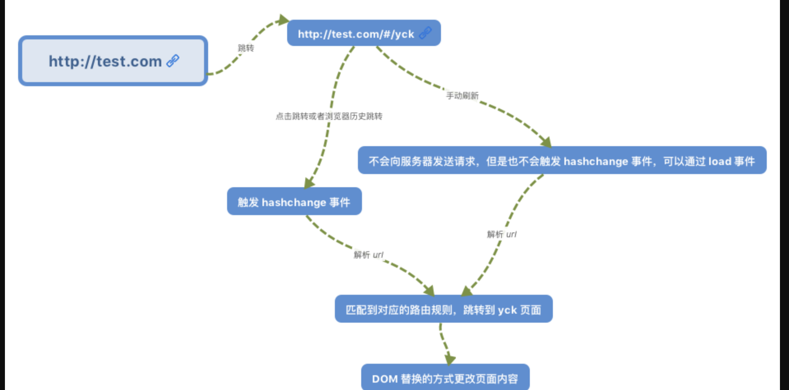

> `History`模式是 `HTML5` 新推出的功能，比之 `Hash URL` 更加美观

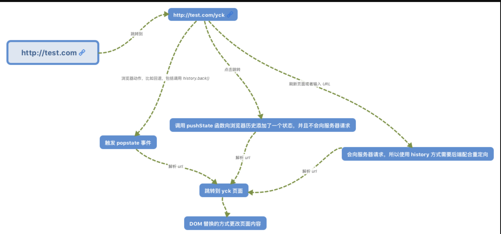

3 Virtual Dom
-------------------------------------

为什么需要 Virtual Dom

> 众所周知，操作 `DOM` 是很耗费性能的一件事情，既然如此，我们可以考虑通过 `JS` 对象来模拟 `DOM` 对象，毕竟操作 `JS` 对象比操作 `DOM` 省时的多

```
// 假设这里模拟一个 ul，其中包含了 5 个 li
[1, 2, 3, 4, 5]
// 这里替换上面的 li
[1, 2, 5, 4]

```

> 从上述例子中，我们一眼就可以看出先前的 `ul` 中的第三个 `li` 被移除了，四五替换了位置。

-   如果以上操作对应到 `DOM` 中，那么就是以下代码

```
// 删除第三个 li
ul.childNodes[2].remove()
// 将第四个 li 和第五个交换位置
let fromNode = ul.childNodes[4]
let toNode = node.childNodes[3]
let cloneFromNode = fromNode.cloneNode(true)
let cloenToNode = toNode.cloneNode(true)
ul.replaceChild(cloneFromNode, toNode)
ul.replaceChild(cloenToNode, fromNode)

```

> 当然在实际操作中，我们还需要给每个节点一个标识，作为判断是同一个节点的依据。所以这也是 `Vue` 和 `React` 中官方推荐列表里的节点使用唯一的 `key` 来保证性能。

-   那么既然 `DOM` 对象可以通过 `JS` 对象来模拟，反之也可以通过 `JS` 对象来渲染出对应的 `DOM`
-   以下是一个 `JS` 对象模拟 `DOM` 对象的简单实现

```
export default class Element {
  /**
   * @param {String} tag 'div'
   * @param {Object} props { class: 'item' }
   * @param {Array} children [ Element1, 'text']
   * @param {String} key option
   */
  constructor(tag, props, children, key) {
    this.tag = tag
    this.props = props
    if (Array.isArray(children)) {
      this.children = children
    } else if (isString(children)) {
      this.key = children
      this.children = null
    }
    if (key) this.key = key
  }
  // 渲染
  render() {
    let root = this._createElement(
      this.tag,
      this.props,
      this.children,
      this.key
    )
    document.body.appendChild(root)
    return root
  }
  create() {
    return this._createElement(this.tag, this.props, this.children, this.key)
  }
  // 创建节点
  _createElement(tag, props, child, key) {
    // 通过 tag 创建节点
    let el = document.createElement(tag)
    // 设置节点属性
    for (const key in props) {
      if (props.hasOwnProperty(key)) {
        const value = props[key]
        el.setAttribute(key, value)
      }
    }
    if (key) {
      el.setAttribute('key', key)
    }
    // 递归添加子节点
    if (child) {
      child.forEach(element => {
        let child
        if (element instanceof Element) {
          child = this._createElement(
            element.tag,
            element.props,
            element.children,
            element.key
          )
        } else {
          child = document.createTextNode(element)
        }
        el.appendChild(child)
      })
    }
    return el
  }
}

```

Virtual Dom 算法简述

-   既然我们已经通过 `JS` 来模拟实现了 `DOM`，那么接下来的难点就在于如何判断旧的对象和新的对象之间的差异。
-   `DOM` 是多叉树的结构，如果需要完整的对比两颗树的差异，那么需要的时间复杂度会是 `O(n ^ 3)`，这个复杂度肯定是不能接受的。于是 `React`团队优化了算法，实现了 `O(n)` 的复杂度来对比差异。
-   实现`O(n)` 复杂度的关键就是只对比同层的节点，而不是跨层对比，这也是考虑到在实际业务中很少会去跨层的移动 `DOM` 元素

> 所以判断差异的算法就分为了两步

-   首先从上至下，从左往右遍历对象，也就是树的深度遍历，这一步中会给每个节点添加索引，便于最后渲染差异
-   一旦节点有子元素，就去判断子元素是否有不同

Virtual Dom 算法实现

树的递归

-   首先我们来实现树的递归算法，在实现该算法前，先来考虑下两个节点对比会有几种情况
-   新的节点的 `tagName` 或者 `key` 和旧的不同，这种情况代表需要替换旧的节点，并且也不再需要遍历新旧节点的子元素了，因为整个旧节点都被删掉了
-   新的节点的 `tagName` 和 `key`（可能都没有）和旧的相同，开始遍历子树
-   没有新的节点，那么什么都不用做

```
import { StateEnums, isString, move } from './util'
import Element from './element'

export default function diff(oldDomTree, newDomTree) {
  // 用于记录差异
  let pathchs = {}
  // 一开始的索引为 0
  dfs(oldDomTree, newDomTree, 0, pathchs)
  return pathchs
}

function dfs(oldNode, newNode, index, patches) {
  // 用于保存子树的更改
  let curPatches = []
  // 需要判断三种情况
  // 1.没有新的节点，那么什么都不用做
  // 2.新的节点的 tagName 和 `key` 和旧的不同，就替换
  // 3.新的节点的 tagName 和 key（可能都没有） 和旧的相同，开始遍历子树
  if (!newNode) {
  } else if (newNode.tag === oldNode.tag && newNode.key === oldNode.key) {
    // 判断属性是否变更
    let props = diffProps(oldNode.props, newNode.props)
    if (props.length) curPatches.push({ type: StateEnums.ChangeProps, props })
    // 遍历子树
    diffChildren(oldNode.children, newNode.children, index, patches)
  } else {
    // 节点不同，需要替换
    curPatches.push({ type: StateEnums.Replace, node: newNode })
  }

  if (curPatches.length) {
    if (patches[index]) {
      patches[index] = patches[index].concat(curPatches)
    } else {
      patches[index] = curPatches
    }
  }
}

```

判断属性的更改

> 判断属性的更改也分三个步骤

-   遍历旧的属性列表，查看每个属性是否还存在于新的属性列表中
-   遍历新的属性列表，判断两个列表中都存在的属性的值是否有变化
-   在第二步中同时查看是否有属性不存在与旧的属性列列表中

```
function diffProps(oldProps, newProps) {
  // 判断 Props 分以下三步骤
  // 先遍历 oldProps 查看是否存在删除的属性
  // 然后遍历 newProps 查看是否有属性值被修改
  // 最后查看是否有属性新增
  let change = []
  for (const key in oldProps) {
    if (oldProps.hasOwnProperty(key) && !newProps[key]) {
      change.push({
        prop: key
      })
    }
  }
  for (const key in newProps) {
    if (newProps.hasOwnProperty(key)) {
      const prop = newProps[key]
      if (oldProps[key] && oldProps[key] !== newProps[key]) {
        change.push({
          prop: key,
          value: newProps[key]
        })
      } else if (!oldProps[key]) {
        change.push({
          prop: key,
          value: newProps[key]
        })
      }
    }
  }
  return change
}

```

判断列表差异算法实现

> 这个算法是整个 `Virtual Dom` 中最核心的算法，且让我一一为你道来。 这里的主要步骤其实和判断属性差异是类似的，也是分为三步

-   遍历旧的节点列表，查看每个节点是否还存在于新的节点列表中
-   遍历新的节点列表，判断是否有新的节点
-   在第二步中同时判断节点是否有移动

> PS：该算法只对有 `key` 的节点做处理

```
function listDiff(oldList, newList, index, patches) {
  // 为了遍历方便，先取出两个 list 的所有 keys
  let oldKeys = getKeys(oldList)
  let newKeys = getKeys(newList)
  let changes = []

  // 用于保存变更后的节点数据
  // 使用该数组保存有以下好处
  // 1.可以正确获得被删除节点索引
  // 2.交换节点位置只需要操作一遍 DOM
  // 3.用于 `diffChildren` 函数中的判断，只需要遍历
  // 两个树中都存在的节点，而对于新增或者删除的节点来说，完全没必要
  // 再去判断一遍
  let list = []
  oldList &&
    oldList.forEach(item => {
      let key = item.key
      if (isString(item)) {
        key = item
      }
      // 寻找新的 children 中是否含有当前节点
      // 没有的话需要删除
      let index = newKeys.indexOf(key)
      if (index === -1) {
        list.push(null)
      } else list.push(key)
    })
  // 遍历变更后的数组
  let length = list.length
  // 因为删除数组元素是会更改索引的
  // 所有从后往前删可以保证索引不变
  for (let i = length - 1; i >= 0; i--) {
    // 判断当前元素是否为空，为空表示需要删除
    if (!list[i]) {
      list.splice(i, 1)
      changes.push({
        type: StateEnums.Remove,
        index: i
      })
    }
  }
  // 遍历新的 list，判断是否有节点新增或移动
  // 同时也对 `list` 做节点新增和移动节点的操作
  newList &&
    newList.forEach((item, i) => {
      let key = item.key
      if (isString(item)) {
        key = item
      }
      // 寻找旧的 children 中是否含有当前节点
      let index = list.indexOf(key)
      // 没找到代表新节点，需要插入
      if (index === -1 || key == null) {
        changes.push({
          type: StateEnums.Insert,
          node: item,
          index: i
        })
        list.splice(i, 0, key)
      } else {
        // 找到了，需要判断是否需要移动
        if (index !== i) {
          changes.push({
            type: StateEnums.Move,
            from: index,
            to: i
          })
          move(list, index, i)
        }
      }
    })
  return { changes, list }
}

function getKeys(list) {
  let keys = []
  let text
  list &&
    list.forEach(item => {
      let key
      if (isString(item)) {
        key = [item]
      } else if (item instanceof Element) {
        key = item.key
      }
      keys.push(key)
    })
  return keys
}

```

遍历子元素打标识

> 对于这个函数来说，主要功能就两个

-   判断两个列表差异
    -   给节点打上标记
    -   总体来说，该函数实现的功能很简单

```
function diffChildren(oldChild, newChild, index, patches) {
  let { changes, list } = listDiff(oldChild, newChild, index, patches)
  if (changes.length) {
    if (patches[index]) {
      patches[index] = patches[index].concat(changes)
    } else {
      patches[index] = changes
    }
  }
  // 记录上一个遍历过的节点
  let last = null
  oldChild &&
    oldChild.forEach((item, i) => {
      let child = item && item.children
      if (child) {
        index =
          last && last.children ? index + last.children.length + 1 : index + 1
        let keyIndex = list.indexOf(item.key)
        let node = newChild[keyIndex]
        // 只遍历新旧中都存在的节点，其他新增或者删除的没必要遍历
        if (node) {
          dfs(item, node, index, patches)
        }
      } else index += 1
      last = item
    })
}

```

渲染差异

> 通过之前的算法，我们已经可以得出两个树的差异了。既然知道了差异，就需要局部去更新 `DOM` 了，下面就让我们来看看 `Virtual Dom` 算法的最后一步骤

这个函数主要两个功能

-   深度遍历树，将需要做变更操作的取出来
-   局部更新 `DOM`

```
let index = 0
export default function patch(node, patchs) {
  let changes = patchs[index]
  let childNodes = node && node.childNodes
  // 这里的深度遍历和 diff 中是一样的
  if (!childNodes) index += 1
  if (changes && changes.length && patchs[index]) {
    changeDom(node, changes)
  }
  let last = null
  if (childNodes && childNodes.length) {
    childNodes.forEach((item, i) => {
      index =
        last && last.children ? index + last.children.length + 1 : index + 1
      patch(item, patchs)
      last = item
    })
  }
}

function changeDom(node, changes, noChild) {
  changes &&
    changes.forEach(change => {
      let { type } = change
      switch (type) {
        case StateEnums.ChangeProps:
          let { props } = change
          props.forEach(item => {
            if (item.value) {
              node.setAttribute(item.prop, item.value)
            } else {
              node.removeAttribute(item.prop)
            }
          })
          break
        case StateEnums.Remove:
          node.childNodes[change.index].remove()
          break
        case StateEnums.Insert:
          let dom
          if (isString(change.node)) {
            dom = document.createTextNode(change.node)
          } else if (change.node instanceof Element) {
            dom = change.node.create()
          }
          node.insertBefore(dom, node.childNodes[change.index])
          break
        case StateEnums.Replace:
          node.parentNode.replaceChild(change.node.create(), node)
          break
        case StateEnums.Move:
          let fromNode = node.childNodes[change.from]
          let toNode = node.childNodes[change.to]
          let cloneFromNode = fromNode.cloneNode(true)
          let cloenToNode = toNode.cloneNode(true)
          node.replaceChild(cloneFromNode, toNode)
          node.replaceChild(cloenToNode, fromNode)
          break
        default:
          break
      }
    })
}

```

Virtual Dom 算法的实现也就是以下三步

-   通过 `JS` 来模拟创建 `DOM` 对象
-   判断两个对象的差异
-   渲染差异

```
let test4 = new Element('div', { class: 'my-div' }, ['test4'])
let test5 = new Element('ul', { class: 'my-div' }, ['test5'])

let test1 = new Element('div', { class: 'my-div' }, [test4])

let test2 = new Element('div', { id: '11' }, [test5, test4])

let root = test1.render()

let pathchs = diff(test1, test2)
console.log(pathchs)

setTimeout(() => {
  console.log('开始更新')
  patch(root, pathchs)
  console.log('结束更新')
}, 1000)

```

4 Diff算法
-------------------------------------

### 4.1 React-Diff

React的思路是递增法。通过对比新的列表中的节点，在原本的列表中的位置是否是递增，来判断当前节点是否需要移动。

1\. 实现原理

来看这样一个例子。

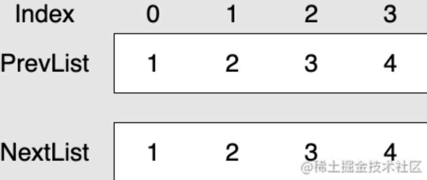

`nextList`为新的列表，`prevList`为旧列表。这个例子我们一眼能看出来，新列表是不需要进行移动的。下面我用`react`的递增思想，解释一下为什么新列表中的节点不需要移动。

我们首先遍历`nextList`，并且找到每一个节点，在`prevList`中的位置。

```
function foo(prevList, nextList) {
    for (let i = 0; i < nextList.length; i++) {
        let nextItem = nextList[i];
        for (let j = 0; j < prevList.length; j++) {
            let prevItem = prevList[j]
            if (nextItem === prevItem) {

            }
        }
    }
}

```

找到位置以后，与上一个节点的位置进行对比，如果当前的位置大于上一个位置，说明当前节点不需要移动。因此我们要定义一个`lastIndex`来记录上一个节点的位置。

```
function foo(prevList, nextList) {
    let lastIndex = 0
    for (let i = 0; i < nextList.length; i++) {
        let nextItem = nextList[i];
        for (let j = 0; j < prevList.length; j++) {
            let prevItem = prevList[j]
            if (nextItem === prevItem) {
                if (j < lastIndex) {
                    // 需要移动节点
                } else {
                    // 不需要移动节点，记录当前位置，与之后的节点进行对比
                    lastIndex = j
                }
            }
        }
    }
}

```

在上面的例子中，`nextList`每个节点在`prevList`的位置为`0 1 2 3`。每一项都要比前一项要大，所以不需要移动，这就是`react`的`diff`算法的原理。

2\. 找到需要移动的节点

在上一小节中，我们是通过对比值是否相等，查找的对应位置。但是在vdom中，每一个节点都是一个vNode，我们应该如何进行判断呢？

答案就是`key`，我们通过对每个节点的`key`进行赋值，并且让处于同一`children`数组下的`vnode`的`key`都不相同，以此来确定每个节点的唯一性，并进行新旧列表的对比。

```
function reactDiff(prevChildren, nextChildren, parent) {
    let lastIndex = 0
    for (let i = 0; i < nextChildren.length; i++) {
        let nextChild = nextChildren[i];
        for (let j = 0; j < prevChildren.length; j++) {
            let prevChild = prevChildren[j]
            if (nextChild.key === prevChild.key) {
                patch(prevChild, nextChild, parent)
                if (j < lastIndex) {
                    // 需要移动节点
                } else {
                    // 不需要移动节点，记录当前位置，与之后的节点进行对比
                    lastIndex = j
                }
            }
        }
    }
}

```

3\. 移动节点

首先我们先明确一点，移动节点所指的节点是`DOM`节点。`vnode.el`指向该节点对应的真实`DOM`节点。`patch`方法会将更新过后的`DOM`节点，赋值给新的`vnode`的`el`属性。

> 为了画图方便，我们用`key`的值来表示`vnode`节点。为了行文方便，我们把`key`值为`a`的`vnode`简写为`vnode-a`，`vnode-a`对应的真实DOM节点为`DOM-A`

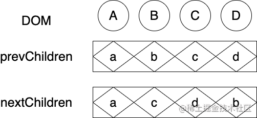

我们来将上图的例子代入`reactDiff`中执行。我们遍历新列表，并查找`vnode`在旧列表中的位置。当遍历到`vnode-d`时，之前遍历在旧列表的位置为`0 < 2 < 3`，说明`A C D`这三个节点都是不需要移动的。此时`lastIndex = 3`, 并进入下一次循环，发现`vnode-b`在旧列表的`index`为`1`，`1 < 3`，说明`DOM-B`要移动。

通过观察我们能发现，只需要把`DOM-B`移动到`DOM-D`之后就可以了。也就是找到需要移动的VNode，我们称该VNode为α，将α对应的真实的DOM节点移动到，α在`新列表`中的前一个VNode对应的真实DOM的后面。

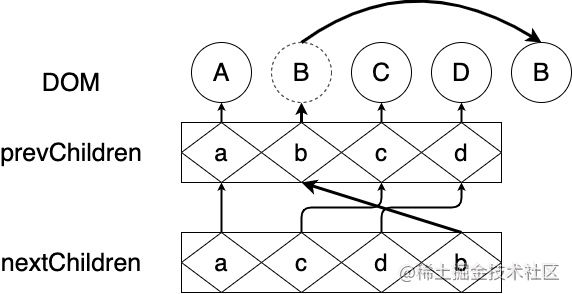

在上述的例子中，就是将`vnode-b`对应的真实DOM节点`DOM-B`, 移动到`vnode-b`在新列表中的前一个`VNode`------`vnode-d`对应的真实DOM节点`DOM-D`的后面

```
function reactDiff(prevChildren, nextChildren, parent) {
    let lastIndex = 0
    for (let i = 0; i < nextChildren.length; i++) {
        let nextChild = nextChildren[i];
        for (let j = 0; j < prevChildren.length; j++) {
            let prevChild = prevChildren[j]
            if (nextChild.key === prevChild.key) {
                patch(prevChild, nextChild, parent)
                if (j < lastIndex) {
                    // 移动到前一个节点的后面
                    let refNode = nextChildren[i - 1].el.nextSibling;
                    parent.insertBefore(nextChild.el, refNode)
                } else {
                    // 不需要移动节点，记录当前位置，与之后的节点进行对比
                    lastIndex = j
                }
            }
        }
    }
}

```

为什么是这样移动的呢？首先我们列表是`从头到尾`遍历的。这就意味着对于当前`VNode`节点来说，该节点之前的所有节点都是排好序的，如果该节点需要移动，那么只需要将DOM节点移动到前一个`vnode`节点之后就可以，因为在新列表中`vnode`的顺序就是这样的。

4\. 添加节点

上一小节我们只讲了如何移动节点，但是忽略了另外一种情况，就是在新列表中有全新的`VNode`节点，在旧列表中找不到。遇到这种情况，我们需要根据新的`VNode`节点生成`DOM`节点，并插入`DOM`树中。

至此，我们面临两个问题：1.如何发现全新的节点、2. 生成的`DOM`节点插入到哪里

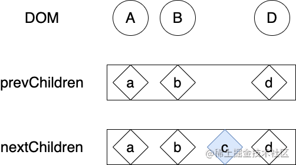

我们先来解决第一个问题，找节点还是比较简单的，我们定义一个`find`变量值为`false`。如果在旧列表找到了`key` 相同的`vnode`，就将`find`的值改为`true`。当遍历结束后判断`find`值，如果为`false`，说明当前节点为新节点

```
function reactDiff(prevChildren, nextChildren, parent) {
    let lastIndex = 0
    for (let i = 0; i < nextChildren.length; i++) {
        let nextChild = nextChildren[i],
            find = false;
        for (let j = 0; j < prevChildren.length; j++) {
            let prevChild = prevChildren[j]
            if (nextChild.key === prevChild.key) {
                find = true
                patch(prevChild, nextChild, parent)
                if (j < lastIndex) {
                    // 移动到前一个节点的后面
                    let refNode = nextChildren[i - 1].el.nextSibling;
                    parent.insertBefore(nextChild.el, refNode)
                } else {
                    // 不需要移动节点，记录当前位置，与之后的节点进行对比
                    lastIndex = j
                }
                break
            }
        }
        if (!find) {
            // 插入新节点
        }
    }
}

```

找到新节点后，下一步就是插入到哪里了，这里的逻辑其实是和移动节点的逻辑是一样的。我们观察上图可以发现，新的`vnode-c`是紧跟在`vnode-b`后面的，并且`vnode-b`的DOM节点------`DOM-B`是已经排好序的，所以我们只需要将`vnode-c`生成的DOM节点插入到`DOM-B`之后就可以了。

但是这里有一种特殊情况需要注意，就是新的节点位于新列表的第一个，这时候我们需要找到旧列表第一个节点，将新节点插入到原来第一个节点之前就可以了。

```
function reactDiff(prevChildren, nextChildren, parent) {
    let lastIndex = 0
    for (let i = 0; i < nextChildren.length; i++) {
        let nextChild = nextChildren[i],
            find = false;
        for (let j = 0; j < prevChildren.length; j++) {
            let prevChild = prevChildren[j]
            if (nextChild.key === prevChild.key) {
                find = true
                patch(prevChild, nextChild, parent)
                if (j < lastIndex) {
                    // 移动到前一个节点的后面
                    let refNode = nextChildren[i - 1].el.nextSibling;
                    parent.insertBefore(nextChild.el, refNode)
                } else {
                    // 不需要移动节点，记录当前位置，与之后的节点进行对比
                    lastIndex = j
                }
                break
            }
        }
        if (!find) {
            // 插入新节点
            let refNode = i <= 0
                            ? prevChildren[0].el
                            : nextChildren[i - 1].el.nextSibling
            mount(nextChild, parent, refNode);
        }
    }
}

```

5\. 移除节点

有增就有减，当旧的节点不在新列表中时，我们就将其对应的DOM节点移除。

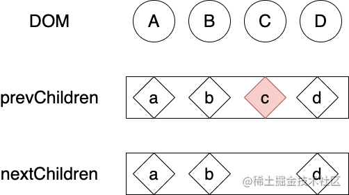

```
function reactDiff(prevChildren, nextChildren, parent) {
    let lastIndex = 0
    for (let i = 0; i < nextChildren.length; i++) {
        let nextChild = nextChildren[i],
            find = false;
        for (let j = 0; j < prevChildren.length; j++) {
            let prevChild = prevChildren[j]
            if (nextChild.key === prevChild.key) {
                find = true
                patch(prevChild, nextChild, parent)
                if (j < lastIndex) {
                    // 移动到前一个节点的后面
                    let refNode = nextChildren[i - 1].el.nextSibling;
                    parent.insertBefore(nextChild.el, refNode)
                } else {
                    // 不需要移动节点，记录当前位置，与之后的节点进行对比
                    lastIndex = j
                }
                break
            }
        }
        if (!find) {
            // 插入新节点
            let refNode = i <= 0
                            ? prevChildren[0].el
                            : nextChildren[i - 1].el.nextSibling
            mount(nextChild, parent, refNode);
        }
    }
    for (let i = 0; i < prevChildren.length; i++) {
        let prevChild = prevChildren[i],
            key = prevChild.key,
            has = nextChildren.find(item => item.key === key);
        if (!has) parent.removeChild(prevChild.el)
    }
}

```

6\. 优化与不足

以上就是React的diff算法的思路。

目前的`reactDiff`的时间复杂度为`O(m*n)`，我们可以用空间换时间，把`key`与`index`的关系维护成一个`Map`，从而将时间复杂度降低为`O(n)`，具体的代码可以[查看此项目 (opens new window)](https://github.com/sunyanzhe/virtual-dom/blob/master/src/diff/react-diff.js)。

我们接下来看这样一个例子

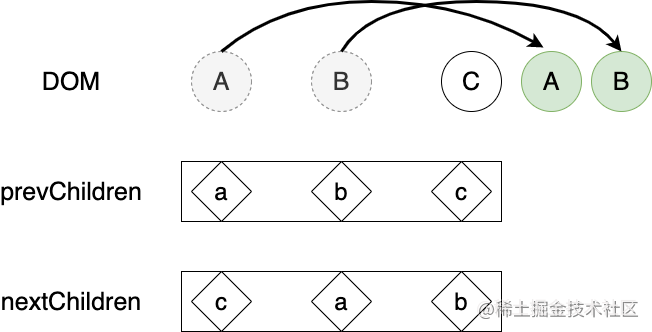

根据`reactDiff`的思路，我们需要先将`DOM-A`移动到`DOM-C`之后，然后再将`DOM-B`移动到`DOM-A`之后，完成`Diff`。但是我们通过观察可以发现，只要将`DOM-C`移动到`DOM-A`之前就可以完成`Diff`。

这里是有可优化的空间的，接下来我们介绍`vue2.x`中的`diff`算法------`双端比较`，该算法解决了上述的问题

### 4.2 Vue2.X Diff ------ 双端比较

所谓`双端比较`就是新列表和旧列表两个列表的头与尾互相对比，，在对比的过程中指针会逐渐向内靠拢，直到某一个列表的节点全部遍历过，对比停止。

1\. 实现原理

我们先用四个指针指向两个列表的头尾

```
function vue2Diff(prevChildren, nextChildren, parent) {
  let oldStartIndex = 0,
    oldEndIndex = prevChildren.length - 1
    newStartIndex = 0,
    newEndIndex = nextChildren.length - 1;
  let oldStartNode = prevChildren[oldStartIndex],
    oldEndNode = prevChildren[oldEndIndex],
    newStartNode = nextChildren[nextStartIndex],
    newEndNode = nextChildren[nextEndIndex];
}

```

我们根据四个指针找到四个节点，然后进行对比，那么如何对比呢？我们按照以下四个步骤进行对比

1.  使用旧列表的头一个节点`oldStartNode`与新列表的头一个节点`newStartNode`对比
2.  使用旧列表的最后一个节点`oldEndNode`与新列表的最后一个节点`newEndNode`对比
3.  使用旧列表的头一个节点`oldStartNode`与新列表的最后一个节点`newEndNode`对比
4.  使用旧列表的最后一个节点`oldEndNode`与新列表的头一个节点`newStartNode`对比

使用以上四步进行对比，去寻找`key`相同的可复用的节点，当在某一步中找到了则停止后面的寻找。具体对比顺序如下图

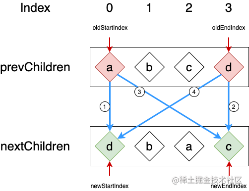

对比顺序代码结构如下:

```
function vue2Diff(prevChildren, nextChildren, parent) {
  let oldStartIndex = 0,
    oldEndIndex = prevChildren.length - 1
    newStartIndex = 0,
    newEndIndex = nextChildren.length - 1;
  let oldStartNode = prevChildren[oldStartIndex],
    oldEndNode = prevChildren[oldEndIndex],
    newStartNode = nextChildren[newStartIndex],
    newEndNode = nextChildren[newEndIndex];

  if (oldStartNode.key === newStartNode.key) {

  } else if (oldEndNode.key === newEndNode.key) {

  } else if (oldStartNode.key === newEndNode.key) {

  } else if (oldEndNode.key === newStartNode.key) {

  }
}

```

当对比时找到了可复用的节点，我们还是先`patch`给元素打补丁，然后将指针进行`前/后移`一位指针。根据对比节点的不同，我们移动的指针和方向也不同，具体规则如下：

1.  当旧列表的头一个节点`oldStartNode`与新列表的头一个节点`newStartNode`对比时`key`相同。那么旧列表的头指针`oldStartIndex`与新列表的头指针`newStartIndex`同时向后移动一位。
2.  当旧列表的最后一个节点`oldEndNode`与新列表的最后一个节点`newEndNode`对比时`key`相同。那么旧列表的尾指针`oldEndIndex`与新列表的尾指针`newEndIndex`同时向前移动一位。
3.  当旧列表的头一个节点`oldStartNode`与新列表的最后一个节点`newEndNode`对比时`key`相同。那么旧列表的头指针`oldStartIndex`向后移动一位；新列表的尾指针`newEndIndex`向前移动一位。
4.  当旧列表的最后一个节点`oldEndNode`与新列表的头一个节点`newStartNode`对比时`key`相同。那么旧列表的尾指针`oldEndIndex`向前移动一位；新列表的头指针`newStartIndex`向后移动一位。

```
function vue2Diff(prevChildren, nextChildren, parent) {
  let oldStartIndex = 0,
    oldEndIndex = prevChildren.length - 1,
    newStartIndex = 0,
    newEndIndex = nextChildren.length - 1;
  let oldStartNode = prevChildren[oldStartIndex],
    oldEndNode = prevChildren[oldEndIndex],
    newStartNode = nextChildren[newStartIndex],
    newEndNode = nextChildren[newEndIndex];

  if (oldStartNode.key === newStartNode.key) {
    patch(oldvStartNode, newStartNode, parent)

    oldStartIndex++
    newStartIndex++
    oldStartNode = prevChildren[oldStartIndex]
    newStartNode = nextChildren[newStartIndex]
  } else if (oldEndNode.key === newEndNode.key) {
    patch(oldEndNode, newEndNode, parent)

    oldEndIndex--
    newEndIndex--
    oldEndNode = prevChildren[oldEndIndex]
    newEndNode = nextChildren[newEndIndex]
  } else if (oldStartNode.key === newEndNode.key) {
    patch(oldStartNode, newEndNode, parent)

    oldStartIndex++
    newEndIndex--
    oldStartNode = prevChildren[oldStartIndex]
    newEndNode = nextChildren[newEndIndex]
  } else if (oldEndNode.key === newStartNode.key) {
    patch(oldEndNode, newStartNode, parent)

    oldEndIndex--
    nextStartIndex++
    oldEndNode = prevChildren[oldEndIndex]
    newStartNode = nextChildren[newStartIndex]
  }
}

```

在小节的开头，提到了要让指针向内靠拢，所以我们需要循环。循环停止的条件是当其中一个列表的节点全部遍历完成，代码如下

```
function vue2Diff(prevChildren, nextChildren, parent) {
  let oldStartIndex = 0,
    oldEndIndex = prevChildren.length - 1,
    newStartIndex = 0,
    newEndIndex = nextChildren.length - 1;
  let oldStartNode = prevChildren[oldStartIndex],
    oldEndNode = prevChildren[oldEndIndex],
    newStartNode = nextChildren[newStartIndex],
    newEndNode = nextChildren[newEndIndex];
  while (oldStartIndex <= oldEndIndex && newStartIndex <= newEndIndex) {
    if (oldStartNode.key === newStartNode.key) {
      patch(oldStartNode, newStartNode, parent)

      oldStartIndex++
      newStartIndex++
      oldStartNode = prevChildren[oldStartIndex]
      newStartNode = nextChildren[newStartIndex]
    } else if (oldEndNode.key === newEndNode.key) {
      patch(oldEndNode, newEndNode, parent)

      oldEndIndex--
      newndIndex--
      oldEndNode = prevChildren[oldEndIndex]
      newEndNode = nextChildren[newEndIndex]
    } else if (oldStartNode.key === newEndNode.key) {
      patch(oldvStartNode, newEndNode, parent)

      oldStartIndex++
      newEndIndex--
      oldStartNode = prevChildren[oldStartIndex]
      newEndNode = nextChildren[newEndIndex]
    } else if (oldEndNode.key === newStartNode.key) {
      patch(oldEndNode, newStartNode, parent)

      oldEndIndex--
      newStartIndex++
      oldEndNode = prevChildren[oldEndIndex]
      newStartNode = nextChildren[newStartIndex]
    }
  }
}

```

至此整体的循环我们就全部完成了，下面我们需要考虑这样两个问题：

-   什么情况下`DOM`节点需要移动
-   `DOM`节点如何移动

我们来解决第一个问题：什么情况下需要移动，我们还是以上图为例。


当我们在第一个循环时，在`第四步`发现旧列表的尾节点`oldEndNode`与新列表的头节点`newStartNode`的`key`相同，是可复用的`DOM`节点。通过观察我们可以发现，原本在旧列表末尾的节点，却是新列表中的开头节点，没有人比他更靠前，因为他是第一个，所以我们只需要把当前的节点移动到原本旧列表中的第一个节点之前，让它成为第一个节点即可。

```
function vue2Diff(prevChildren, nextChildren, parent) {
 // ...
  while (oldStartIndex <= oldEndIndex && newStartIndex <= newEndIndex) {
    if (oldStartNode.key === newStartNode.key) {
       // ...
    } else if (oldEndNode.key === newEndNode.key) {
      // ...
    } else if (oldStartNode.key === newEndNode.key) {
      // ...
    } else if (oldEndNode.key === newStartNode.key) {
      patch(oldEndNode, newStartNode, parent)
      // 移动到旧列表头节点之前
      parent.insertBefore(oldEndNode.el, oldStartNode.el)

      oldEndIndex--
      newStartIndex++
      oldEndNode = prevChildren[oldEndIndex]
      newStartNode = nextChildren[newStartIndex]
    }
  }
}

```

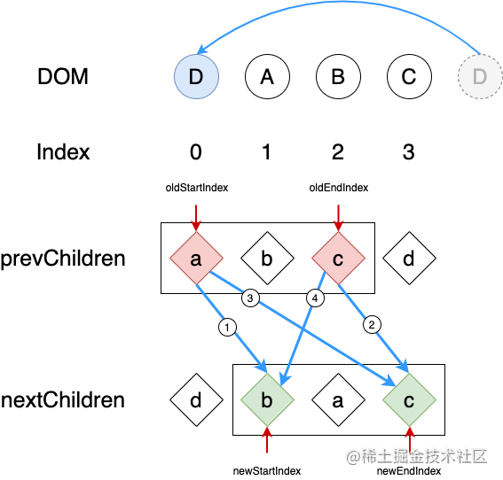

然后我们进入第二次循环，我们在`第二步`发现，旧列表的尾节点`oldEndNode`和新列表的尾节点`newEndNode`为复用节点。原本在旧列表中就是尾节点，在新列表中也是尾节点，说明该节点不需要移动，所以我们什么都不需要做。

同理，如果是旧列表的头节点`oldStartNode`和新列表的头节点`newStartNode`为复用节点，我们也什么都不需要做。

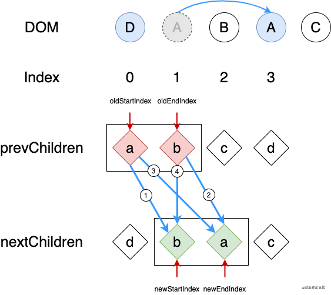

进入第三次循环，我们在`第三部`发现，旧列表的头节点`oldStartNode`和新列表的尾节点`newEndNode`为复用节点。到这一步聪明如你肯定就一眼可以看出来了，我们只要将`DOM-A`移动到`DOM-B`后面就可以了。

依照惯例我们还是解释一下，原本旧列表中是头节点，然后在新列表中是尾节点。那么只要在旧列表中把当前的节点移动到原本尾节点的后面，就可以了。

```
function vue2Diff(prevChildren, nextChildren, parent) {
  // ...
  while (oldStartIndex <= oldEndIndex && newStartIndex <= newEndIndex) {
    if (oldStartNode.key === newStartNode.key) {
      // ...
    } else if (oldEndNode.key === newEndNode.key) {
      // ...
    } else if (oldStartNode.key === newEndNode.key) {
      patch(oldStartNode, newEndNode, parent)
      parent.insertBefore(oldStartNode.el, oldEndNode.el.nextSibling)

      oldStartIndex++
      newEndIndex--
      oldStartNode = prevChildren[oldStartIndex]
      newEndNode = nextChildren[newEndIndex]
    } else if (oldEndNode.key === newStartNode.key) {
     //...
    }
  }
}

```

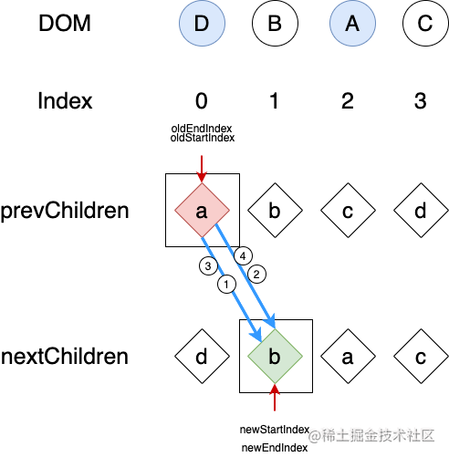

OK，进入最后一个循环。在`第一步`旧列表头节点`oldStartNode`与新列表头节点`newStartNode`位置相同，所以啥也不用做。然后结束循环，这就是`Vue2 双端比较`的原理。

2\. 非理想情况

上一小节，我们讲了`双端比较`的原理，但是有一种特殊情况，当四次对比都没找到复用节点时，我们只能拿新列表的第一个节点去旧列表中找与其`key`相同的节点。

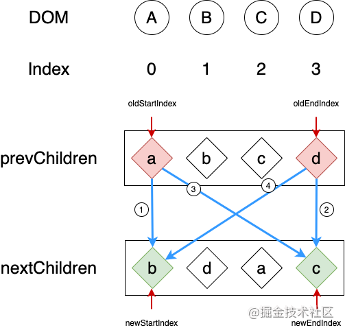

```
function vue2Diff(prevChildren, nextChildren, parent) {
  //...
  while (oldStartIndex <= oldEndIndex && newStartIndex <= newEndIndex) {
    if (oldStartNode.key === newStartNode.key) {
    //...
    } else if (oldEndNode.key === newEndNode.key) {
    //...
    } else if (oldStartNode.key === newEndNode.key) {
    //...
    } else if (oldEndNode.key === newStartNode.key) {
    //...
    } else {
      // 在旧列表中找到 和新列表头节点key 相同的节点
      let newKey = newStartNode.key,
        oldIndex = prevChildren.findIndex(child => child.key === newKey);

    }
  }
}

```

找节点的时候其实会有两种情况：一种在旧列表中找到了，另一种情况是没找到。我们先以上图为例，说一下找到的情况。

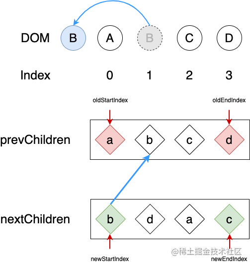

当我们在旧列表中找到对应的`VNode`，我们只需要将找到的节点的`DOM`元素，移动到开头就可以了。这里的逻辑其实和`第四步`的逻辑是一样的，只不过`第四步`是移动的尾节点，这里是移动找到的节点。`DOM`移动后，由我们将旧列表中的节点改为`undefined`，这是至关重要的一步，因为我们已经做了节点的移动了所以我们不需要进行再次的对比了。最后我们将头指针`newStartIndex`向后移一位。

```
function vue2Diff(prevChildren, nextChildren, parent) {
  //...
  while (oldStartIndex <= oldEndIndex && newStartIndex <= newEndIndex) {
    if (oldStartNode.key === newStartNode.key) {
    //...
    } else if (oldEndNode.key === newEndNode.key) {
    //...
    } else if (oldStartNode.key === newEndNode.key) {
    //...
    } else if (oldEndNode.key === newStartNode.key) {
    //...
    } else {
      // 在旧列表中找到 和新列表头节点key 相同的节点
      let newtKey = newStartNode.key,
        oldIndex = prevChildren.findIndex(child => child.key === newKey);

      if (oldIndex > -1) {
        let oldNode = prevChildren[oldIndex];
        patch(oldNode, newStartNode, parent)
        parent.insertBefore(oldNode.el, oldStartNode.el)
        prevChildren[oldIndex] = undefined
      }
      newStartNode = nextChildren[++newStartIndex]
    }
  }
}

```

如果在旧列表中没有找到复用节点呢？很简单，直接创建一个新的节点放到最前面就可以了，然后后移头指针`newStartIndex`。

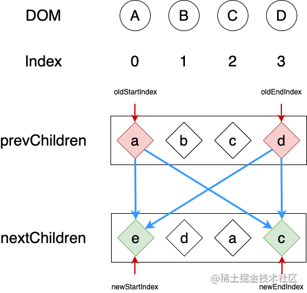

```
function vue2Diff(prevChildren, nextChildren, parent) {
  //...
  while (oldStartIndex <= oldEndIndex && newStartIndex <= newEndIndex) {
    if (oldStartNode.key === newStartNode.key) {
    //...
    } else if (oldEndNode.key === newEndNode.key) {
    //...
    } else if (oldStartNode.key === newEndNode.key) {
    //...
    } else if (oldEndNode.key === newStartNode.key) {
    //...
    } else {
      // 在旧列表中找到 和新列表头节点key 相同的节点
      let newtKey = newStartNode.key,
        oldIndex = prevChildren.findIndex(child => child.key === newKey);

      if (oldIndex > -1) {
        let oldNode = prevChildren[oldIndex];
        patch(oldNode, newStartNode, parent)
        parent.insertBefore(oldNode.el, oldStartNode.el)
        prevChildren[oldIndex] = undefined
      } else {
      	mount(newStartNode, parent, oldStartNode.el)
      }
      newStartNode = nextChildren[++newStartIndex]
    }
  }
}

```

最后当旧列表遍历到`undefind`时就跳过当前节点。

```
function vue2Diff(prevChildren, nextChildren, parent) {
  //...
  while (oldStartIndex <= oldEndIndex && newStartIndex <= newEndIndex) {
    if (oldStartNode === undefind) {
    	oldStartNode = prevChildren[++oldStartIndex]
    } else if (oldEndNode === undefind) {
    	oldEndNode = prevChildren[--oldEndIndex]
    } else if (oldStartNode.key === newStartNode.key) {
    //...
    } else if (oldEndNode.key === newEndNode.key) {
    //...
    } else if (oldStartNode.key === newEndNode.key) {
    //...
    } else if (oldEndNode.key === newStartNode.key) {
    //...
    } else {
    // ...
    }
  }
}

```

3\. 添加节点

我们先来看一个例子

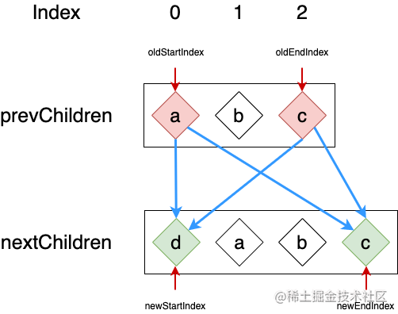

这个例子非常简单，几次循环都是尾节点相同，尾指针一直向前移动，直到循环结束，如下图

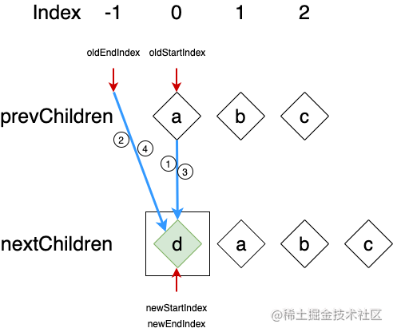

此时`oldEndIndex`以及小于了`oldStartIndex`，但是新列表中还有剩余的节点，我们只需要将剩余的节点依次插入到`oldStartNode`的`DOM`之前就可以了。为什么是插入`oldStartNode`之前呢？原因是剩余的节点在新列表的位置是位于`oldStartNode`之前的，如果剩余节点是在`oldStartNode`之后，`oldStartNode`就会先行对比，这个需要思考一下，其实还是与`第四步`的思路一样。

```
function vue2Diff(prevChildren, nextChildren, parent) {
  //...
  while (oldStartIndex <= oldEndIndex && newStartIndex <= newEndIndex) {
  // ...
  }
  if (oldEndIndex < oldStartIndex) {
    for (let i = newStartIndex; i <= newEndIndex; i++) {
      mount(nextChildren[i], parent, prevStartNode.el)
    }
  }
}

```

4\. 移除节点

与上一小节的情况相反，当新列表的`newEndIndex`小于`newStartIndex`时，我们将旧列表剩余的节点删除即可。这里我们需要注意，旧列表的`undefind`。在第二小节中我们提到过，当头尾节点都不相同时，我们会去旧列表中找新列表的第一个节点，移动完DOM节点后，将旧列表的那个节点改为`undefind`。所以我们在最后的删除时，需要注意这些`undefind`，遇到的话跳过当前循环即可。

```
function vue2Diff(prevChildren, nextChildren, parent) {
  //...
  while (oldStartIndex <= oldEndIndex && newStartIndex <= newEndIndex) {
  // ...
  }
  if (oldEndIndex < oldStartIndex) {
    for (let i = newStartIndex; i <= newEndIndex; i++) {
      mount(nextChildren[i], parent, prevStartNode.el)
    }
  } else if (newEndIndex < newStartIndex) {
    for (let i = oldStartIndex; i <= oldEndIndex; i++) {
      if (prevChildren[i]) {
        partent.removeChild(prevChildren[i].el)
      }
    }
  }
}

```

5\. 小结

至此`双端比较`全部完成，以下是全部代码。

```
function vue2diff(prevChildren, nextChildren, parent) {
  let oldStartIndex = 0,
    newStartIndex = 0,
    oldStartIndex = prevChildren.length - 1,
    newStartIndex = nextChildren.length - 1,
    oldStartNode = prevChildren[oldStartIndex],
    oldEndNode = prevChildren[oldStartIndex],
    newStartNode = nextChildren[newStartIndex],
    newEndNode = nextChildren[newStartIndex];
  while (oldStartIndex <= oldStartIndex && newStartIndex <= newStartIndex) {
    if (oldStartNode === undefined) {
      oldStartNode = prevChildren[++oldStartIndex]
    } else if (oldEndNode === undefined) {
      oldEndNode = prevChildren[--oldStartIndex]
    } else if (oldStartNode.key === newStartNode.key) {
      patch(oldStartNode, newStartNode, parent)

      oldStartIndex++
      newStartIndex++
      oldStartNode = prevChildren[oldStartIndex]
      newStartNode = nextChildren[newStartIndex]
    } else if (oldEndNode.key === newEndNode.key) {
      patch(oldEndNode, newEndNode, parent)

      oldStartIndex--
      newStartIndex--
      oldEndNode = prevChildren[oldStartIndex]
      newEndNode = nextChildren[newStartIndex]
    } else if (oldStartNode.key === newEndNode.key) {
      patch(oldStartNode, newEndNode, parent)
      parent.insertBefore(oldStartNode.el, oldEndNode.el.nextSibling)
      oldStartIndex++
      newStartIndex--
      oldStartNode = prevChildren[oldStartIndex]
      newEndNode = nextChildren[newStartIndex]
    } else if (oldEndNode.key === newStartNode.key) {
      patch(oldEndNode, newStartNode, parent)
      parent.insertBefore(oldEndNode.el, oldStartNode.el)
      oldStartIndex--
      newStartIndex++
      oldEndNode = prevChildren[oldStartIndex]
      newStartNode = nextChildren[newStartIndex]
    } else {
      let newKey = newStartNode.key,
        oldIndex = prevChildren.findIndex(child => child && (child.key === newKey));
      if (oldIndex === -1) {
        mount(newStartNode, parent, oldStartNode.el)
      } else {
        let prevNode = prevChildren[oldIndex]
        patch(prevNode, newStartNode, parent)
        parent.insertBefore(prevNode.el, oldStartNode.el)
        prevChildren[oldIndex] = undefined
      }
      newStartIndex++
      newStartNode = nextChildren[newStartIndex]
    }
  }
  if (newStartIndex > newStartIndex) {
    while (oldStartIndex <= oldStartIndex) {
      if (!prevChildren[oldStartIndex]) {
        oldStartIndex++
        continue
      }
      parent.removeChild(prevChildren[oldStartIndex++].el)
    }
  } else if (oldStartIndex > oldStartIndex) {
    while (newStartIndex <= newStartIndex) {
      mount(nextChildren[newStartIndex++], parent, oldStartNode.el)
    }
  }
}

```

### 4.3 Vue3 Diff ------ 最长递增子序列

`vue3`的`diff`借鉴于[inferno (opens new window)](https://github.com/infernojs/inferno)，该算法其中有两个理念。第一个是相同的前置与后置元素的预处理；第二个则是最长递增子序列，此思想与`React`的`diff`类似又不尽相同。下面我们来一一介绍。

1\. 前置与后置的预处理

我们看这两段文字

```
Hello World
Hey World

```

其实就简单的看一眼我们就能发现，这两段文字是有一部分是相同的，这些文字是不需要修改也不需要移动的，真正需要进行修改中间的几个字母，所以`diff`就变成以下部分

```
text1: 'llo'
text2: 'y'

```

接下来换成`vnode`，我们以下图为例。

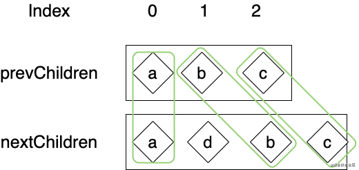

图中的被绿色框起来的节点，他们是不需要移动的，只需要进行打补丁`patch`就可以了。我们把该逻辑写成代码。

```
function vue3Diff(prevChildren, nextChildren, parent) {
  let j = 0,
    prevEnd = prevChildren.length - 1,
    nextEnd = nextChildren.length - 1,
    prevNode = prevChildren[j],
    nextNode = nextChildren[j];
  while (prevNode.key === nextNode.key) {
    patch(prevNode, nextNode, parent)
    j++
    prevNode = prevChildren[j]
    nextNode = nextChildren[j]
  }

  prevNode = prevChildren[prevEnd]
  nextNode = prevChildren[nextEnd]

  while (prevNode.key === nextNode.key) {
    patch(prevNode, nextNode, parent)
    prevEnd--
    nextEnd--
    prevNode = prevChildren[prevEnd]
    nextNode = prevChildren[nextEnd]
  }
}

```

这时候，我们就需要考虑边界情况了，这里有两种情况。一种是`j > prevEnd`；另一种是`j > nextEnd`。

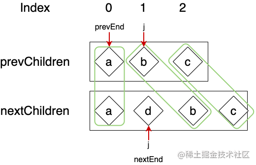

我们以这张图为例，此时`j > prevEnd`且`j <= nextEnd`，我们只需要把新列表中`j`到`nextEnd`之间剩下的节点插入进去就可以了。相反， 如果`j > nextEnd`时，我们把旧列表中`j`到`prevEnd`之间的节点删除就可以了。

```
function vue3Diff(prevChildren, nextChildren, parent) {
  // ...
  if (j > prevEnd && j <= nextEnd) {
    let nextpos = nextEnd + 1,
      refNode = nextpos >= nextChildren.length
                ? null
                : nextChildren[nextpos].el;
    while(j <= nextEnd) mount(nextChildren[j++], parent, refNode)

  } else if (j > nextEnd && j <= prevEnd) {
    while(j <= prevEnd) parent.removeChild(prevChildren[j++].el)
  }
}

```

我们再继续思考，在我们`while`循环时，指针是从两端向内逐渐靠拢的，所以我们应该在循环中就应该去判断边界情况，我们使用`label`语法，当我们触发边界情况时，退出全部的循环，直接进入判断。代码如下：

```
function vue3Diff(prevChildren, nextChildren, parent) {
  let j = 0,
    prevEnd = prevChildren.length - 1,
    nextEnd = nextChildren.length - 1,
    prevNode = prevChildren[j],
    nextNode = nextChildren[j];
  // label语法
  outer: {
    while (prevNode.key === nextNode.key) {
      patch(prevNode, nextNode, parent)
      j++
      // 循环中如果触发边界情况，直接break，执行outer之后的判断
      if (j > prevEnd || j > nextEnd) break outer
      prevNode = prevChildren[j]
      nextNode = nextChildren[j]
    }

    prevNode = prevChildren[prevEnd]
    nextNode = prevChildren[nextEnd]

    while (prevNode.key === nextNode.key) {
      patch(prevNode, nextNode, parent)
      prevEnd--
      nextEnd--
      // 循环中如果触发边界情况，直接break，执行outer之后的判断
      if (j > prevEnd || j > nextEnd) break outer
      prevNode = prevChildren[prevEnd]
      nextNode = prevChildren[nextEnd]
    }
  }

  // 边界情况的判断
  if (j > prevEnd && j <= nextEnd) {
    let nextpos = nextEnd + 1,
      refNode = nextpos >= nextChildren.length
                ? null
                : nextChildren[nextpos].el;
    while(j <= nextEnd) mount(nextChildren[j++], parent, refNode)

  } else if (j > nextEnd && j <= prevEnd) {
    while(j <= prevEnd) parent.removeChild(prevChildren[j++].el)
  }
}

```

2\. 判断是否需要移动

其实几个算法看下来，套路已经很明显了，就是找到移动的节点，然后给他移动到正确的位置。把该加的新节点添加好，把该删的旧节点删了，整个算法就结束了。这个算法也不例外，我们接下来看一下它是如何做的。

当`前/后置`的预处理结束后，我们进入真正的`diff`环节。首先，我们先根据新列表剩余的节点数量，创建一个`source`数组，并将数组填满`-1`。

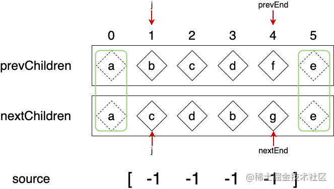

我们先写这块逻辑。

```
function vue3Diff(prevChildren, nextChildren, parent) {
  //...
  outer: {
  // ...
  }

  // 边界情况的判断
  if (j > prevEnd && j <= nextEnd) {
    // ...
  } else if (j > nextEnd && j <= prevEnd) {
    // ...
  } else {
    let prevStart = j,
      nextStart = j,
      nextLeft = nextEnd - nextStart + 1,     // 新列表中剩余的节点长度
      source = new Array(nextLeft).fill(-1);  // 创建数组，填满-1

  }
}

```

那么这个`source`数组，是要做什么的呢？他就是来做新旧节点的对应关系的，我们将新节点在旧列表的位置存储在该数组中，我们在根据`source`计算出它的`最长递增子序列`用于移动DOM节点。为此，我们先建立一个对象存储当前新列表中的`节点`与`index`的关系，再去旧列表中去找位置。

在找节点时要注意，如果旧节点在新列表中没有的话，直接删除就好。除此之外，我们还需要一个数量表示记录我们已经`patch`过的节点，如果数量已经与新列表剩余的节点数量一样，那么剩下的`旧节点`我们就直接删除了就可以了

```
function vue3Diff(prevChildren, nextChildren, parent) {
  //...
  outer: {
  // ...
  }

  // 边界情况的判断
  if (j > prevEnd && j <= nextEnd) {
    // ...
  } else if (j > nextEnd && j <= prevEnd) {
    // ...
  } else {
    let prevStart = j,
      nextStart = j,
      nextLeft = nextEnd - nextStart + 1,     // 新列表中剩余的节点长度
      source = new Array(nextLeft).fill(-1),  // 创建数组，填满-1
      nextIndexMap = {},                      // 新列表节点与index的映射
      patched = 0;                            // 已更新过的节点的数量

    // 保存映射关系
    for (let i = nextStart; i <= nextEnd; i++) {
      let key = nextChildren[i].key
      nextIndexMap[key] = i
    }

    // 去旧列表找位置
    for (let i = prevStart; i <= prevEnd; i++) {
      let prevNode = prevChildren[i],
      	prevKey = prevNode.key,
        nextIndex = nextIndexMap[prevKey];
      // 新列表中没有该节点 或者 已经更新了全部的新节点，直接删除旧节点
      if (nextIndex === undefind || patched >= nextLeft) {
        parent.removeChild(prevNode.el)
        continue
      }
      // 找到对应的节点
      let nextNode = nextChildren[nextIndex];
      patch(prevNode, nextNode, parent);
      // 给source赋值
      source[nextIndex - nextStart] = i
      patched++
    }
  }
}

```

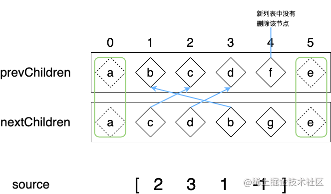

找到位置后，我们观察这个重新赋值后的`source`，我们可以看出，如果是全新的节点的话，其在`source`数组中对应的值就是初始的`-1`，通过这一步我们可以区分出来哪个为全新的节点，哪个是可复用的。

其次，我们要判断是否需要移动。那么如何判断移动呢？很简单，和`React`一样我们用递增法，如果我们找到的`index`是一直递增的，说明不需要移动任何节点。我们通过设置一个变量来保存是否需要移动的状态。

```
function vue3Diff(prevChildren, nextChildren, parent) {
  //...
  outer: {
  // ...
  }

  // 边界情况的判断
  if (j > prevEnd && j <= nextEnd) {
    // ...
  } else if (j > nextEnd && j <= prevEnd) {
    // ...
  } else {
    let prevStart = j,
      nextStart = j,
      nextLeft = nextEnd - nextStart + 1,     // 新列表中剩余的节点长度
      source = new Array(nextLeft).fill(-1),  // 创建数组，填满-1
      nextIndexMap = {},                      // 新列表节点与index的映射
      patched = 0,
      move = false,                           // 是否移动
      lastIndex = 0;                          // 记录上一次的位置

    // 保存映射关系
    for (let i = nextStart; i <= nextEnd; i++) {
      let key = nextChildren[i].key
      nextIndexMap[key] = i
    }

    // 去旧列表找位置
    for (let i = prevStart; i <= prevEnd; i++) {
      let prevNode = prevChildren[i],
      	prevKey = prevNode.key,
        nextIndex = nextIndexMap[prevKey];
      // 新列表中没有该节点 或者 已经更新了全部的新节点，直接删除旧节点
      if (nextIndex === undefind || patched >= nextLeft) {
        parent.removeChild(prevNode.el)
        continue
      }
      // 找到对应的节点
      let nextNode = nextChildren[nextIndex];
      patch(prevNode, nextNode, parent);
      // 给source赋值
      source[nextIndex - nextStart] = i
      patched++

      // 递增方法，判断是否需要移动
      if (nextIndex < lastIndex) {
      	move = false
      } else {
      	lastIndex = nextIndex
      }
    }

    if (move) {

    // 需要移动
    } else {

    //不需要移动
    }
  }
}

```

3\. DOM如何移动

判断完是否需要移动后，我们就需要考虑如何移动了。一旦需要进行DOM移动，我们首先要做的就是找到`source`的最长递增子序列。

```
function vue3Diff(prevChildren, nextChildren, parent) {
  //...
  if (move) {
	const seq = lis(source); // [0, 1]
  // 需要移动
  } else {

  //不需要移动
  }
}

```

> 什么是最长递增子序列：给定一个数值序列，找到它的一个子序列，并且子序列中的值是递增的，子序列中的元素在原序列中不一定连续。
>
> 例如给定数值序列为：[ 0, 8, 4, 12 ]。
>
> 那么它的最长递增子序列就是：[0, 8, 12]。
>
> 当然答案可能有多种情况，例如：[0, 4, 12] 也是可以的。

上面的代码中，我们调用`lis` 函数求出数组`source`的最长递增子序列为`[ 0, 1 ]`。我们知道 source 数组的值为 `[2, 3, 1, -1]`，很显然最长递增子序列应该是`[ 2, 3 ]`，但为什么计算出的结果是`[ 0, 1 ]`呢？其实`[ 0, 1 ]`代表的是最长递增子序列中的各个元素在`source`数组中的位置索引，如下图所示：

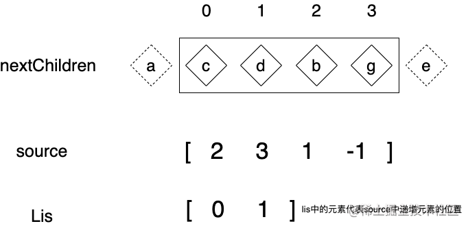

我们根据`source`，对新列表进行重新编号，并找出了`最长递增子序列`。

我们从后向前进行遍历`source`每一项。此时会出现三种情况：

1.  当前的值为`-1`，这说明该节点是全新的节点，又由于我们是从后向前遍历，我们直接创建好DOM节点插入到队尾就可以了。
2.  当前的索引为`最长递增子序列`中的值，也就是`i === seq[j]`，这说说明该节点不需要移动
3.  当前的索引不是`最长递增子序列`中的值，那么说明该DOM节点需要移动，这里也很好理解，我们也是直接将DOM节点插入到队尾就可以了，因为队尾是排好序的

```
function vue3Diff(prevChildren, nextChildren, parent) {
  //...
  if (move) {
   // 需要移动
	const seq = lis(source); // [0, 1]
    let j = seq.length - 1;  // 最长子序列的指针
    // 从后向前遍历
    for (let i = nextLeft - 1； i >= 0; i--) {
      let pos = nextStart + i, // 对应新列表的index
        nextNode = nextChildren[pos],	// 找到vnode
      	nextPos = pos + 1，    // 下一个节点的位置，用于移动DOM
        refNode = nextPos >= nextChildren.length ? null : nextChildren[nextPos].el, //DOM节点
        cur = source[i];  // 当前source的值，用来判断节点是否需要移动

      if (cur === -1) {
        // 情况1，该节点是全新节点
      	mount(nextNode, parent, refNode)
      } else if (cur === seq[j]) {
        // 情况2，是递增子序列，该节点不需要移动
        // 让j指向下一个
        j--
      } else {
        // 情况3，不是递增子序列，该节点需要移动
        parent.insetBefore(nextNode.el, refNode)
      }
    }

  } else {
  //不需要移动

  }
}

```

说完了需要移动的情况，再说说不需要移动的情况。如果不需要移动的话，我们只需要判断是否有全新的节点给他添加进去就可以了。具体代码如下：

```
function vue3Diff(prevChildren, nextChildren, parent) {
  //...
  if (move) {
	const seq = lis(source); // [0, 1]
    let j = seq.length - 1;  // 最长子序列的指针
    // 从后向前遍历
    for (let i = nextLeft - 1； i >= 0; i--) {
      let pos = nextStart + i, // 对应新列表的index
        nextNode = nextChildren[pos],	// 找到vnode
      	nextPos = pos + 1，    // 下一个节点的位置，用于移动DOM
        refNode = nextPos >= nextChildren.length ? null : nextChildren[nextPos].el, //DOM节点
        cur = source[i];  // 当前source的值，用来判断节点是否需要移动

      if (cur === -1) {
        // 情况1，该节点是全新节点
      	mount(nextNode, parent, refNode)
      } else if (cur === seq[j]) {
        // 情况2，是递增子序列，该节点不需要移动
        // 让j指向下一个
        j--
      } else {
        // 情况3，不是递增子序列，该节点需要移动
        parent.insetBefore(nextNode.el, refNode)
      }
    }
  } else {
    //不需要移动
    for (let i = nextLeft - 1； i >= 0; i--) {
      let cur = source[i];  // 当前source的值，用来判断节点是否需要移动

      if (cur === -1) {
       let pos = nextStart + i, // 对应新列表的index
          nextNode = nextChildren[pos],	// 找到vnode
          nextPos = pos + 1，    // 下一个节点的位置，用于移动DOM
          refNode = nextPos >= nextChildren.length ? null : nextChildren[nextPos].el, //DOM节点
      	mount(nextNode, parent, refNode)
      }
    }
  }
}

```

至此`vue3.0`的diff完成。

4\. 最长递增子序列

我们以该数组为例

```
[10,9,2,5,3,8,7,13]

```

我们可以使用动态规划的思想考虑这个问题。动态规划的思想是将一个大的问题分解成多个小的子问题，并尝试得到这些子问题的最优解，子问题的最优解有可能会在更大的问题中被利用，这样通过小问题的最优解最终求得大问题的最优解。

我们先假设只有一个值的数组`[13]`，那么该数组的最长递增子序列就是`[13]`自己本身，其长度为`1`。那么我们认为每一项的递增序列的长度值均为1

那么我们这次给数组增加一个值`[7, 13]`, 由于`7 < 13`，所以该数组的最长递增子序列是`[7, 13]`，那么该长度为`2`。那么我们是否可以认为，当`[7]`小于`[13]`时，以`[7]`为头的递增序列的长度是，`[7]`的长度和`[13]`的长度的和，即`1 + 1 = 2`。

ok，我们基于这种思想来给计算一下该数组。我们先将每个值的初始赋值为`1`


首先 `7 < 13` 那么`7`对应的长度就是`13`的长度再加1，`1 + 1 = 2`


继续，我们对比`8`。我们首先和`7`比，发现不满足递增，但是没关系我们还可以继续和`13`比，`8 < 13`满足递增，那么`8`的长度也是`13`的长度在加一，长度为`2`


我们再对比`3`，我们先让其与`8`进行对比，`3 < 8`，那么`3`的长度是`8`的长度加一，此时`3`的长度为`3`。但是还没结束，我们还需要让`3`与`7`对比。同样`3 < 7`，此时我们需要在计算出一个长度是`7`的长度加一同样是`3`，我们对比两个长度，如果原本的长度没有本次计算出的长度值大的话，我们进行替换，反之则我们保留原本的值。由于`3 === 3`，我们选择不替换。最后，我们让`3`与`13`进行对比，同样的`3 < 13`，此时计算出的长度为`2`，比原本的长度`3`要小，我们选择保留原本的值。


之后的计算依次类推，最后的结果是这样的


我们从中取最大的值`4`，该值代表的最长递增子序列的个数。代码如下：

```
function lis(arr) {
  let len = arr.length,
    dp = new Array(len).fill(1); // 用于保存长度
  for (let i = len - 1; i >= 0; i--) {
    let cur = arr[i]
    for(let j = i + 1; j < len; j++) {
      let next = arr[j]
      // 如果是递增 取更大的长度值
      if (cur < next) dp[i] = Math.max(dp[j]+1, dp[i])
    }
  }
  return Math.max(...dp)
}

```

至此为止，我们讲完了基础的最长递增子序列。然而在`vue3.0`中，我们需要的是最长递增子序列在原本数组中的索引。所以我们还需要在创建一个数组用于保存每个值的最长子序列所对应在数组中的`index`。具体代码如下：

```
function lis(arr) {
  let len = arr.length,
    res = [],
    dp = new Array(len).fill(1);
  // 存默认index
  for (let i = 0; i < len; i++) {
    res.push([i])
  }
  for (let i = len - 1; i >= 0; i--) {
    let cur = arr[i],
      nextIndex = undefined;
    // 如果为-1 直接跳过，因为-1代表的是新节点，不需要进行排序
    if (cur === -1) continue
    for (let j = i + 1; j < len; j++) {
      let next = arr[j]
      // 满足递增条件
      if (cur < next) {
        let max = dp[j] + 1
        // 当前长度是否比原本的长度要大
        if (max > dp[i]) {
          dp[i] = max
          nextIndex = j
        }
      }
    }
    // 记录满足条件的值，对应在数组中的index
    if (nextIndex !== undefined) res[i].push(...res[nextIndex])
  }
  let index = dp.reduce((prev, cur, i, arr) => cur > arr[prev] ? i : prev, dp.length - 1)
  // 返回最长的递增子序列的index
  return result[index]
}

```
