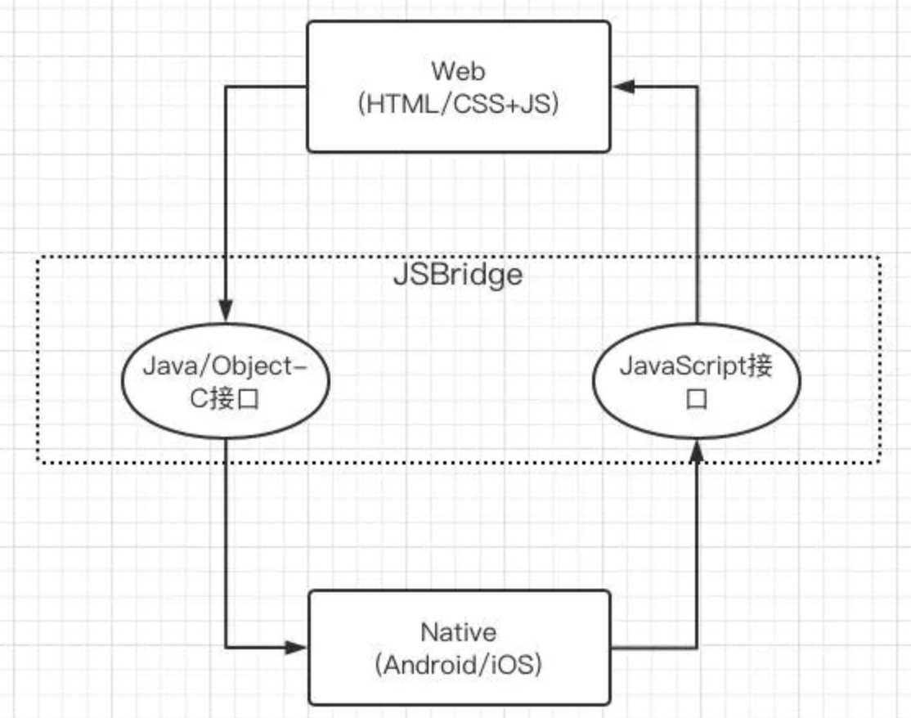
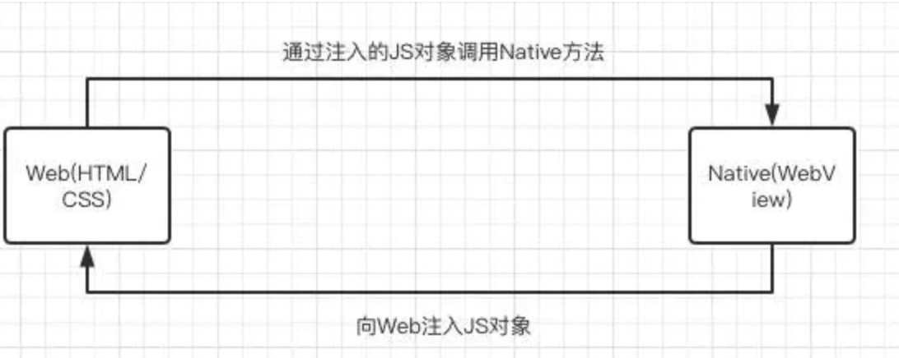

移动多端开发
===

------------------------------------------------------------------------------------------

1 移动端适配
-------------------------------------------------------------------------------------------------------------------------------------------------------------------------------

为什么要做适配

-   为了适应各种移动端设备，完美呈现应有的布局效果
-   各个移动端设备，分辨率大小不一致，网页想铺满整个屏幕，并在各种分辨下等比缩放

### 适配方案

-   固定高度，宽度百分比适配-布局非常均匀，适合百分比布局
-   固定宽度，改变缩放比例适配-什么情况都可以
-   Rem适配
-   像素比适配

单位

-   `em`根据元素自身的字体大小计算,元素自身 `16px 1em=16px`
-   `Rem R -> root` 根节点( html ) 根据html的字体大小计算其他元素尺寸

百分比适配

> 固定高度，宽度百分比适配

-   根据设置的大小去设置高度，单位可以用px 百分比 auto
-   常用Flex布局
-   百分比宽度

> 以640设计稿为例，在外层容器上设置最大以及最小的宽

```
#wrapper {
    max-width: 640px; /*设置设计稿的宽度*/
    min-width: 300px;
    margin: 0 auto;
}

```

> 后面的区块布局都用百分比，具体元素大小用`px`计算

Rem适配(常用)

-   根据屏幕的分辨率动态设置`html`的文字大小，达到等比缩放的功能
-   保证`html`最终算出来的字体大小，不能小于`12px`
-   在不同的移动端显示不同的元素比例效果
-   如果`html`的`font-size:20px`的时候，那么此时的`1rem = 20px`
-   把设计图的宽度分成多少分之一，根据实际情况
-   `rem`做盒子的宽度，`viewport`缩放

> `head`加入常见的`meta`属性

```
<meta name="format-detection" content="telephone=no">
<meta name="apple-mobile-web-app-capable" content="yes">
<meta name="apple-mobile-web-app-status-bar-style" content="black">
<!--这个是关键-->
<meta name="viewport" content="width=device-width, initial-scale=1.0, maximum-scale=1.0, user-scalable=0，minimum-scale=1.0">

```

> 把这段代码加入`head`中的`script`预先加载

```
// rem适配用这段代码动态计算html的font-size大小
(function(win) {
    var docEl = win.document.documentElement;
    var timer = '';

    function changeRem() {
        var width = docEl.getBoundingClientRect().width;
        if (width > 750) { // 750是设计稿大小
            width = 750;
        }
        var fontS = width / 10; // 把设备宽度十等分 1rem=10px
        docEl.style.fontSize = fontS + "px";
    }
    win.addEventListener("resize", function() {
        clearTimeout(timer);
        timer = setTimeout(changeRem, 30);
    }, false);
    win.addEventListener("pageshow", function(e) {
        if (e.persisted) { //清除缓存
            clearTimeout(timer);
            timer = setTimeout(changeRem, 30);
        }
    }, false);
    changeRem();
})(window)

```

像素比适配

-   `window.devicePixelRatio`
-   物理像素是手机屏幕分辨率
-   独立像素 指`css`像素 屏幕宽度
-   像素比 = 物理像素 / `css`宽度
-   获取设备的像素比 `window.devicePixelRatio`

2 移动端300ms延迟
-----------------------------------------------------------------------------------------------------------------------------------------------------------------------------------------

> 由来：300毫米延迟解决的是双击缩放。双击缩放，手指在屏幕快速点击两次。safari浏览器就会将网页缩放值原始比例。由于用户可以双击缩放或者是滚动的操作， 当用户点击屏幕一次之后，浏览器并不会判断用户确实要打开至这个链接，还是想要进行双击操作 因此，safair浏览器就会等待300ms，用来判断用户是否在次点击了屏幕

解决方案：

1.  禁用缩放，设置meta标签 `user-scalable=no`
2.  `fastclick.js`

> 原理：FastClick的实现原理是在检查到touchend事件的时候，会通过dom自定义事件立即发出click事件，并把浏览器在300ms之后真正的click事件阻止掉。fastclick.js还可以解决穿透问题

-   fastclick可以解决在手机上点击事件的300ms延迟
-   zepto的touch模块，tap事件也是为了解决在click的延迟问题

触摸事件的响应顺序

-   `ontouchstart`
-   `ontouchmove`
-   `ontouchend`
-   `onclick`

3 如何解决移动端 Retina 屏 1px 像素问题
-------------------------------------------------------------------------------------------------------------------------------------------------------------------------------------------------------------------------------------------------------------------------------

-   `伪元素 + transform scaleY(.5)`
-   `border-image`
-   `background-image`
-   `box-shadow`

> 一般来说，在PC端浏览器中，设备像素比（dpr）等于1，1个css像素就代表1个物理像素；但是在`retina`屏幕中，dpr普遍是2或3，1个css像素不再等于1个物理像素，因此比实际设计稿看起来粗不少

1.  伪元素+scale

```
<style>
    .box{
        width: 100%;
        height: 1px;
        margin: 20px 0;
        position: relative;
    }
    .box::after{
        content: '';
        position: absolute;
        bottom: 0;
        width: 100%;
        height: 1px;
        transform: scaleY(0.5);
        transform-origin: 0 0;
        background: red;
    }
</style>

<div class="box"></div>

```

1.  border-image

```
div{
    border-width: 1px 0px;
    -webkit-border-image: url(border.png) 2 0 stretch;
    border-image: url(border.png) 2 0 stretch;
}

```

4 如何解决移动端击穿（穿透）问题
-------------------------------------------------------------------------------------------------------------------------------------------------------------------------------------------------------------------------------------------------------------------

> 在移动端开发的时候，我们有时候会遇到这样一个bug：点击关闭遮罩层的时候，遮罩层下面的带有点击的元素也会被触发，给人一种击穿了页面的感觉，这是为什么呢？

-   点击"打开弹框"按钮，显示遮罩层
-   点击"关闭弹框"按钮，遮罩层消失，底下的连接被触发

```
var show = document.getElementById('show') // 打开按钮
var mask = document.getElementById('mask') // 遮罩层
var btn = document.getElementById('btn')   // 关闭按钮

show.onclick = function () {
    mask.style.display = 'block'
}

btn.addEventListener('touchstart', function () {
    mask.style.display = 'none'
}, false)

```

-   这样问题的形成原因是什么呢？
-   我们先来看一段代码：(以下代码需在移动端上运行)

```
<div id="btn">我是一个按钮</div>
var btn = document.getElementById('btn')
btn.addEventListener('touchstart', function () {
    console.log('start')
}, false)

btn.addEventListener('touchmove', function () {
    console.log('move')
}, false)

btn.addEventListener('touchend', function () {
    console.log('touchend')
}, false)

btn.addEventListener('click', function () {
    console.log('click')
}, false)

```

> 以上代码会出现2种运行情况

```
start ===> move ===> end
start ===> end ===> click

```

> 看到这里相信大家都明白了，由于「关闭弹框」按钮绑定的事件是`touch`，a标签是`click`事件，在`touch`事件触发后，我们弹出框的遮罩层就消失了，这时候的`click`事件就被a标签给捕获到了，形成了击穿的效果

方法一、阻止默认事件

```
btn.addEventListener('touchend', function (e) {
    mask.style.display = 'none'
    e.preventDefault()
}, false)

```

> 在执行 touchstart 和 touchend 事件时，隐藏执行完隐藏命令后，立即阻止后续事件(推荐在touchend时，阻止后续的默认事件)

方法二、统一使用click事件

```
btn.addEventListener('click', function () {
    mask.style.display = 'none'
}, false)

```

> 这个方法简单，就是交互的效率没有`click`事件高，另外，用户在`touch`的时候，有可能微微滑动了一下，就会无法触发点击事件。影响用户体验。

方法三、延迟执行

```
btn.addEventListener('touchend', function () {
    setTimeout(function () {
        mask.style.display = 'none'  // 可以使用fadeOut动画
    }, 300)
}, false)

```

> 点击之后，我们不立即隐藏。让遮罩在350ms毫秒内淡出消失。（我为了演示方便就没有添加动画了，采用了定时器方法。）

方法四、 css属性pointer-events

```
click.setAttribute('style', 'pointer-events:none')
mask.style.display = 'none'
setTimeout(function () {
    click.setAttribute('style', 'pointer-events:auto')
}, 350)

```

> 这样做法是，在遮罩消失之前，先让a标签忽略点击事件，这样遮罩层的点击事件，就不会被a标签捕获到。还是等350毫秒之后，再次赋予a标签的点击能力。这个方法跟方法三原理相似，只是利用了不同的css属性而已。个人觉得方法三比较好一点。方法四有明显的2个缺点：

-   遮罩层下面可能有多个带有事件的元素，那么你需要给所有可点击元素添加`pointer-events`属性 然后删除。不仅容易出错，还影响性能
-   如果用户在`350`毫秒内点击了元素，会造成页面失效的错觉，影响体验。

方法五、fastClick库

> 这个库的引用方法，在我上一篇文章中已经讲到。fastClick的原理就是使用了方法一的做法。fastClick 在 touchend 阶段 调用 event.preventDefault，然后通过 document.createEvent 创建一个 MouseEvents，然后 通过 `eventTarget.dispatchEvent` 触发对应目标元素上绑定的 click 事件

5 移动端的兼容问题
-------------------------------------------------------------------------------------------------------------------------------------------------------------------------------------------------------------

-   给移动端添加点击事件会有300S的延迟 如果用点击事件，需要引一个`fastclick.js`文件，解决`300s`的延迟 一般在移动端用`ontouchstart`、`ontouchmove`、`ontouchend`
-   移动端点透问题,`touchstart` 早于 `touchend` 早于`click`,`click`的触发是有延迟的，这个时间大概在`300ms`左右，也就是说我们`tap`触发之后蒙层隐藏， 此时 `click`还没有触发，300ms之后由于蒙层隐藏，我们的click触发到了下面的a链接上尽量都使用`touch`事件来替换`click`事件。例如用touchend事件(推荐)。用`fastclick`，`github.com/ftlabs/fast...`用`preventDefault`阻止`a`标签的`click`消除 `IE10` 里面的那个叉号`input:-ms-clear{display:none;}`
-   设置缓存 手机页面通常在第一次加载后会进行缓存，然后每次刷新会使用缓存而不是去重新向服务器发送请求。如果不希望使用缓存可以设置`no-cache`。
-   圆角`BUG` 某些Android手机圆角失效 b`ackground-clip: padding-box;` 防止手机中网页放大和缩小 这点是最基本的，做为手机网站开发者来说应该都知道的，就是设置`meta`中的`viewport`
-   设置用户截止缩放，一般写视口的时候就已经写好了

6 JSBridge原理是什么？如何设计一个JSBridge？
------------------------------------------------------------------------------------------------------------------------------------------------------------------------------------------------------------------------------------------------------------------------------

### 6.1 JSBridge原理

> `JSBridge`的作用就是让`native`可以调用`web`的`js`代码，让`web`可以调用原生的代码，实现数据通信，它在做`native`代码和js代码相互转换的事情。



实现数据间的通讯关键是以下两点：

-   将`Native`端的接口封装成js接口
-   将`Web`端js接口封装成原生接口

### 6.2 JsBridge的核心

-   拦截Url
-   `load url("javascript:js_method()");`

### 6.3 为什么是'JS'Bridge

> 因为Web端支持JavaScript，而`Native(iOS/Android)`端的`Webview`控件对JavaScript也有所支持，页面加载完成后调用页面的JavaScript代码

### 6.4 应用场景

> 它有什么用？我们在使用混合开发模式(`Hybrid App`)混合使用`Native`和`Web`技术用到。例如目前的使用此技术的主流框架`React Native`、`Weex`、微信小程序等

### 6.5 JSBridge实现 ------ Native端调用Web端代码

> `WebView`是`Native`中加载网页的一个控件，该组件提供一个`evaluateJavascript()`方法运行JS代码。我们要做的是在Native端执行一个js方法，在Web端进行监听

1\. 执行一段JS代码

```
webView.evaluateJavascript("window.showWebDialog('123')",null);

```

2\. Web端进行监听

```
<script>
    window.showWebDialog = text => window.alert(text);
</script>

```

### 6.6 JSBridge实现 ------ Web端调用Native端代码（拦截URL Schema）

> 当Web端要请求`Native`端的方法时，我们首先要自定义一个`URL Schema`，向Native端发起一个请求，最后在`Native`端的`WebView`进行监听，下面我们看看具体实现：


1\. URL schema介绍

> `URL schema` 是类`URL`的请求格式，如：`<protocol>://<domain>/<path>?<query>`

接下来可以自定义通信的`URL schema`，如：

```
jsbridge://<method>?<params>
jsbridge://showToast?text=hello&a=b

```

2\. 发送URL schema请求

> 请求自定义`URL Schema`方法：`jsbridge://showToast?text=`

向Native端发起请求：

```
<script>
    function showNativeDialog(text) {
        window.alert('jsbridge://showToast?text=' + text);
    }
</script>

```

3\. Native端实现监听

```
   webView.setWebChromeClient(new WebChromeClient() {
        @Override
        public boolean onJsAlert(WebView view, String url, String message, JsResult result) {
            if (!message.startsWith("jsbridge://")) {
                return super.onJsAlert(view, url, message, result);
            }

            UrlSchema urlschema = new UrlSchema(message);
            if ("showToast".equals(urlchema.getMethodName())) {
                String text = urlschema.getParams("text");
                Toast.makeText(mContext, text, Toast.LENGTH_LONG).show();
            }

            result.confirm();
            return true;
        }
    }

```

### 6.7 JSBridge实现 ------ Web端调用Native端代码（注入api)

> 注入API 方式的是Native端通过 WebView 提供的接口，向 JavaScript 的 `Context（window）`中注入对象。在Web中通过注入的对象调用Native方法



1\. 向WebView注入JS对象

创建一个JS对象，并实现监听的方法

```
class NativeBridge{
    private Context context;

    NativeBridge(Context context){
        this.context = context;
    }

    @JavascriptInterface
    public void showNativeDialog(String text){
        Toast.makeText(context,text,Toast.LENGTH_LONG).show();
    }
}

```

Native端通过WebView的接口注入JS对象

```
webView.addJavascriptInterface(new NativeBridge(mContext),"NativeBridge");

```

2\. 通过注入的JS对象调用Native代码

Web中获取JS对象，调用Native代码：

```
<script>
    function showNativeDialog(text) {
        //window.alert('jsbridge://showToast?text=' + text);
        window.NativeBridge.showNativeDialog(text);
    }
</script>

```
