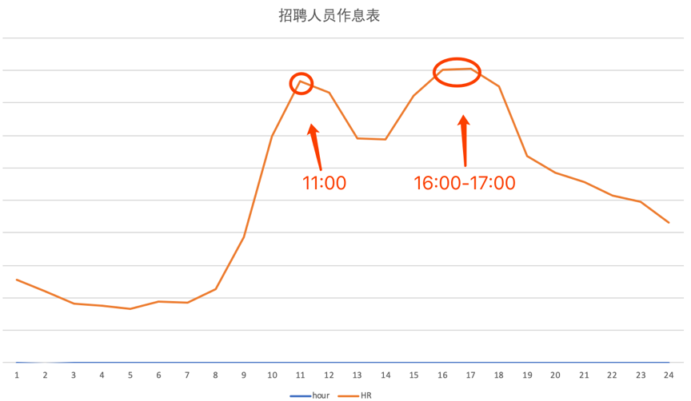
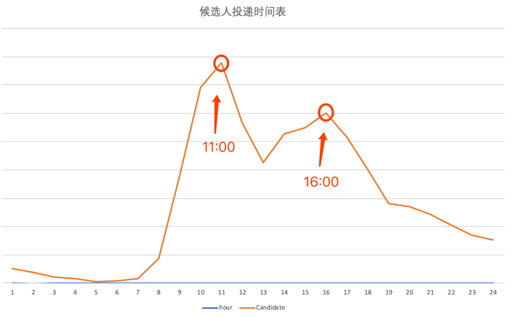

十二、综合问题
----------------------------------------------------------------------------------------------------------------------------------

经历

-   整个经历自我介绍，越详细越好，什么时候接触计算机，什么时候接触前端。
-   整个经历中，你认为最值得骄傲的事情，最难的事情是什么。
-   什么事情让你自豪，什么事情让你有挫败感。
-   未来的发展，自己的规划。

项目相关

-   项目难点。（如何发现问题，解决思路，最后结果）
-   项目考虑过优化吗，你是如何优化的，思路是什么。
-   项目的组织架构，你对它的现有架构的理解，哪些优点值得借鉴，哪些缺点需要改进。
-   如果让你从0到1建一个项目，你考虑的点是什么，有哪些流程需要注意的。
-   如何进行技术选型，需要考虑哪些点。
-   项目中代码规范，你们项目有方案吗，你了解的代码规范有哪些方案。
-   说一说项目中你们是如何测试的，有哪些单元测试方案，能不能说一说。
-   项目中引入TS的原因，为什么这么做。

### 把握投递简历的黄金时间段

> 大家从事不同种类的工作，每天也在不断地制定自己的工作时间表。每个月总结的时候会发现有些事情总是在一个固定的时间去做，也可能在这个时间段发起同一件事情的几率非常的大，而且不止自己这样做，做同样工作的小伙伴亦如此。这就是工作种类作息时间的安排，招聘人员也一样，他们也有固定看简历和电话沟通的时间段。如果抓住这个"黄金投递点"，就等于抓住了招聘人员的视线，进而获得更多关注的可能性会更大。

HR 工作作息时间表

每个公司特别是互联网公司都有大量的招聘需求，而面对这么多的需求，公司 HR 是如何应对的？每天的工作作息时间是否有规律可循呢？

下面通过曲线图的形式来展示拉勾网 HR 的工作作息表：

由上图可知，每天 HR 最活跃的时间段为`上午 11 ~ 12 点、下午 4 点 ~ 5 点`。也就是说在这两个时间段里，我们的招聘小伙伴在疯狂的筛选简历，即在招聘平台上筛选来自不同候选人的简历。

如果`面试者投递简历的时间为上午的 10 ~ 11 点 或者下午的 3 ~ 4 点`，那么简历有可能会被优先处理。相信你也有过体验：一天当中，上午的工作心情以及认真度普遍是最高的，也就是说投递的简历是最容易被招聘人员筛选出来的。

候选人投递时间表

上面分析了 HR 最活跃的时间段，那求职者是不是也有个投递简历的高峰期？如何错开高峰期呢？调取了拉勾网投递简历的数据。

下面通过曲线图的形式来展示候选人投递简历的时间表：

> 由上图可知，候选人投递简历的高峰期是在`上午 11 点和下午 4 点`这两个时间段，也就是说和 HR 筛选简历的时间段完全重合。相信你也有过类似的体验：当专心做某一件事情的时候，肯定不会注意到投递来的新简历，这就是为什么简历石沉大海的原因。

通过上面两个数据的分析，相信你也应该知道了 HR 筛选简历的时间段，由此可知，`投递简历的"黄金时间段"在上午的 10 ~ 11 点 或者下午的 3 ~ 4 点`。因此，从现在起，调整投递简历的时间吧，在更好的时间段将自己的简历呈现到 HR 的面前。

### 把握面试时的关键点

面试前的准备工作

先说说面试前的准备吧。常规的准备相信你一定知道，比如制作一份吸引 HR 的简历、穿一身体面的衣服、整理一下自己的发型等。简历相关的准备前面已经详细讲过，这里就不多介绍了。

下面说说穿着相关的准备，很多小伙伴认为面试时的穿着并不是很重要，面试官肯定更看重个人魅力和知识的储备。当然这么说是没错的，但如果你和面试官首次见面，在还没有开始正式聊天之前，他是无法感知你的个人魅力或者知识储备的。

假如第一次见面就看到邋遢的外表或者奇怪的着装，面试官会怎么给你贴标签呢？首先他一定会认为你并不尊重这次面试，给他造成一种没有礼貌的印象；然后就是被你身上的味道熏倒无法和你多交流；最后根本来不及了解你的个人魅力和知识储备就草草地结束了这次面试。相信这个结果一定不是你想碰到的吧？所以，干净得体的着装是面试非常重要的一个环节。

面试官也会通过你的着装去判断你的性格，以及判断与公司的文化、团队的气氛是否匹配。这时可能你会问：我也没有进入到这家公司和团队，该如何判断面试当天穿什么衣服才符合这个公司的文化或者符合这个团队的气氛呢？当然，我们没有办法做到"把面试官的感受照顾到很细"的层面。

但是不同的穿着一定会表现出你的性格，有些表现出来的性格可能不会被大众所接受的，希望可以回避一下。下面简单说说几种可以表现性格的穿着：

喜欢穿简单朴素衣服的人，往往给人的印象是性格比较沉着稳重、为人比较真诚和随和，无论是在工作或学习上，还是在生活中，会给人一种勤奋好学、诚实肯干的感觉；

喜欢穿样式繁杂、颜色多样、花里胡哨的衣服的人，多是虚荣心比较强，爱表现自己而且又是乐于炫耀的人，会给人一种性格有些飞扬跋扈的感觉；

喜欢穿浅色衣服的人，性格比较活泼好动，十分健谈，会给人一种喜欢交朋友的感觉；

喜欢穿深色衣服的人，性格比较稳重，显得城府很深，会给人一种比较沉默，做人做事深谋远虑的感觉。

如果你希望在面试中表现的不是那么具有攻击力或者给人比较亲和、稳重性格的话，建议穿简单、朴素、纯色的衣服，会显得整个人比较清爽，且比较容易亲近，相信面试官也愿意和你多聊几句。当然不仅穿着干净，而且一定要注意个人卫生，最好不要让自己身上的体味过重或者使用太重味道的香水。化妆时，不建议浓妆艳抹，自然的淡妆让自己看起来很精神就可以。

如何全面的介绍自己

接下来就是面试的过程了，首先面试官会说："请简单介绍一下自己。"

> 面试官有两个目的：（1）希望通过你的简单描述可以和简历上的经历做校对；（2）通过简单地介绍来看看你的逻辑和总结能力如何。所以自我介绍也是非常重要的一个环节，好的自我介绍一定要做到以下几点。

1.  面试时的自我介绍

> 一定要把握住时间。面试时的自我介绍一般`控制3～5分钟`最合适，尽量不要超过10分钟。时间过短说明你根本没有清晰的介绍自己，这时面试官很难了解你到底做了什么；时间过长可能很多内容不是面试官需要的信息，这时大部分的面试官会主动打断你，从而留下了不太好的印象。

那如何把握好时间呢？建议在介绍时包含以下几个部分就好：`（1）情况介绍，包括教育经历；（2）工作经验的介绍；（3）介绍最有价值的经历`。这样的一个自我介绍应该可以很好的控制在5分钟左右了，既可以让面试官清晰的了解你的情况，也能表现出你的优势。

1.  面试过程中需突出的几个点

> 在面试过程中一定要突出以下几个点：做过什么、有哪些工作业绩、优势是什么，这样可以很好的突出自己。

做过什么：介绍自己，把自己曾经做过的事情说清楚，每段工作对应时间节点的公司名称、担任职务、工作内容等，尤其是对最近两份工作做过的事情要重点说说，较早之前的工作经验，或者学习的经验可以一带而过，要把握"重点突出"的原则。

有哪些工作业绩：把自己在不同阶段做成的有代表性的项目经验介绍清楚，但是一定要注意：（1） 应与应聘岗位需要的能力相关的业绩多介绍，不相关的一笔带过或不介绍，因为面试官关注的是对用人单位有用的业绩；（2）要注意介绍你个人的业绩而不是团队业绩，要把自己最精彩的一两段业绩加以重点呈现。当然也要做好充足的准备，可以迎接面试官的提问。

> 突出自己的优势：注意介绍自己的优势一定要与应聘的岗位密切相关，主要是围绕自己专业特长来介绍。除专业特长以外的特长，特别突出可以介绍，但要点到为止。

举个例子：你好，我是某某，2018年3月加入XXX公司，担任产品经理一职，主要负责公司核心产品的规划和设计工作；在这段期间，我独立完成过XX项目的产品跟进和上线的工作，将产品的数据提升了30%，业绩突出，获得了公司的认可。在项目中，我通过学习和与外部专家的沟通，获许了XXX新策略的信息，并积极尝试，达成了我的目标。

1.  每段工作的离职原因

> 在面试的过程中一定要突出自己职业规划的逻辑性，也就是说需要让面试官感受到你的每次工作变动都是为了个人成长以及有规划的进行变动。所以在表述的时候最好可以清晰地说出你在每段工作中的收获和成长点，当然如果在陈述这些内容时可以体现出你的个人思考，就更是画龙点睛了。

如何回答面试中的问题

相信你经常会碰到面试官问以下的问题，这些问题也是面试官给你的一些考验，如果更好地回答这些问题可能会成为你入职心仪公司的敲门砖。

1.  你为什么选择我们公司？

这个问题相信不少小伙伴遇到过，可能你的原因是随便投递、公司离自己住的地方近、工资给的高、公司不加班、公司有各种补助等。如果这些答案出现在你的面试回答中，那 HR 会重新考虑是否要录用你了。

所以在回答这个问题时需要有一些准备：

-   可以先描述一下自己的能力与岗位要求的契合度，表现出在公司提供的岗位上有机会可以一展所长；
-   说出几个被企业所吸引的优点，这些优点能为以后的工作带来什么好处；
-   自己的职业发展与公司前景作出总结。

相信这些回答可以很容易抓住面试官的心，不过前期也是需要你对这家企业，以及所招聘的岗位做了一定的功课。

1.  你为什么从上家公司离职？

> 也许你在前公司受到了委屈、也许前公司人事关系复杂所以离职，但无论前公司有多么的糟糕，都千万不能在面试时说出来。因为你在上家公司离职的原因，会使面试官联想到你会不会因为在新公司受到委屈而轻易离职？再者，面试官其实并不关心你为什么要离职，所以面试时只需要给在场所有的人一个都可以接受的答案就可以了。

例如，可以这样回答：为了更好的发展，所以选择离职。切记在回答这个问题的时候，不能贬低前公司、不要损害前领导的形象。

1.  你的优点和缺点是什么？

> 相信很多小伙伴对这个问题都很头疼，自己的优点说的太多会让面试官感觉过于自大，可在面试的过程中又有谁愿意说自己的缺点呢？下面列举几个简单的方向，希望可以帮助你解决这个尴尬的困境。

-   优点：可以`结合过往的工作经历`和`工作业绩`等讲述一下自己的优势。例如，我曾经参加过某某项目，相信我的这个工作经验可以很好的帮助到公司解决什么方面的问题等。当然也可以通过一些例子说明自己的人品或性格方面的优势，哪家企业可以拒绝一位性格和能力都很好的候选人呢？
-   缺点：金无足赤、人无完人，要勇敢的面对自己的缺点，可以向面试官说明，你针对自己的缺点做了哪些改变，以此来说明你正在积极地改变自己去成为更优秀的人。

1.  未来 3 年或 5 年，你的职业规划是什么？

> 当面试官问到这个问题时，是希望看到你的自我学习力和未来牵引你的职业动力是什么。对职业规划不清晰的人，很难获得成功，也不会在一个岗位上待很久，所以也不是公司最合适的人选。

当被问到你的职业规划是什么的时候，此时可以设定一个短期就能实现的规划和一个未来希望实现的目标。

例如，我希望可以在未来的 1 ~ 2 年内，梳理和参与到几个完整的项目中，从中学习和看到整个项目进度是什么样的，从而提升自己的工作能力和项目经验。在未来的 3 ~ 5 年内我希望可以独立承担项目，做一个可以让大家都能使用并且体验良好的产品出来。

> 这样的回答，在短期规划上会让面试官认为你是一个脚踏实地，希望可以通过学习而成长的人，而且也在积极的改变自己；在长期规划上也能让面试官感受到你对这份工作的热情，具有很强的成就动机。

1.  在选工作中更看重的是什么？

很多小伙伴反馈，这个问题很难回答，其实也能想到面试官肯定更看重你的是个人成长和发展空间。当然也许你的内心想的是涨薪或者培训，虽然薪资是一定的，但是如果让面试官认为你是一个物质的人，并没有长久的培养空间，那面试的结果就可想而知了。

1.  你还有什么问题吗？

这是面试结束前的最后一个问题，也可以认为是个形式问题或走个流程，此时可根据前面面试过程中的表现程度来适当的提问，比如`公司福利、上下班时间、团队氛围、个人岗位发展`等，但尽量不要问从网上就能查到公司信息的问题。

### 工作交接流程 & 福利衔接

工作交接流程

如何不伤和气的提出辞呈

> 终于拿到了自己心仪公司的 Offer 了，可能有很多小伙伴又开始发愁了：如何与领导顺利提出辞呈，又不伤和气呢？这个时候一定要做好最坏的打算，你要明白，心软拖着不说会更伤害自己与前公司的关系，不如直截了当、当机立断。

一般提出离职的方式分为两种：

-   通过邮件的形式提出辞呈；
-   直接找直属 leader 沟通。

> 具体采用哪种方式，可根据自己的个性来判断，比如不太擅长沟通、偏内向的可以通过邮件的方式；如果已经想好了怎么和上级沟通，也可以直接找 leader 阐明心意。那在写邮件或直接沟通时需要注意哪些呢？

-   首先，可以先表达出对公司和领导在工作中的指导和帮助的感激，以及这段时间在公司的工作和成长的开心，同时说明一下做出辞职的决定对自己来说是多么难的一次选择。相信这样的表达可以让领导对你有个不错的印象。
-   其次，`不论你的离职原因是不满意薪资、不适应团队的管理风格还是发展空间到达了上限等，都不要在这里抱怨出来，因为每个公司的 leader 都清楚公司里的问题`，与其这样，不如直接告诉 leader，辞职的原因是希望可以有更好的发展，或者是让自己有更好的学习成长的空间。相信你的决心加上这样的理由，leader 一定会领会里面的意思。

> 如果这时 leader 突然问：找到下家了么？该怎么回答？建议这样委婉地回答：手里有好几个 Offer，还没确定好去哪家

最不建议的离职理由：经常会有小伙伴为了避免双方尴尬，会选择"家人生病需要较长的时间照顾"、"家人要求我回老家工作"等类似这样的理由，如果是真实的当然不会有问题，如果是虚构的，以后万一被发现，则会给前公司留下一个不诚信的印象，以后再相见时会更尴尬。

当然也有小伙伴提出离职是为了通过拿到的 Offer 要求涨薪，这样的"小聪明"玩不好可能就把自己"玩"进去了，不但在拿到 Offer 的公司名声坏了，也不会被现在的公司重用的。

最后，可以和前司表示一下，自己一定会负责任地把手里的工作交接清楚，站好最后一班岗，这样也可以给前司 leader 留下一个让人踏实的印象。毕竟你的面试背调还在人家手里，总不希望闹得不可开交，拿不到一个好的背调反馈吧。

合理安排交接工作

> 一般来说，如果你是一位已经转正的全职员工，那么交接的时间为一个月，所以公司也会要求你在这一个月里正常工作，那么，如何清晰地在这一个月里合理安排交接工作呢？

-   先和直属 leader 协商找到一个靠谱的工作交接人；
-   把自己以往的项目文档整理好，分类发给交接人；
-   如果你手里还有未结束的项目，可以带着交接人熟悉一下，一起对这个项目做收尾工作；
-   通知同事或者项目对接人自己已经离职，接下来的项目由被交接人负责；
-   空出两周的时间，协助交接人熟悉你手里的工作内容，在旁做好支持工作。
-   如果新的公司期望你能尽快入职的话，多数情况下会担心你拒绝入职，此时建议你诚恳地向新公司解释，并和新公司同步交接工作的进度。

交接文档有以下注意事项，比如：

-   清晰的文档归类，发现问题可以马上与你沟通；
-   尽可能将相关的文档都涉及到，让你的交接文档更容易查找；
-   记得文档转出时抄送给领导，这个很重要，一定要记得；

我相信这样的交接流程不会让自己手忙脚乱，也可以给前司留下不错的印象。

离职最后一天走的时候，记得和同事们一一打招呼，感谢大家以往的照顾和帮助，以后要常保持联系。`更重要的一点是，一定要拿到"离职证明"文件或"解除 / 终止劳动合同报告书"`。

福利衔接

> 交接工作都做完了，很多小伙伴会问：我的社保、公积金怎么办？下面来讲讲 3 种常用的福利交接事项。

社保公积金

-   各个公司的社保、公积金都是以`每个月的 15 日作为分界点`，如果你是在 `15 号前入职`的新公司，那么就会帮你交当月的社保和公积金，如果你是在 `15 号后`从前公司离职，社保、公积金会由前公司承担。当然也会有特殊情况，要看人才局的具体安排。
-   如果你正好是 `15 号前离职`，中间休息了一段时间，`15 号后入职新公司的`，可能需要你自己`找第三方保险代缴公司`自行缴纳社保公积金了。

年假

通常，公司会按照你出勤的月份帮你做年假的换算，然后与你协商安排延后几天离职，或结算成工资，或者按照公司的规定有其他操作。

十三、人事面
------------------------------------------------------------------------------------------------------------------------

### 第一个要点: 你是否胜任这份工作？

1\. 对于这份工作，你最感兴趣的是什么？

-   能充分发挥我的工作热情，知识和技术。
-   是我过去_____年从事_____（职业）的延续。
-   工作任务有挑战性，有战略性和有价值感。
-   短期项目和长期项目有很好的平衡。
-   热爱并有能力完成这份工作。
-   我将全身心的投入到工作中，能够很好的完成工作项目如：_____（可以根据招聘信息上对该岗位工作内容的描述填写）

2\. 你认为这份工作能给你带来什么？

-   有机会接触更多的客户。
-   能发挥我的特长：_____。
-   赋予我责任包括：_____（岗位责任）。
-   有吸引我的企业文化，如贵司的_____（可以适当夸赞下公司的企业文化、特色等）。
-   能更好的锻炼我的_____（能力）。
-   提供与人交流沟通并互相帮助的工作环境。

3\. 对于上一份工作，你最喜欢和最讨厌的是什么？

-   喜欢在团队会议上开展头脑风暴。
-   喜欢富有挑战性，比如：_____。
-   讨厌按部就班的工作，更追求能体现自我价值的工作，比如：_____。
-   喜欢富有创造性，比如：_____。
-   讨厌重复的工作，但是愿意在机械性的工作中寻求新的方法，提高工作效率。
-   处理大量的邮件是比较有挑战性的，但我喜欢及时的回复，看着待处理邮件越来越少带给我很大满足感。

4\. 你管理过多少人的团队？

-   我现在正管理一个_____人的团队。
-   负责项目的大小决定团队人员的数量。
-   有过管理团队和小组的经验。
-   目前没有管理团队的经验，但我对做管理有充分的准备。
-   我经常志愿参加团体活动，一般都有_____到_____人参加，我在其中担任负责人。
-   我负责过_____人的项目，虽然并不是日常管理，但是作为项目经理，我主持的项目都会提前完成，并控制预算在_____元以内。

5\. 你承担过哪些经济责任？

-   在上份工作中，我负责过预算为_____的项目。
-   经过前三份工作，我负责的项目预算越来越多，经济责任也越来越大，从第一份工作的_____到最近_____的项目。
-   我是从负责技术转为负责财务。随着公司的发展，我不仅负责部门的技术工作，还负责采购和执行方面的财务工作。
-   在我之前的工作中，我并未涉及过财务方面的事务，但我相信我全面了解自己的工作，能够处理好。
-   我虽然没有直接负责财务问题，但是我负责管理过一个_____的项目。
-   我负责过一个大型的项目，对公司尤为重要，能够带来_____的利润。虽然我没有直接负责财务，但我的领导对项目的成功起着举足轻重的作用。
-   我设法使销售额在18个月的时间里翻了三倍，从_____到_____。

6\. 过去一年中，你做过的最艰难的决定是什么？

-   可以说一个你遇到并成功解决的问题。
-   是否进行裁员。
-   是继续呆在老公司还是寻找新的工作机会。
-   是否暂缓部门扩大计划。
-   是否减少自己和手下员工的薪酬，以免裁员。
-   是否接受晋升继续在原公司工作还是回学校深造。我选择_____，因为_____。

7\. 带给你最大满足感的成就有哪些？

-   描述一个让你感到骄傲又做的非常专业的事情，并解释下为什么这件事带给你满足感。
-   设法在降低40%成本的基础上，将产能提高了一倍。
-   解决了同事无法解决的问题。
-   提前在预算内完成任务。
-   在面对巨大困难_____时，也能圆满达成目标_____。
-   可以描述一个与你现在正在面试的岗位要求类似，你又成功完成的项目。
-   在大学期间，获得_____，使我得到了_____的实习机会。

8\. 你能否胜任这份工作？

-   列举两到三个你能胜任的原因。
-   愿意参加额外的培训以满足岗位要求。
-   列举两到三个相关技能。
-   列举自己的特长。
-   将在_____领域的持续深造，积累经验和学识。

9\. 你是否愿意接受心理测试？

-   可以，能否告知这个测试在面试中起多少决定作用？
-   可以，对能够定义我工作能力的任何方式我都接受。
-   可以，也希望贵司告知测试结果。
-   可以，请问你们怎样测试？
-   我很愿意你们对我的专业能力做出评估，并回答任何相关问题。
-   注意如果你表现出对心理测试的反感，很可能给面试官不好的映像

10\. 从上份工作中你学到了什么？

-   学会了如何同时处理多个任务和管理复杂的计划。
-   学会了如何根据优先级处理多项工作。
-   学会了认真做好每一件事（即使只是一些日常小事），并从中体会到工作的乐趣。
-   学会了在开放和真诚的工作环境中与同事互相帮助，互相成就。
-   学会了如何在大/小公司工作，如：_____。
-   学会了如何高效地处理重要事务。比如：_____。
-   学会了不论工作环境怎样复杂，都有值得学习和使人成长的地方，比如_____。

11\. 在上份工作中，你是否有发现前任所遗留的问题？

-   是的，我发现了一个问题并开发了一项新的技术，比如_____。
-   是的，我在简历上有写明我在上份工作中所解决的问题，包括：_____。
-   没有，我的上司很有能力，把工作做的很好。为我后续开展工作打下了良好的基础。
-   没有，但是因为我处理问题的能力受到领导的赏识，我被赋予了比前任更多的权限和责任，比如：_____。
-   老实说，我不能说有什么特别的问题是我的前任造成或遗留的。对我来说，最重要的是共同解决问题，而不是考虑这是谁的责任。

12\. 哪种岗位更适合你：基层或管理？

-   在我的上份工作中，我同时扮演两种角色，无论是作为员工还是经理，我处理起来都得心应手。
-   两种岗位我都可以，但是我更倾向于_____，因为_____。
-   我认为我更适合做一名普通员工，因为我更擅长执行领导指派的任务。
-   我认为管理岗更适合我，因为我是一名天然的领导者，无论何时，都愿意担任领导的任务。

13\. 这个领域，你认为将来的主要趋势是什么？

-   在参加面试前，我曾做过调查，发现了多个趋势：_____。
-   我发现_____有巨大的潜力，这也是我选择这个行业的原因。
-   据我所知，_____正发生着细微的变化。我将关注这一变化在市场中的运用和对我们行业的影响。
-   我认为我们这个领域的技术正在变得越来越先进，在未来，拥有先进的技术是必不可少的。

14\. 你适合这份工作的原因是什么？

-   我认为我可以在两个方面增加公司的价值：比如_____（举两个实例）。
-   列举几个自己最突出的优点。
-   结合今天与您的会面所了解到的信息，我可以说，我具备贵公司期望员工所具有的潜力、热情和毅力。
-   我有类似的岗位经验，比如：_____。

15\. 你是否认为对这份工作来说，你的资历过高？

-   也许，但是我希望能在贵司长期发展。我相信贵司能及时发现我对公司的其他帮助，并与公司共同成长。
-   我在_____的丰富的经历，可以使我比那些慢慢成长起来的人更快的开展工作。
-   我过往的经历和能力都很适合这份工作，我有信心在岗位上有优秀的表现。
-   你是否对我简历上所写的能力有疑问，我很愿意为你解答。
-   如果是，我相信这部分资历也能为您和您的公司所用。
-   也许是这样，在我的职业生涯中有幸获得过很多好的工作机会，使我更注重工作给我的满足感，并更乐于_____（表述岗位职责）。

16\. 对于你申请的这份工作，你如何理解？

-   列举一个你觉得该岗位的关键任务。
-   这是一份具有挑战性的工作。
-   这是一份需要注重客户满意度的工作。
-   这是我理想中的工作，为了这份工作，我做过各种调研，努力提高自我能力，比如：_____。
-   这份工作注重_____，需要很高的职业素养,如：_____，我很愿意提高自身水平达到贵司的要求。

17\. 你将如何职业性的提升自己？

-   通过三种途径提升自己：阅读专业杂志、参加会议、研修继续教育课程。
-   紧跟行业潮流，学习技术，不断突破。
-   尝试新事物，学习新技能，开发新兴趣，比如：_____。
-   接受行业导师的指导，提高自身能力。
-   在成人大学参加课程，扩大视野，增加知识储备。
-   在岗位上学习，了解同事的工作、技能、兴趣，学会多角度看待问题。

18\. 你最大的成就是什么？

-   详细叙述几项自己的成就，比如：上线产品、重组部门、质量管控等。
-   我是个非常善于交际的人，经常致力于改善部门同事之间的关系。
-   在工作中，我能避免犯错，降低成本，达成目标。
-   在我23岁时便升任经理，尽管有很多资历和年纪都比我老的员工，但我领导还是因为我的潜力冒着风险提拔了我，最终她没有后悔自己的决定。
-   我完成了一个项目，给公司带来了巨大的利益。（可以详细说明）
-   在我的职业生涯中，我经常被任命完成各种艰巨的项目，被赋予了更多的责任。
-   我以优异的成绩大学毕业，后被留任为两个教授的助教。

19\. 你理想的工作状态是怎样的？

-   举两到三个在工作中能让你感到快乐的事情，比如同事、工作环境等。
-   开放而轻松的工作环境。
-   团队之间互相协作，又能互相体谅的工作环境。
-   相对自由的环境（我是个自律的人，做事主动，不太喜欢日常工作被过多的监管）。
-   能独立工作的环境。
-   有适当压力的工作，因为压力便是动力。

20\. 你希望签署固定期限还是无固定期限合同？

-   贵司提供哪一种合同？
-   固定期限合同更适合我，因为：_____。
-   在签署合同前，我想先明确岗位职责。
-   比起我对该工作的热情，合同是次要的。
-   两种形式我都可以接受。

21\. 如果你被指派过多的任务并无法在期限内完成，你将如何处理？

-   类似的事我碰到过两次，第一次我_____，第二次我_____。
-   如果我发现自己无法按时完成任务，我会第一时间告知我的领导，并明确难点，看是否能通过合作尽量减少延误带来的损失。
-   尽快通知相关人员，告知我的进度与交期。
-   寻求帮助，看是否能按时完成。
-   考虑是否能先将重要的部分提前完成。

22\. 你更喜欢单独作业还是团队合作？

-   任何环境我都可以适应，团队合作有利于创造，独立工作则能让我更专注。
-   各有优点，团队合作有利于创造，独立工作则有利于自我反馈。
-   在我看来，最理想的是将工作分为两部分，一部份专注于自我完成，一部分于小组协作完成。
-   过去我更专注于独立工作，以后我会注意团队沟通。
-   过去我更专注于团队协作，以后我会注意独立工作。

23\. 如何最有效的学习？

-   在工作中学习。
-   多看，多听，多读，多应用。
-   制定学习计划，稳固提升。
-   创造性，逻辑性，记忆性相结合的学习。
-   多阅读，多尝试。结合指导，运用于实际。

24\. 你认为铁饭碗还存在吗？

-   如今市场变化如此之快，很难说哪些工作还是铁饭碗。
-   努力的话还是有可能存在的。保持工作的热情，不断学习，有责任心是维持工作竞争力的关键。
-   有稳定的工作，比如提供终身聘用制的岗位。而那些日新月异的新兴技术行业相对而言则风险更大。
-   我不认为岗位的稳定性是首要的，我更关心的是我能否在岗位上习得技能，能否从中有所获利。
-   随着全球市场化的推进，曾经的铁饭碗逐渐消失。相反，因为科技的进步，不断产生新的工作岗位。不稳定有时也意味着机遇。
-   随着经济下行和失业率的攀升，铁饭碗越来越少。要想获得工作就必须向雇主展现你的价值。

25\. 包括你在内，现有三名候选人，你认为我决定录用的标准是什么？

-   是否热爱这份工作。
-   是否拥有担任这个岗位的能力。
-   是否符合公司的价值观。
-   是否能够融入公司的企业文化。
-   是否真诚，忠于公司利益。

26\. 在你全面投入工作前，你觉得你需要多久的适应期？

-   很快，我相信我对工作和责任已经有了很好的理解；等我接触了我的同事，熟悉了环境，稳定下来，我就会在这个职位上做出成绩。
-   在我回答这个问题前，有两个问题请教：这份工作的首要任务是什么？有什么项目是需要我马上负责处理的？
-   我适应环境很快，大概需要_____周。
-   我可以马上开始着手日常事务的处理。对于特定的项目，我需要详细了解项目内容，熟悉公司流程，了解客户背景后才能处理。

27\. 作为一名企业员工，将如何彰显自己的社会责任？这是否会困扰你？

-   企业需要关心的不仅仅是利润。作为一个国际企业，应该在解决全球重大问题上体现自身的价值。
-   我想在一家绿色环保的公司工作。我认为企业应当注重环境保护，尽其所能阻止全球变暖。
-   企业应当有企业良心，保护环境，承担社会责任。
-   每一个企业，无论大小，都应该做一些事情来解决我们今天所面临的社会问题。这可能是简单的用纸杯替换塑料杯，也可能是复杂的，如提供货车方便拼车。
-   我认为理想的企业应该尊重他人，不仅仅局限于那些对他产品感兴趣的群体，而是尊重企业所在地，所在国，乃至全球所有人。
-   有社会责任感的企业定能增加员工的忠诚度和满意度，吸引相同价值观的人才一起为企业为社会做贡献。
-   这对我不重要，我认为企业的首要任务便是为自己的员工提供好的福利。

### 第二个要点：你是怎样的人？

28\. 开场白。\
当你和面试官打完招呼后，有可能会出现短暂的沉默，面试官以此测试你的反应和主动性。你可以用以下方式开场：

-   请问我能坐这吗？
-   感谢您安排这次的面试。我很期待我们的谈话。
-   您希望从什么问题开始？
-   您希望我先自我介绍下还是您先介绍下工作岗位情况？
-   在我们开始前，是否需要我再详细介绍下我的简历？
-   请问看了我的简历，哪点最打动您？

29\. 请做自我介绍。

-   这是个很宽泛的要求，你可以适当的提问面试官，然后再介绍面试官关心的信息。例如：_____。
-   您最想了解哪方面的信息：工作经历还是工作风格。
-   您是想了解我过去的经历还是最近的成就？
-   您希望我粗略介绍下还是详细叙述我的经历？
-   自我介绍下与现岗位有关的工作经历。
-   自我介绍下性格、理想、优点、成就等。

30\. 你的特点是什么？

-   列举与应聘岗位契合的性格优点和技能优势。
-   对雇主而言，我的综合优势明显：有良好的技术背景、参加过管理培训和拥有跨国公司经历。
-   我过去的雇主大多认可我的优点：注重细节、守时、善于整合信息。
-   我有胜任这份工作的技术，热情和学识。
-   我是个很好的倾听者，善于处理人际关系。在工作中，我发现我的同行们很多都技术精湛，精力充沛，乐于奉献，但是都不善沟通，不会协作，不懂互惠互谅。

31\. 当你的想法被驳斥你将如何处理？

-   迅速重新组织语言，反省被拒原因。一旦找出问题所在，马上解决，寻求新的方案。
-   不轻言放弃，同时寻求其他方案。
-   举例说明自己曾经方案被拒，调整后被重新启用，并且获得了成功。
-   我希望贵司能有一个开明的环境，鼓励员工多提方案，互相交流。
-   说实话，我不介意我的提议偶尔不被采纳。我明白并不是每一个提议都是合理的。我更愿意求同存异，与时俱进，博采众长。
-   反思己见，细心揣摩。
-   如果我认为我的提案非常优秀，对公司非常有利，我会适当的坚持。

32\. 有哪些事将导致你对一个项目失去兴趣？

-   像大多数人一样，对按部就班，机械重复的工作缺少兴趣。赋予我更多的责任，能使我在工作中保持热情和专注的工作更吸引我。
-   很多时候，相处的同事如果刻薄而严肃，比如固执己见，墨守成规，甚至打压异己都会让我对这份工作失去兴趣。
-   过于清闲，自己的能力无法得到充分的发挥。
-   缺少正向反馈，上层处事不公，不够赏罚分明。
-   看不到前途，没有挑战。

33\. 下班时间你喜欢做什么？

-   多提体育和文化相关的活动，少提会引起面试官反感的项目。
-   阅读。
-   音乐。
-   健身。
-   球类运动。
-   志愿者。
-   看电影。
-   看展览（可以是跟行业有关）。

34\. 当你意识到自己犯错时将如何处理？

-   分析当下的处境再采取下一步行动。
-   对涉事人员道歉，保证不再犯。
-   反省原因，确保不再犯。
-   承担责任，继续工作，确保不再犯。

35\. 抗压能力。

-   有时，面试官会保持适当的沉默，以此测试你的抗压能力。不要被吓倒，更不要因为害怕沉默而被迫开口。开口必言之有物。
-   你可以在心理默数，一般数到8时，面试官都会开口打破沉默。
-   询问面试官感兴趣的问题。
-   询问岗位内容和岗位职责。
-   询问公司情况，部门组成。
-   也可以主动询问面试官是否对录用自己还有什么其他问题？

36\. 当你感到生气时你会如何表现？

-   当我被排除在项目之外，但我又认为自己有能力参加这个项目的时候，我会感到生气。但我不会任由情绪控制自己，会主动询问决策人缘由，冷静处理。
-   我是一个性情平和、积极向上的人，这有助于我在遇事不顺时保持冷静。我认为沟通可以防止引起愤怒和沮丧，也是处理事情的关键。
-   我会冷静下来，整理思绪，不冲动行事。愤怒往往使人口不择言。
-   我会直言不讳，不会用沉默对抗使我感到生气的人或事。
-   只要不触碰我的底线（比如缺乏责任心、不作为等），一般我不会轻易生气。
-   我会先将自己置身事外，将真正激怒我的缘由记录下来，我往往会发现，那些让我感到愤怒的事情并没有我想的那样对我造成伤害。

37\. 处于压力下，你将如何工作？

-   压力就是动力，压力使我做事更有效率。我自认能在任何环境下都专注于完成任务的人。
-   总的来说，我是个有计划的人，很少让自己处于压力之下，但对于意料之外的事也能很好的处理。如果压力无法避免，我也会尽量克服压力。
-   我抗压能力很强。在上份工作中，我就在非常紧急的期限内顺利完成项目。
-   如果压力来自于同事，我会努力解决它。我明白人与人之间的误会和矛盾都会打压士气，我想我应该是个不错的调停者。
-   遇到压力的时候，我会努力让自己吃好，睡好，锻炼好身体，以此来应对工作中的挑战。

38\. 对于你的职业生涯，你有哪些遗憾？

-   我希望我能在将来找到一份理想的工作（描述下自己的职业目标）。
-   老实说，我目前为止没有遗憾。我很清楚自己的目标，也努力得到了我想得到的成就。
-   作为一名职场新人，暂时还不好说有什么遗憾。
-   我很遗憾在我过去的职业生涯中没有发挥我最大的潜力。
-   我后悔没有更早的投入到自己的事业中，认为做什么都是一样的。随着我的成熟，我开始明白做自己真正喜欢的事情才是职业生涯中最重要的。

39\. 你不相信我们会履行达成的协议吗？

-   这个问题往往在你与面试官达成某项口头协议但是你提出需要书面协议之后。
-   我只是希望能把协议规范化，保证我们的沟通没有问题。
-   我当然相信贵司，但是我只是建议把我们的沟通内容记录下来，以免产生误解。
-   只是防止以后贵司其他部门，如人事需要了解我们的协议时，我可以有所凭证。
-   我当然相信贵司，记录下来只是方便我更仔细的研读。
-   这无关信任。书面协议更加专业，更加有效，以免将来产生不必要的问题。

40\. 你有哪些优缺点？

-   充满热情，精力旺盛，工作努力。
-   工作专注，效率高。
-   能保持长时间工作的状态。
-   其他。

41\. 在未来的一年中，你最想得到哪方面的提升？

-   提高自身能力的同时，提高自己组员的水平，共同成长。
-   更好的了解_____的市场需求。
-   工作方面，想参加一个_____培训提高自己的技能。私人生活上，想练习下_____（这里可以提一些对社交有帮助的活动或是兴趣爱好）。
-   对公司来说，想提高市场份额，维护好关键客户。

42\. 能否举例说明你在工作中的创新？

-   去年，我策划组织并举办了一场贸易展，取得了巨大的成功。这得益于我在摊位的设计和实施上的创新。
-   我非常善于分析并多角度的观察事物。能欣赏不同的思维方式，接受不同的观点。
-   我善于倾听，能够为同事提供思路，帮助他们更好的完成工作。
-   在我看来，创新便是能从不同的或者时全新的角度去思考并发现各种可能性的一种能力。我在上一份工作中，曾经：_____。
-   我会思考，并将所思化为行动。纸上谈兵不过是空中楼阁，创意必须能在实际中运用。

43\. 你如何形容自己的个性？

-   思考下自己的真实个性，而不是你认为面试官想要你展现的个性。
-   乐于迎接挑战，喜欢处理问题，不会被困难所吓倒。
-   执行力高。
-   善于学习。
-   善于分析，对数字敏感。
-   处事高效，可靠。
-   善于交际，开朗。

44\. 当被告知你的方案不奏效时你将如何处理？

-   在修改我的方案前，我会听取建议，看是否合理。
-   我非常乐于接受他们的真诚的建议。
-   最初，很难接受自己的方案被否绝，但事实上，这也是个激励自己重新思考，提高自己的机会。
-   只要能完成任务，我很乐意接受新的思路新的方案。
-   我会弄明缘由，只要新的方案能更快更好的完成任务，我会欣然接受。

45\. 你如何定义成功？

-   我认为成功是应该被量化的。比如，我决定让手下员工接受培训，尽管竞争激烈，但在半年间，减少了9%的流转率。
-   我认为成功就是超既定的目标不断前进。
-   成功就像是一段旅程，会随着时间而改变。对现在的我而言，找一份能发挥我的潜力，让我变得与众不同的工作便是成功。
-   成功是是拥有不断学习的能力。并让学识丰富我的人生。
-   成功就是不畏艰难，遇到问题不放弃。
-   成功便是不忘初心。始终保持真诚。很多人为了成功放弃了自己的原则，但是往往时间会让他们付出代价。

46\. 你的领导风格时怎样的？

-   平易近人。
-   以身作则。
-   有福同享，有难同当。
-   照章办事，有据可依。
-   开明，自由。
-   富有激情，感染力。

47\. 你最喜欢的网站是哪个？为什么？

-   可以选择一个与你工作有关的，充满学术性和知识性的网页。

48\. 在你的职业生涯中对你鼓舞最大的人是谁？为什么？

-   第一份工作的领导。一个好的领导能丰富员工的人生。我从他身上学会了尊重和欣赏他人。
-   我的父亲。他让我明白工作不分贵贱。每一份工作都有他的价值。
-   我的导师。他一直支持鼓励我尝试新的事物，不畏惧失败。我希望我能将这种精神传递下去。
-   我六年级时的一位任课老师。他能发现每个学生身上的闪光点，告知学生每一个个体都是独一无二的。这份独特的礼物我倍感珍惜，在我的职业生涯中，不断的鼓舞着我。
-   其他，可举例说明。

49\. 你的工作风格是怎样的？

-   我更倾向于团队工作。我认可他人的贡献，努力培养团队精神，给团队中的每一位成员树立正确的价值观。
-   我是个实干派。我喜欢直面核心，并解决问题，喜欢接受新的挑战。
-   我做事有条理，有计划。喜欢确保细节万无一失。
-   我做事有计划性，有头有尾。成功完成项目会给我带来很大的成就感。
-   能独立完成指派的任务，无需太多的指导。
-   目标导向型。

50\. 你未来的目标是什么？

-   扩大视野，增加知识储备，学习_____。
-   举例与自身职业发展有关的目标。
-   岗位（指明一个你感兴趣的部门领导岗，并说明原由）。
-   学习外语（对岗位有利的）。

51\. 你如何看待我的面试风格？如果让你来主持面试，你会有哪些不同？

-   我认为您的提问恰到好处，完全能判断谁是合适的候选人。我希望你能发现我非常合适。
-   你的面试安排非常合理，所提的问题直接而全面。过程有条不紊，我相信完全能为这岗位寻找到合适的候选人。
-   您非常友善，提问也非常翔实。最初，我有一些紧张，但是您平复了我的情绪并提供了很多信息，使我确定我很适合这个工作。
-   感谢您给我足够的机会展示自己。

52\. 当你面临失业的时候，你将如何处理负面影响？

-   一开始会非常困难，但是我会克服失业的迷茫，坚持寻找新的工作。
-   一开始会感到绝望，但是后来慢慢发现这也是开始一份新工作的机会。
-   持续学习，保持自身的竞争力，以此保持自己的自信心。
-   先多花时间陪伴家人朋友。然后重新审视自身，开始寻找新的工作。

53\. 你最大的失败是什么？你从中吸取了哪些教训？

-   尽量减少对失败细节的描述，特别是不要情绪化。侧重于描述你从失败的经历中学到的东西。
-   学会两手准备。当计划失败时，能马上启动第二套备选方案。
-   在我目前的职业生涯中还没有可以回答这个问题的经历，我可以说说我在学校时期遇到的类似的事情。没能按时完成论文以至没能取得好的成绩。让我加深了对时间的敏感，让我明白必须按时完成任务。
-   失败并不可耻，只要你能从中有所得。如果你没有失败过，只能说明你不曾尝试。
-   我曾在一个快速发展的行业工作，一下扩招了很多员工，当经济下行时，我不得不解雇其中一部分人。使我明白眼光必须放长远，不要轻易做出判断。
-   我在职业生涯的早期，就职前没有做好充分的调查，入职后不久便离职。自此，我学会在做决定前先做仔细的调查。

54\. 你的缺点和局限是什么？

-   提一些与你的工作无关的缺点。并且着重讨论你如何客服他们。最重要的是真诚。不要自以为是的编造。
-   不懂拒绝。后来我发现把我的安排和截止日等标注在日历上非常有帮助。当我被求助时，我可以给出合理的理由去拒绝。
-   非常讨厌浪费时间，这也使我对他人表现的非常不耐烦。为了克服这一点，我强迫自己理清思路，提前告知他人自己的项目流程，有效避免无意义的解释，浪费时间。
-   当我超负荷工作时，我往往会忽略一些常规性的任务。我意识到这个问题后，我会每天花一刻钟的时间更新我的安排，整理文件，把第二天重要的事情记录下来。
-   头天工作太晚影响第二天的工作。强迫自己定时睡觉，养精蓄锐开始第二天的工作。
-   不会在众人面前表达自己的观点。最近，我跟我的领导也讨论了这个问题，并且跟他分享了我的观点，也得到了他的鼓励，使我更有自信大声的说出我的想法。

55\. 请描述下你的理想职业和理想领导。

-   理想的工作：
-   不断学习，不断成长，不断变强；
-   学有所用，能够体现自身价值
-   理想的公司：
-   尊重下属的价值，贡献，给予成长的机会。
-   中型公司，互相熟识。

56\. 你的长期目标是什么？

-   在一个能长期发展的岗位上工作。帮助公司拓展业务。
-   在一个能让我发挥能力和潜力的公司工作。
-   回学校继续进修。增强自己技能，与时俱进。以便能胜任管理岗。

57\. 如果你被告知今天的表现不是很理想，你将如何处理？

-   不要表现的过分抗拒和对立，也不要感到内疚和歉意。保持积极，自信的态度，尊重对方，听取建议和指导。
-   请告知我今天哪里表现的不理想？
-   请问我哪里还需要改进？
-   感谢您的反馈，如果你给我一些建议，我会努力改进，对这份工作我还是很感兴趣的。
-   我很渴望得到这份工作，我也认为自己是适合的人选。大概是太紧张了，没有发挥好。

58\. 什么样的情况，让你无法做出决定？

-   有些不受欢迎但又必须要做的决定。
-   解雇员工。
-   当某一职位空出时，在两个同样热情和富有竞争力的候选人中做选择。
-   很难拒绝别人的请求。
-   在决定是启用老人还是新人完成项目时会两难。老人富有经验，但是不给新人机会则永远无法发现他们的潜力。
-   当我的意见和大家相左的时候，很难决定是尊崇大家的意见还是坚持自己的看法。

59\. 请描述下你过的最糟糕的一天，又是如何度过的？

-   遇到裁员，部门被裁撤一半的员工。当时就算是被留下的也很难保持好的心态。我只能加倍努力的工作以避免过多沉浸于裁员的阴影中。
-   我的直系上司辞职的时候。工作中，我跟她配合非常默契，他的离开让我非常不舍。后来，新领导的风格完全不同，但是我也试着与他建立良好的工作关系。
-   曾经在一个项目中估算错误，不得不重组人员，纠正错误。幸好，最终结果没有受影响，但是给其他人造成了很多额外的工作量。
-   我最糟糕的经历是曾经有人在公司传播关于我的谣言。这些流言不但不真实还恶意中伤我。我与散步谣言的人对峙，让他停止对我的中伤。
-   当我意识到我无法按时完成所有的项目时，我感到很沮丧。如今，我学会了给自己的计划预留一些时间，以免出现意外情况而无法按时完成。

60\. 你是否言行一致？

-   是的，我的价值观指导我的行为，比如：
-   热爱工作。
-   尽职尽责。
-   富有创造性。
-   勤奋。
-   单纯诚信。

61\. 在你的下一份工作中，你最满意的一点将是什么？

-   能实现我以下三个目标：_____（跟工作有关的）。
-   能负责大型项目：_____。
-   好的团队，自由的环境。
-   能展现自身才华，帮助公司解决问题：_____。

### 第三个要点：你是否适合这个企业？

62\. 你将与我们一起相处多久？

-   我希望能长期任职，至少_____年。
-   只要我对公司有贡献，关系融洽，我愿意长期服务。
-   我更喜欢稳定的工作。
-   只要有进步的空间，有前途，并且公司也满意我的表现，我就能一直工作下去。

63\. 如何形容你的上一任领导？

-   不要批评你的上任领导。即使关系不融洽，也可以说说他带给你的积极影响或者你从他身上学到的东西。
-   在这行经验丰富，知识渊博的人才。
-   有自信，有竞争力。
-   平易近人。
-   我从他身上学到了很多，比如：_____（如何与人相处，如何开展谈判，如何据理力争等）。

64\. 你将如何对团队合作做出贡献？

-   我喜欢通过团队协作来完成项目。这有利于加强个体间的联系，培养合作意识。我很愿意在下一份工作中为加强团队凝聚感做贡献。
-   我很喜欢以一明成员的身份进行团队合作。我欣赏每一个人的观点、能力以及对团队的贡献。互相交换观点，并鼓励每一个人发挥自己的特长，以此加强团队精神。
-   我乐于倾听别人的意见并分享我的观点。我相信用我的才智提出我的方案便是给整个团队做出贡献。
-   我相信每个人的意见和建议都应该被听取和尊重，人人都是平等的。让所有人都感受到他的价值被认可，全面加强团队合作精神。

65\. 为什么放弃上一份工作？

-   我所在的部门经历了重组，而我还是希望能从事原来的工作。
-   我的专业和原岗位不够匹配，我的领导也无法提供更合适的岗位给我。
-   我负责的项目结束了。我希望能有更广阔的平台和发展空间。
-   我所在的部门因预算等原因被裁撤。
-   我被调离到与我的专业不匹配的岗位上，跟上司谈判后觉得应该找一份更适合我的工作。
-   我和我的上司在_____意见无法达成一致。经过考虑，换一份工作更好。

66\. 你如何看待你的下属对你的看法？

-   有条理，注重细节。
-   自由，公平，开放。
-   平易近人，好相处。
-   敬业，认真。
-   严于律己，宽以待人。
-   良师益友。

67\. 请形容下在你工作中遇到的最难相处的人。

-   某一任领导：咄咄逼人，缺乏耐心。但是我从他那也学到了很多。比如学会了如何有理有据地坚持自己的观点。
-   前任领导：很难相处，言行不一。
-   工作中的同事：充满负能量。
-   工作中的同事：逻辑混乱，目标模糊，难以沟通。
-   很难说我的工作生涯中遇到过多难相处的人。也许是我工作时间还太短。但是我相信面对难相处的人，我会努力去理解他的动机，再去处理。

68\. 你愿意在我的位置上坐一天吗？

-   当然，在我能力与之相匹配那天。
-   当然，但是是等您等到升职后。
-   现在不愿意，以后吧。
-   当然，等您发现更舒服的位置后。老实说，我渴望将来能达到您的位置。

69\. 如何形容你和同事的关系？

-   非常好，他们非常支持我的工作，也非常信任我。
-   大家互相尊重，非常和谐。
-   彼此了解，对对方的贡献也非常欣赏。
-   非常好，合作非常愉快。能彼此学习，进步。
-   我的工作相对独立，没有太多的常规接触。但我认为，我与人相处非常有礼，处事也很专业。

70\. 哪类人是你最难相处的？

-   我处事灵活，与人为善，能跟大多数人很好的相处。但是，对固执己见的人敬谢不敏。
-   我更喜欢与真诚开朗的人共事。
-   通常，我在与人相处上很少遇到问题，除了不太喜欢与总为自己的错误找借口和懒散的人相处。
-   我和那些死板、专制的人相处得不像我和那些直接、互相鼓励合作的人相处得那么好。
-   我更喜欢和那些对他人的出色工作表示认可和赞扬的人一起工作，而不是那些做什么都只想邀功的人。

71\. 描述下你与上司发生争执的情况。

-   我们会就公司一些战略层面的观点展开讨论，但是一旦我们考虑了关键因素和可能的结果，我们通常就会达成一致。
-   我们从未发生过争执，但是如果有意见相左，也会试着去理解对方的想法。
-   我记得有一次我们对一个问题的解决方法发生了分歧。但是最终我们没有使用对方的方法，而且用共同讨论得出的第三种方案成功的解决了问题。
-   在过去，我们很少发生分歧，一旦发生，往往是因为看待事物不够全面，当我们了解了各方面后，就会达成共识。
-   在是否聘请顾问解决项目中，我和领导产生了争执，最终我说服了他，并被证实是非常正确的决定。
-   当我无法说服我的领导时，我会接受他的决定，尊重领导的权威。

72\. 请形容下你最满意的一个领导。

-   在我过去的三份工作中，我都从与我领导的共事中学到了很多，比如：_____。
-   我的上一任领导乐于跟我们分享各种主意。并且如果得到他的认可，也很乐意实施运用，给予我们认可。
-   我毕业后的第一位领导。他不断鼓励和支持我追逐自己的目标。当我进步时从不吝啬赞扬。当我沮丧时总能给我建议帮助我。
-   我最喜欢的一任领导总是待我非常真诚，虽然有时候过于直白，但是我知道他给我的反馈都是真心实意的。
-   我最喜欢的一位领导总能看到我的成功，而不是只看到我的错误。所以我工作非常努力。
-   我最喜欢的一位领导总是鞭策我不断前进，不断学习，不断成功，不会放任我自暴自弃。
-   我最喜欢的一位领导会不断的让我接受挑战，促使我越来越强大。

73\. 如果你领导提出的计划或者制定的政策与你的想法南辕北辙，你将如果处理？

-   我会让领导了解我的想法，而不是与领导对抗。我相信交流是非常重要的。
-   我认可领导的方案或者计划，但是也会提出建议反复测试，以求更加完善。
-   在提出我的计划前我会先开展全面的调查，确保自己的方案有建设性，并有策略的提出自己的建议。
-   曾经当我和领导意见相左的时候我会感到非常的羞耻，但后来我意识到这是一种不成熟的心态，这意味着我跟领导没有建立坚实的关系。自从想明白以后，我会努力和每一任领导建立良好的关系，能自信的表达不同的观点。
-   我会私下表达我的不同观点，不会当面反驳领导。

74\. 如何评价你的上家单位？

-   尽量回答积极的一面，即使上家单位有让你不满意的地方，也着重说下你从中学到的经验。
-   我的上家雇主非常专业。日常运营有序，奖罚得当。在那里，我学会了高效的、及时的、以目标为导向的工作。
-   我在上家单位的时间很短，但是同事都非常的友善，离职的时候也非常的友好。

75\. 如何处理办公室政治？

-   我尽量专注于自身的工作，不让自己卷入这些斗争。也会详细的记录自己的工作，以免出现权责不清的纠纷。
-   我不喜欢说闲话，如果我不小心听到也会无视。流言蜚语是有害无益的，传播流言蜚语是惹上麻烦的主要原因，也是不尊重同事的表现。
-   当事情出错并且影响到我，我会合理的提出意见。不会浑水摸鱼，制造矛盾。
-   我尊重同事，以诚待人，无论对方是谁，处于哪个阶层。如果出现问题，我会指出并提出解决方案。由于我是个值得信赖的人，所以同事也很愿意严肃的对待我的提案。
-   我认为了解自己的盲点很重要。我会小心地注意任何小集团或派系的形成，并了解他们的动机。这样我就不会有意无意地疏远办公室里的其他人。

76\. 请讨论一个你在职业生涯中做过的有争议的决定。

-   我向领导提出离职后被挽留，并且得到很多许诺，但是我还是决定重新找工作，因为：_____。
-   同事劝我放弃在某一项目中的利益，因为：*。 但是我坚持我的做法，因为：*。
-   我坚持推进一项计划，但领导有所顾虑，我从各方面说服了他，项目得以顺利进行。
-   做我领导，我往往是最终的决策者。为了让下属更好的执行，我决定让他们参与其中，这样能让他们得到相关的信息，能更好的理解我的选择，能明白我为什么做这样的决定，能有更宏观的视角。

77\. 你为何认为在工作中沟通是十分重要的？

-   交流是成功的一个关键因素。一个人是否能够更好的完成任务往往取决于他的沟通能力。
-   频繁的沟通可以有效的分享信息。能将消息传递给所有人，给人更多的参与感，也更容易互相理解。
-   真诚的沟通------说我所想，想我所说，是一个企业的血脉。当人们不愿意表达并掩饰自己的真实想法时，误会就会随之产生。
-   同事相处中，清楚明细的表达是首要的，特别是在传递关键信息和下达指令时。

78\. 你团队的合作风格是什么？

-   我是一个有团队精神的人，经常主动领导一个团队，积极性高、专注力强，对自己的领导能力有信心。我会提出很多问题，以确保每个人都能跟上，而且我会非常注意，从不让自己显得专横或排斥新想法。
-   我非常专注于手头的项目，如果我们偏离了既定轨道，我会引导团队成员回到正轨，确保工作尽可能完全和有效地完成。
-   我重视团队合作，喜欢合作，愿意聆听大家的意见和建议，在工作中达成共识。
-   我是个有想法的人，喜欢挑战。我鼓励其他人接受新的不同项目，并不断寻找新的方法去克服问题。
-   我做事很有条理，喜欢让团队保持稳定的步调前进。我重视逻辑和系统性的思维。
-   我发现，当我定期与我的团队联系时------通过电子邮件、会议或去公司拜访------我的效率最高。

79\. 你上次的绩效考核成绩如何？

-   非常出色。这是领导跟我之间积极又建设性的交流。我明确达到了目标：_____。
-   总体不错。是一次对我来说非常有帮助的反馈。我意识到在_____我需要在未来的工作中加强训练。
-   不是很满意。我应该多跟领导沟通。对他的期许我还有很多沟通不到位的地方。
-   非常好。（提下自己优异的表现）

80\. 你为什么要找工作？

-   我在上一家公司已经工作了X年，我相信我的工作技能和能力都在此期间得到了提高，但是没有进一步的发展空间。我想找一份与我能力更匹配的工作。
-   我希望我的职业生涯有所改变，能服务于更好的公司，比如：_____。
-   行业发展趋势使得更多的公司向海外转移，目睹很多同事被辞退，我意识到我需要寻找新的工作。
-   和无数其他人一样，我也因为最近的经济萧条而被解雇了。尽管我们有许多有能力和有成就的员工，但还是由于我们无法控制的财务原因，整个部门团队被解散。

81\. 你为什么长时间没有就职？

-   完善自己的知识体系，比如：_____。
-   对自己进行全面的评估，更好的认识自己，以最大的热情投入到新的工作中。
-   对已收到的offer进行研究，仔细考虑。只接受有意义、有质量的工作岗位。
-   对自己的职业生涯进行反思，我现在很很确定贵司便是我寻求的发展平台。
-   找份工作不难，但是找到一份合适的工作却需要时间和坚持。
-   当下的求职市场不景气，需要更多的努力和毅力去寻找一份合适的工作。

82\. 你为什么辞去上份工作？

-   我的专业知识得不到发挥。我相信贵司的岗位能提供更多的机会，以及更好的施展空间。
-   在我从事上一份工作之前，我一直处在一个能激励我成长的工作环境中，在那里我可以全身心地投入工作。我最终意识到，如果我继续留在那个岗位，我的主动性将会磨灭，也将得不到成长。
-   我所在的部门因为战略和财务状况被裁撤。
-   得不到与我能力匹配的晋升机会。
-   我所在的公司在走下坡路，但我知道我必须不断进步，不断磨砺自己的技能。
-   前一份工作不能提供我进步的机会。
-   企业文化和我个人的工作风格不匹配。

83\. 你为什么要来我们公司应聘？

-   岗位和公司都符合我的目标。比如：_____。
-   贵公司以卓越著称，我相信我能在未来为贵公司的成功做出积极的贡献。
-   贵司提供的岗位符合我之前的工作经验，我相信我能为公司做出贡献。
-   我关注贵司很久，贵司最吸引我的地方是：_____。

84\. 你目前的求职状态如何？

-   诚实告知你目前的状态。除非你真的收到offer，否则不要杜撰。即使你没有拿到offer, 你仍要在面试官面前表现的积极乐观。
-   我有自信。我已经完成了第一阶段：收集信息和分析信息。现在只需要展开第二阶段：联系公司和参加面试。
-   感觉不错，我已经参加了四次面试，包括跟您的面试。正在和其中两家公司洽谈，但我仍未做出承诺，追求更具有吸引力的岗位，对我来说是明智的。
-   收到两家公司的邀请，如果算上贵司，我将考虑加入哪个团队。
-   我每天都在忙着找工作，已经得到了一些好的offer。我希望能在六周内找到一份工作。

85\. 是否应聘其他公司？

-   没有，贵司提供的岗位正合我意。在得到结果前我将专注于此次的机会。
-   没有，我刚开始找工作，这里是我认为最适合的工作。
-   是的，面过两家。都是很有意思的公司，但是贵司仍是我的首选。

86\. 我们为什么要聘用你而不是其他人？

-   这个岗位非常有吸引力，我相信会有很多候选人跟我一样对这个岗位有兴趣。列举两个特长：_____。
-   我对这份工作非常有兴趣，并且也符合岗位的要求。
-   我的性格、能力和经验都很符合贵司的要求。

87\. 如果同意聘用你,你将如何答复？

-   我需要时间考虑。
-   我很高兴，能否告知岗位职责、工作环境等信息。
-   非常感谢您的赏识，我会接受。

88\. 有收到其他的入职通知吗？

-   上个月，我参加了三次面试，都是我感兴趣的公司，我对结果很乐观。
-   没有，仍在等之前面试公司的答复。
-   猎头有联系我并提供可能的岗位。
-   我只接触了很少的公司，因为我要确保他们符合我的要求，不想草率做决定。
-   是的，但是贵司仍是我的首选。
-   没有，我刚开始找工作，我想先从最感兴趣的开始。

89\. 包括我们公司在内，你将决定接受哪家的offer？

-   我会接受贵司提供的岗位。我相信这是适合我的工作。
-   我会比较公司的优缺点，考虑我的技能和哪家公司更匹配。我的理想是找一家能开展我职业生涯的公司而不仅仅是找一份工作。
-   总的来说我倾向于选择贵司，能否给我一天时间考虑下？
-   很高兴能取得您的认同，我还想就几点细节跟你确认下，看你是否能考虑？

90\. 到此为止，你还有什么问题吗？

-   至少提出一个问题；这样能让面试官感觉你对面试是上心的，并且显示你是好问有求知欲的。但不要问的过于深入，也不要问你已经知道的事情。
-   可以提问一些关于工作和公司的事情。
-   提问面试官是否对自己今天的表现满意，是否还会安排后续面试？
-   贵司希望找一个怎样的候选人？
-   可以请面试官做个自我介绍，包括一些公司的介绍。
-   请问前任是离职还是升迁？
-   请问您个人觉得这个岗位最重要最富挑战的点是什么？

### 第四个要点：聘用你，公司需付出多少？

91\. 你的上份薪资是多少？

-   直接回答薪水。
-   委婉拒绝，因为和前公司签过保密协议，不对外讨论自己的薪资。如果贵司认为我是合适的人选，我相信工资我们可以协商。
-   如果贵司决定聘用我，我很乐意讨论下我的薪资报酬问题。

92\. 你是否愿意降薪？

-   这取决于您希望我降低多少。
-   可以（但是请思考一分钟后再答复，这样可以迫使面试官说出自己的目标薪水）。
-   可以，只要公司能够定期调薪。
-   可以，如果我还可以得到其他非工资福利的话。
-   可以，如果公司环境良好，有晋升机会的话。
-   可以，但是岗位职责还需要重新讨论，在岗位职责和项目上我希望有更多的选择权。
-   考虑到我个人的财务情况，我不接受降薪。

93\. 你如何评价你上一份工作的薪资？

-   很简单，我遵循一个准则：多劳多得。
-   总的来说，我的付出超过我所得X倍。

94\. 在你现阶段的职业生涯中，为什么没有得到高薪？

-   我以前的工作与我们现在讨论的工作完全不同；受行业限制，薪资水平是比较低的。这是一个非常新的领域，所以大多数员工都认为在经济上所有牺牲是值得的，但我现在意识到，我需要寻求更多的经济保障。
-   薪水不是我最看重的。我最看重的在我喜欢的公司做一份喜欢的工作。
-   我之前的工资并不能完全反应我的所得，公司还提供很多额外的福利。
-   我认为我值得更多，这也是我跳槽的原因。
-   我很幸运在我接受一个岗位的时候，最首要的原因不是薪资。
-   我还会分出额外的时间在工作以外的兴趣上，所以导致工资不是很高，这是我个人的选择。

95\. 你认为你值多少？

-   我更看重我的职业前途而不是薪资。也许在我们进一步讨论了我的资历和经验之后，再来看这个问题会比较合适。
-   非常感谢你们能坦言这个问题。在此之前，我们能否再详述下岗位职责，让我也能对这个工作有更全面的了解。
-   我对薪资的要求为：*。因为：*。
-   我很自信我能达到岗位的要求，所以我的薪资也应该是在最高档。
-   我在这个领域已经工作了X年，我也对这个行业的薪资有所了解。在此基础上，我想我可以基于这个岗位，要求￥_____。

96\. 你心目中的薪资水平是多少？

-   我希望得到一份与我的潜力和未来贡献值相匹配的薪水。
-   在3-5年间能达到：_____。
-   在_____到_____之间，等我对岗位有了更具体的了解，我们可以把工资的范围再缩小。
-   根据我的调查，在_____和_____之间。另外我认为我的能力和经验可以拿最高档
-   如果能告诉我贵司对该岗位的薪资预算，对我们讨论这个问题会很有帮助。

97\. 在为期6个月培训期中，你是否能接受降低工资？

-   培训期减薪是每个新员工的标准要求，还是有什么特别的原因。
-   对提升自我学习新技能我非常感兴趣，能详细说说关于培训的事吗。
-   我对这份工作非常感兴趣，能等我了解该工作所有的岗位责任后再来谈这个问题吧。
-   完成这次内部培训后，我还有什么额外的责任吗？
-   可以考虑，但是我想知道这个培训为期多久？考虑到我学东西很快，培训时间是取决个人的学习进度吗？
-   不接受，我认为我的能力可以拿全薪。

98\. 你寻求哪些福利？

-   医疗保险。
-   岗位培训，技能培训等。
-   据我了解，贵司的福利非常全面。我对贵司在这方面很满意。
-   考虑到这份工作会有很多出差，想了解差旅费的报销问题。

99\. 薪资对你有多重要？

-   薪资当然是我选择工作很重要的一个因素。但是我更想在我的工作中有所作为，与志同道合的人一起做喜欢的工作。对我来说，这比钱更重要。
-   薪资是很重要的，并且在我的职业生涯中，我的薪水一直与我的贡献相当。我希望以后也是如此。
-   我认为高工资是对工作价值的肯定。
-   工资很重要，但是实现自我价值更重要。我想要的工作是能展现我的能力和技术，而不仅仅是能提供一份高工资。

100\. 你对加班怎么看？

-   如果是任务需要，我可以安排加班。
-   合理的加班我没问题。有加班费吗？
-   我愿意加班直到把工作做完。
-   公司支持在家办加班吗？
-   也许我们可以想法避免加班。
-   这要看加班的时常和频率。理论上我都可以接受，但是实际上，我希望公司能平衡好工作时间和私人时间。
-   只要有合理的理由都可以。

101\. 你预期在未来5年内，薪资水平达到多少？

-   增长15-20%。
-   我希望能在未来5年内，磨练自己的能力，在职位和薪水上都有增长。
-   大概_____-_____。
-   由于我的职业生涯才刚刚开始，所以我有理由相信在五年内我会赚得更多，但我无法预测一个具体的数字。
-   这行变化很大，我认为我可以增长50%甚至更多。